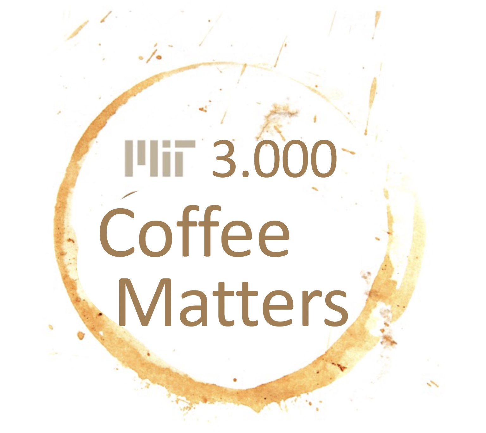
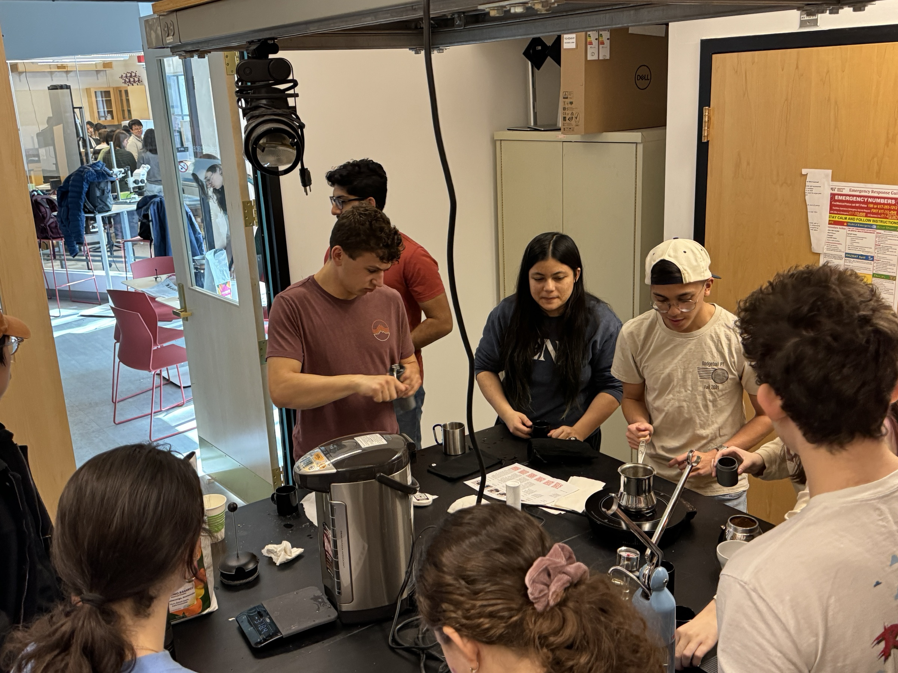
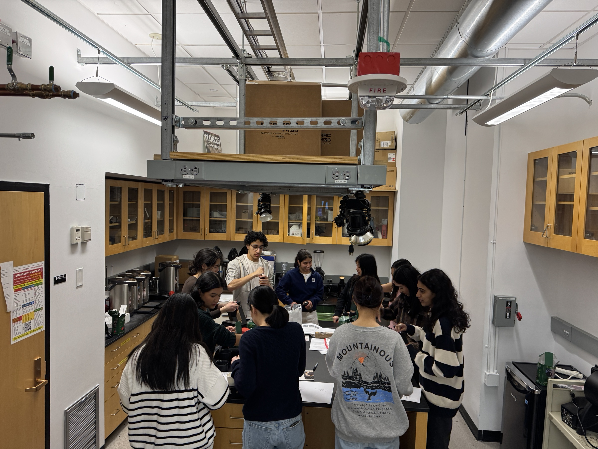
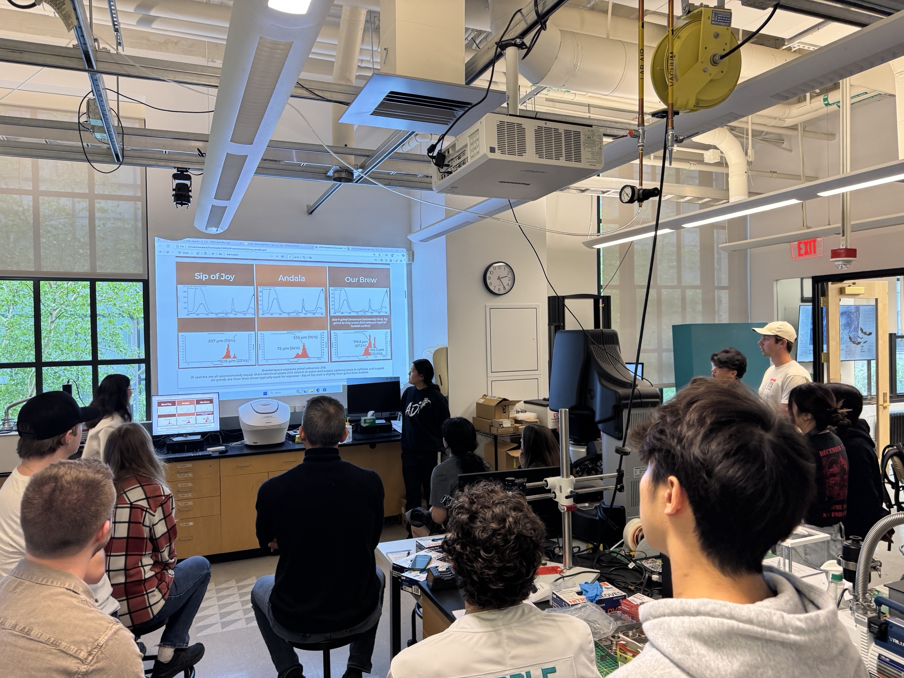

# 3.000 Coffee Matters: Using The Breakerspace To Make The Perfect Cup

3.000 Coffee Matters uses coffee as a familiar, delicious entry point into materials science. Students brew, taste, measure, image, and analyze coffee while learning how structure, processing, chemistry, and instrumentation connect to the final cup.

The subject moves among the Breakerspace lounge, the neighboring food-safe teaching space in 8-102B, and the instrument lab. Students prepare and taste coffee only in food-safe spaces, then use approved samples and materials characterization tools in the lab. A cup of coffee becomes a testable materials system: beans are grown, processed, roasted, ground, extracted, filtered, tasted, and measured.

This subject is designed for first-year students and can count toward the 6-unit discovery-focused credit limit. It is typically graded P/D/F.

## What Students Do

Students spend the term moving between tasting, brewing, measurement, and interpretation. The course is built around a simple idea: if changing a brewing variable changes the cup, the Breakerspace can help explain why.

In recent offerings, students have:

* Brewed coffee with controlled changes in grind size, filter media, water, roast, and brew method.
* Compared sensory notes with quantitative measurements from the lab.
* Used particle size analysis to connect grind distribution with extraction and flavor.
* Used optical microscopy to examine filter media, grounds, and coffee-related materials.
* Used SEM to compare the microstructure of green and roasted coffee beans.
* Used FTIR spectroscopy to compare coffee chemistry and identify materials in brewing equipment.
* Used hardness testing to compare grinder burrs and think about wear, materials, and manufacturing.
* Roasted coffee and collected observations as the beans changed color, smell, structure, and texture.
* Developed small final projects around coffee questions they wanted to investigate.

## Course Rhythm

The course usually begins with an introduction to the Breakerspace, coffee brewing, and the basic tools students will use. Students receive hands-on practice with brewing equipment, then move into structured lab rotations.

During the rotation phase, students work in small teams. A typical lab period pairs a lounge activity with a lab activity: students brew and taste coffee in the lounge, then use an instrument in the lab to measure something connected to that experience.

Brewing and tasting also take place in 8-102B, off the lounge and opposite the Breakerspace instrument lab. Keeping those activities in a food-safe room lets students work directly with coffee while preserving the lab-wide rule that food and drinks do not enter the instrument lab.

  <figure class="page-figure">
    
    <figcaption>3.000 students prepare coffee in food-safe room 8-102B.</figcaption>
  </figure>
  <figure class="page-figure">
    
    <figcaption>Different offerings use the same room for hands-on brewing and tasting.</figcaption>
  </figure>

After the rotations, students use lab time for project work. The goal is to formulate a focused coffee question, design a manageable experiment, collect data, and present the result clearly.

## Lecture Themes

Lecture topics vary by year, but recent versions of 3.000 have included:

* Introduction to coffee as a materials system.
* The coffee bean: species, origin, processing, and structure.
* Grinding, particle size, burr design, and extraction.
* Principles of microscopy and spectroscopy.
* Coffee chemistry, including compounds that affect taste and aroma.
* Water chemistry and its effect on extraction and flavor.
* Roasting, heat transfer, color change, and microstructure.
* Brew methods and extraction variables.
* Project design, data interpretation, and final presentations.

Different tastings are paired with lecture topics so students can connect concepts to sensory experience.

## Lab Rotations

The rotations are meant to introduce both coffee variables and Breakerspace instruments. They are not just demonstrations; students collect data and use it to explain what they tasted or observed.

### Grind Size And Extraction

Students brew coffee at different grind settings, taste the results, and use the [particle size analyzer](./tutorials/psa.html) to measure the distribution of grounds. This connects an everyday brewing adjustment to quantitative particle-size data.

### Grinder Design And Materials

Students compare manual grinders and use the [hardness tester](./tutorials/hardness-tester.html) to characterize grinder burr materials. The exercise connects material selection, wear resistance, grinding behavior, and cup quality.

### Filtration Method

Students brew with paper, metal, and cloth filters, then use the [optical microscope](./instruments/optical.html) to examine filter structure. Pore size, fiber diameter, and surface texture help explain why different filters change body, clarity, and mouthfeel.

### Brew Methods

Students compare brewing techniques such as pour over, French press, Turkish coffee, Moka pot, Americano, and manual espresso. The point is not to declare one method best, but to understand how pressure, grind, temperature, contact time, filtration, and dilution change the final drink.

### Spectroscopy And Coffee Chemistry

Students use [FTIR spectroscopy](./instruments/ftir.html) to collect spectra from coffee samples and brewing materials. These measurements introduce chemical fingerprints, functional groups, and the difference between identifying a relatively simple material and comparing complex mixtures like coffee.

### SEM And Roasted Bean Structure

Students use [scanning electron microscopy](./instruments/sem.html) to compare green and roasted coffee bean cross sections. SEM images show how roasting changes internal structure, pore size, fracture texture, and the physical pathways involved in extraction.

### Roasting

Students observe coffee roasting on the Breakerspace roaster, tracking how beans change during heating. Roasting connects chemistry, heat transfer, moisture loss, color, sound, smell, and structure in a process students can see and taste.

## Brewing Equipment And Methods

The course uses brewing methods that highlight different physical variables:

* **Aeropress:** controlled, repeatable small brews for lab comparisons.
* **Pour over:** filtration, flow, channeling, grind size, and water delivery.
* **French press:** immersion brewing, coarse grinds, suspended solids, and body.
* **Turkish coffee:** extremely fine grind, heating during brewing, foam, and sediment.
* **Moka pot:** pressure-assisted brewing, heat, and strong concentrated coffee.
* **Manual espresso press:** pressure, puck preparation, extraction force, and crema.
* **Americano:** dilution of espresso and how concentration changes sensory perception.

Many exercises use a shared Aeropress brew method so that students can change one variable while holding the rest of the procedure constant.

## Student Projects

After learning the instruments and brewing workflows, students develop their own coffee-related projects. Strong projects usually begin with a question that can be tested using both sensory observation and lab data.

<figure class="page-figure">
  
  <figcaption>Students present final projects in the Breakerspace, connecting brewing results with instrument data and interpretation.</figcaption>
</figure>

Examples of project directions include:

* How does water chemistry change extraction and perceived flavor?
* Can a small change in fines content explain a noticeable flavor difference?
* How do filter materials change the suspended solids or oils that reach the cup?
* How does roast level change bean microstructure and extraction behavior?
* Can spectroscopy distinguish green and roasted beans, coffee varieties, or brewing materials?
* How do grinder burr materials or geometry relate to grind distribution?

The final goal is not only to make better coffee. It is to practice asking a materials question, designing an experiment, using the right instrument, and explaining what the data can and cannot prove.

## Why Coffee Works For Materials Science

Coffee is complex enough to be real science and familiar enough that everyone can bring useful intuition. A coffee bean has cellular structure, fracture behavior, moisture, chemistry, volatile compounds, and processing history. A brewed cup has extraction, filtration, colloids, dissolved molecules, suspended particles, temperature, and human perception.

That makes coffee an unusually good teaching material: students can taste a difference, measure something about it, and then ask whether the measurement actually explains what they experienced.
