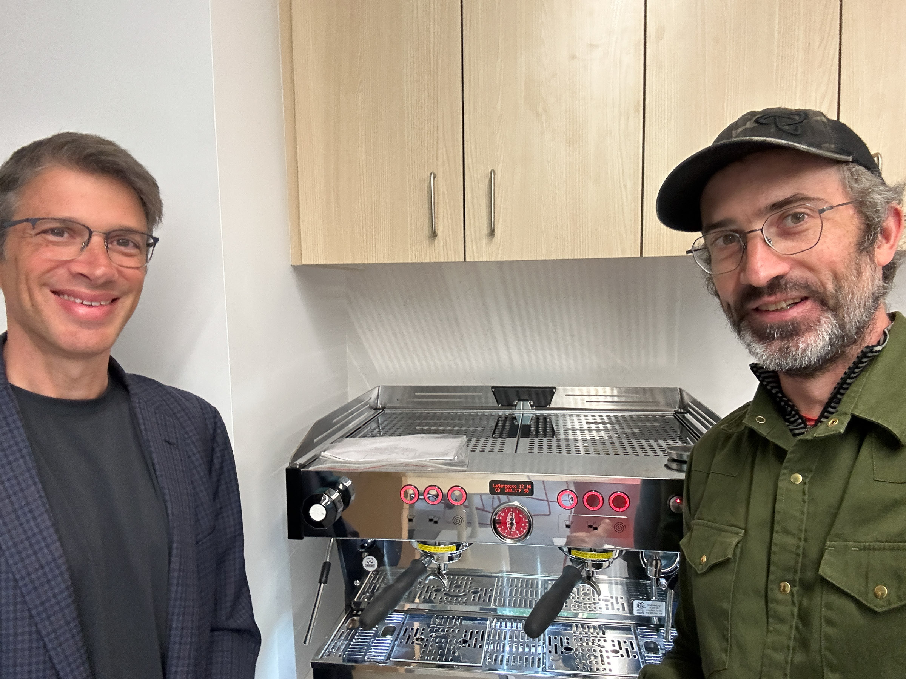

# About The Breakerspace

The DMSE Breakerspace is an undergraduate materials exploration lab where students can move from having a question about a material to collecting and interpreting evidence themselves. Its characterization and mechanical-testing instruments make hands-on investigation part of coursework, independent projects, and everyday experimentation rather than something encountered only in a specialized research setting.

The instrument lab is paired with a shared lounge and nearby teaching spaces. Together, they give students room to investigate materials, discuss results, document projects, work with classmates, and take part in a broader learning community.

<figure class="page-figure">
  
  <figcaption>Students in 3.010 connect an X-ray diffraction lesson with hands-on instrument training in the Breakerspace.</figcaption>
</figure>

## Why The Breakerspace Exists

Materials science becomes more meaningful when students can connect concepts to objects they can see, handle, measure, and question. The Breakerspace is designed to lower the practical barrier between curiosity and evidence: students can learn an instrument, examine a material they care about, compare several characterization methods, and develop the judgment needed to understand what their data do and do not show.

The lab is undergraduate-facing by design. It supports students at different stages, from a first encounter with microscopy or spectroscopy to independent capstone work requiring more advanced characterization. Training emphasizes safe, practical instrument use while the instrument guides, staff support, and shared examples help students continue learning after the initial session.

## How The Lab Has Developed

The Breakerspace's role has grown through a combination of recurring subject partnerships and student-led use. Some courses visit for an introduction to the space and the possibilities of materials characterization. Others integrate instrument training, structured exercises, project work, or several methods used in parallel.

These collaborations now span several kinds of undergraduate learning. 3.001 has returned for exploration sessions over multiple years. 3.010 has used course-integrated X-ray diffraction exercises and training. In 3.040, trained subject instructors manage teaching in the lab. [3.000 Coffee Matters]({{ "/3000.html" | relative_url }}) uses a familiar material system to connect preparation, sensory observation, characterization, and interpretation. Students in the 3.042 capstone course often arrive as independent users, then work with Breakerspace staff when their projects require more advanced methods.

This activity also helps the lab improve. Questions from students and teaching teams inform new exercises, training practices, sample resources, and instrument capabilities. The Breakerspace is therefore both a shared facility and an evolving undergraduate teaching environment.

As one proposed way to share those connections, see the demo Materials Showcase [Pumpkins Under Pressure: Carving For Strength]({{ "/showcases/pumpkin-strength-to-weight.html" | relative_url }}). It is an early content-model example rather than a completed quantitative study.

Learn more about the available [teaching collaboration pathways]({{ "/teaching.html" | relative_url }}).

## Meet The Team

The Breakerspace is led by **Professor Jeffrey Grossman** and managed by **Justin Lavallee**. Together with the lab's student staff, they support training, course activities, instrument use, project questions, and the continued development of the space.

Student staff are central to daily Breakerspace operation. They provide hands-on instrument training, help users work through questions in the lab, support course sessions, and contribute to improving exercises and shared resources. Teaching assistants, teaching fellows, and trained subject instructors also work with the Breakerspace team when courses use the lab.

<figure class="page-figure">
  
  <figcaption>Professor Jeffrey Grossman and Breakerspace manager Justin Lavallee.</figcaption>
</figure>

## Contact Us

We'd love to hear from you. To reach the Breakerspace team, please email [dmse-breakerspace@mit.edu](mailto:dmse-breakerspace@mit.edu).
