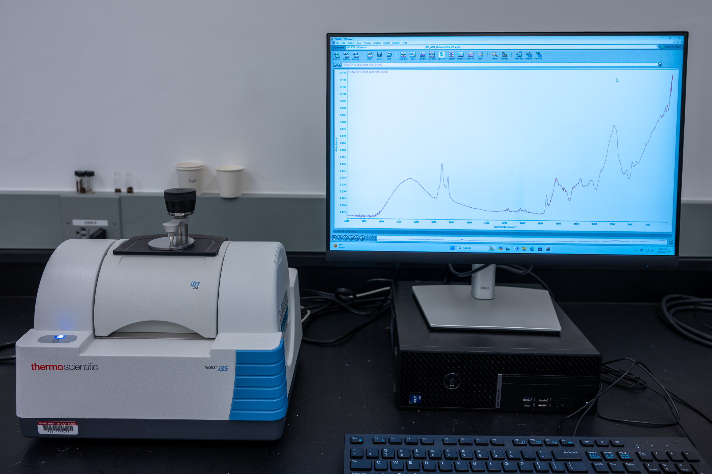
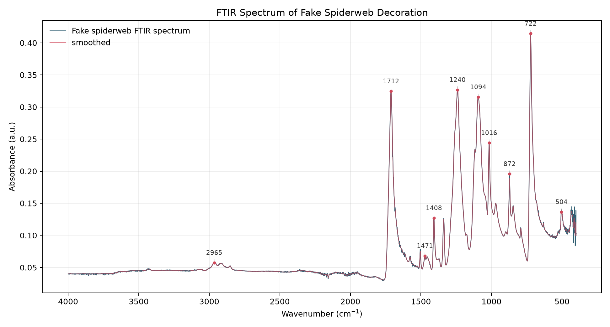
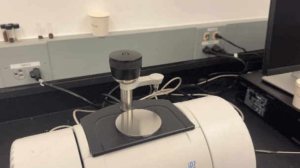
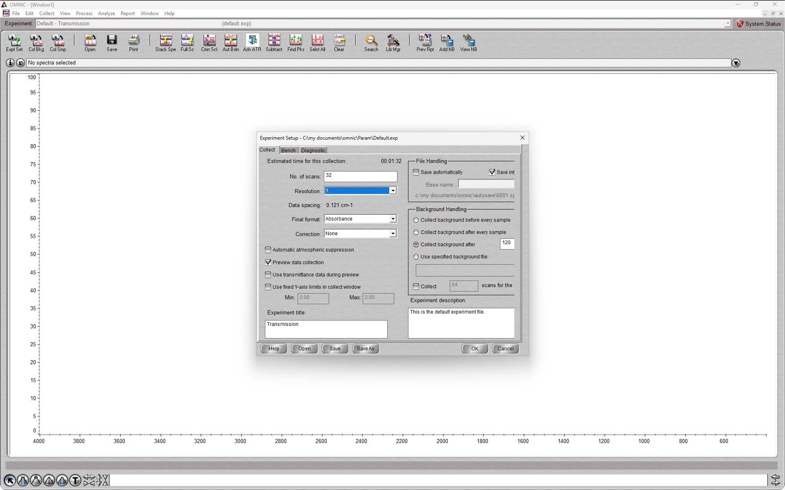
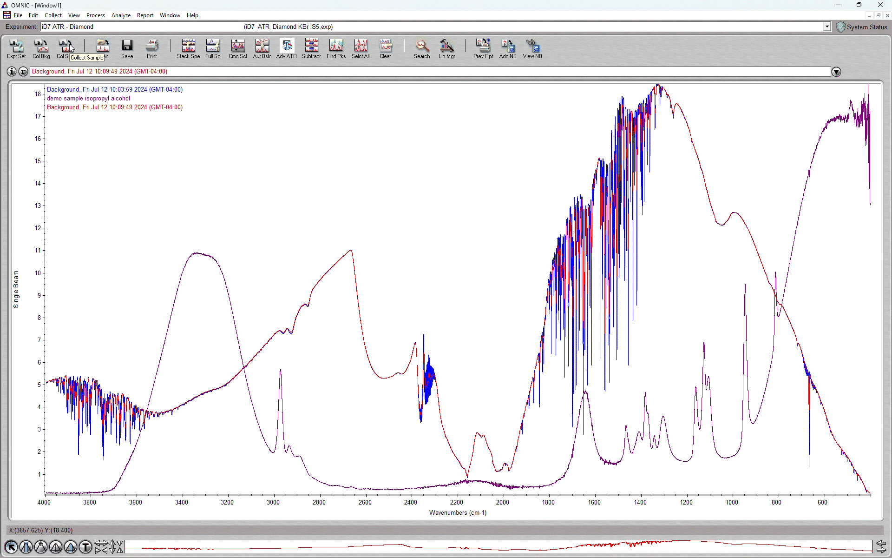
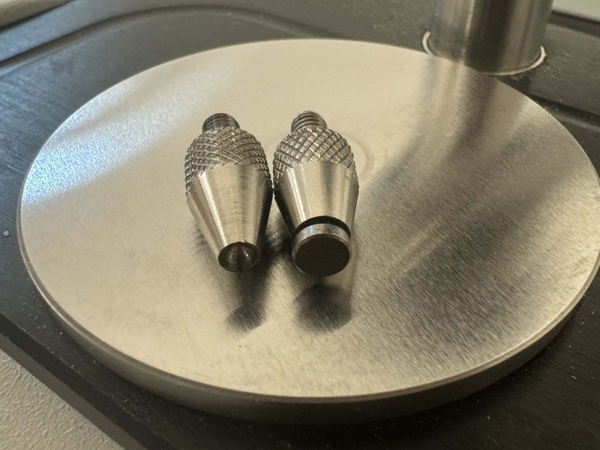

# Thermo Scientific Nicolet iS5 FTIR Spectrometer



## Overview

The Thermo Scientific Nicolet iS5 Fourier-transform infrared (FTIR) spectrometer measures how a sample absorbs infrared light. The resulting spectrum is useful for identifying or comparing many organic, polymeric, biological, and other molecular materials.

Most Breakerspace FTIR work uses the iD7 attenuated total reflectance (ATR) accessory, which is left on the instrument by default. ATR makes it straightforward to collect spectra from many solids, semi-solids, powders, pastes, and liquids with minimal sample preparation. The lab also has an iD1 transmission accessory and a Pike Technologies EasiDiff diffuse reflection accessory for less common workflows.

This page is the operating page for the FTIR. It combines the quick reference for trained users, detailed training notes, reservation link, manuals, and exercises.

### Quick Actions {#quick-actions}

<section markdown="1">
#### Get started

* [New to FTIR? Register for training](https://breakerspace.libcal.com/calendar?cid=19408&t=w&d=0000-00-00&cal=19408&ct=69558&inc=0)
* [Reserve time on the FTIR](https://breakerspace.libcal.com/seat/174791)
* [Trained users: open or print the two-page Quick Guide]({{ page.url | relative_url }}?view=quick-guide#quick-guide)
* [Operating the FTIR now? Follow the standard operating protocol](#sop)
* [Learn the complete operating workflow](#details)
</section>
<section markdown="1">
#### Learn and reference

* [Choose an FTIR sampling method](#quick-method)
* [Learn what FTIR can show you](#science)
* [View manufacturer manuals](#manuals)
* [Try the practice exercises](#exercises)
</section>



### What This Instrument Shows You {#science}

#### The Basic Idea

FTIR spectroscopy uses infrared light to probe molecular vibrations. Molecules are not still objects: their bonds stretch, bend, twist, and rock. When infrared light has the right energy to drive one of those motions, the sample absorbs some of that light. The FTIR records absorption across many infrared wavelengths and displays the result as a spectrum.

Different chemical bonds absorb infrared light in different regions. For example, O-H, N-H, C-H, C=O, and C-O bonds tend to produce recognizable features. The lower-wavenumber "fingerprint" region can be especially useful because many molecules have distinct combinations of peaks there.

The ATR accessory makes the measurement easier by pressing the sample against a diamond crystal. Infrared light reflects inside the crystal, and a very shallow evanescent field interacts with the sample touching the crystal surface. Good contact matters: if the sample does not touch the ATR window well, the spectrum may be weak or misleading.

#### What Scientists Use It For

* A chemist might compare an unknown powder with reference spectra to ask whether it is closer to a polymer, sugar, salt, oil, or other material class.
* A materials scientist might check whether a plastic, coating, adhesive, fiber, film, or residue has the expected chemical signature.
* A biologist or bioengineer might compare dried biological materials, gels, scaffolds, or treated surfaces to look for broad molecular differences.
* A conservator, artist, designer, or archaeologist might identify binders, coatings, paper additives, textile fibers, or surface contamination.
* A student might use FTIR after microscopy: first see that a residue, film, or fiber is present, then ask what kind of molecular material it may be.

#### What To Look For In The Results

Start with the main peaks. Ask where strong absorptions appear, whether they are broad or sharp, and whether expected regions are present or missing. A broad feature can suggest O-H or N-H stretching; strong peaks near the carbonyl region can point toward molecules with C=O bonds; clusters of peaks in the fingerprint region can help distinguish similar materials.

Then compare, rather than relying on one peak alone. FTIR is most useful when you compare a sample spectrum with a known reference, a database hit, a control sample, or before/after spectra from the same project. A good match usually means several major features line up, not just one peak.

Think about how complicated the sample is before interpreting the spectrum. FTIR can be very useful for pure samples, suspected contamination on a mostly known material, or mixtures with a limited number of likely components. In those cases, you may be able to ask focused questions such as "does this look like polyethylene?", "is this residue oily?", or "did this surface pick up a silicone-like contaminant?" The answer is usually based on matching a pattern of peaks to a reasonable comparison, not on reading a chemical name from the spectrum.

For chemically complex bulk mixtures, the interpretation changes. Coffee is a good example: brewed coffee, roasted beans, or coffee residues contain many different reactive compounds mixed in unknown ratios. The FTIR spectrum of the bulk material is a combined molecular fingerprint from everything the infrared beam samples. That fingerprint can still be useful for comparison, such as comparing green and roasted coffee, different extraction methods, or before/after treatment, but it usually cannot be deconvoluted into a reliable list of individual compounds or concentrations.

<figure style="margin-left:0; margin-right:0;">
  
  <figcaption>Example FTIR spectrum from a fake spiderweb decoration. The strong bands near 1712, 1240, 1094, 872, and 722 cm-1 are consistent with a polyester such as PET. This is the kind of relatively simple polymer sample where FTIR can support a likely material identification.</figcaption>
</figure>

For ATR spectra, also look for practical problems. A weak spectrum may mean poor crystal contact. Negative absorbance features can mean the crystal was dirty during background collection. Water vapor, carbon dioxide, contamination, and leftover solvent can all add features that do not belong to the sample.

#### What This Instrument Cannot Tell You

* FTIR usually identifies molecular features or material classes, not a complete formulation by itself.
* It cannot turn a complex bulk mixture into a list of every chemical component. When many compounds contribute overlapping peaks, the combined spectrum may be useful for comparison but not for assigning each peak to one ingredient.
* It is much stronger for pure samples, known materials with possible contamination, or simple mixtures than for unknown mixtures with dozens, hundreds, or thousands of components in unknown ratios.
* It cannot reliably identify materials that do not absorb infrared light strongly.
* It is often less direct for metals, ceramics, salts, and inorganic materials than for polymers, organics, and molecular solids.
* A database match is evidence, not proof. Similar materials can have similar spectra, and mixtures can be difficult to interpret.
* ATR mostly samples the material in contact with the crystal. A coating, residue, or surface layer can dominate the spectrum even if the bulk material underneath is different.

### Standard Operating Protocol {#sop}

#### Instrument Startup {#startup}

* [Power on the instrument](../assets/img/tutorials/ftir/ftir-switch.JPG), [if needed](../assets/img/tutorials/ftir/ftir-power.JPG).
* Log on to the instrument workstation using your MIT Kerberos.
* [Start OMNIC software](../assets/img/tutorials/ftir/ftir-desktop.JPG).
* Verify instrument connection using [system status](../assets/img/tutorials/ftir/omnic-status.PNG).
* Remove the protective cover from the ATR crystal plate.
* [Clean the ATR crystal](#crystal).
* Collect a background before loading samples.

#### Operation {#operation}

* Wear nitrile gloves when handling samples, ATR accessories, the pressure tower, pressure tips, Kimwipes, or cleaning solvent.
* Remove gloves before using the keyboard, mouse, or instrument workstation.
* [Clean the ATR crystal](#crystal) before each sample or whenever contamination is possible.
* Choose the sampling method and pressure tip appropriate for the sample.
* Load the sample so it makes good contact with the ATR crystal or the selected accessory.
* Collect the sample spectrum.
* Save each spectrum you need. Spectra must be selected and saved individually.
* Wear gloves again before unloading the sample or cleaning the crystal.
* Repeat background, sample collection, cleaning, and saving as needed.

#### Instrument Shutdown {#shutdown}

* Save all data you need.
* Close OMNIC.
* Log off the workstation.
* Clean the ATR crystal.
* Put the cover on the crystal plate and clamp it in place using the pressure tower.
* Leave the instrument powered on. The manufacturer recommends leaving the instrument powered when not in use.
* Leave the work area clean and remove all samples, wipes, and waste.

### Compatible Materials And Quick Sample Prep {#materials}

* Samples must be non-hazardous and safe to handle in the Breakerspace.
* Many solids, semi-solids, powders, pastes, and liquids can be measured by ATR.
* Cleaning solvents must also be non-hazardous. Isopropyl alcohol is the routine cleaning solvent for the ATR crystal.
* Samples should be dry enough, stable enough, and contained enough that they will not spill, crumble into the instrument, stain the crystal plate, or leave persistent odor.
* Volatile liquids may evaporate during collection and should be discussed with staff if containment or exposure is uncertain.
* Powders should be used sparingly and cleaned completely after collection.
* Sharp, sticky, abrasive, hard, reactive, odorous, unknown, staining, or difficult-to-clean samples should be discussed with staff before measurement.

<em>If you have any questions about whether a material is appropriate to characterize in the Breakerspace, please ask before bringing it to the lab.</em>

### Quick Method Selection {#quick-method}

| Goal | Typical method | Starting thought |
| --- | --- | --- |
| Identify or compare a plastic, coating, adhesive, film, fiber, residue, paste, or solid organic material | iD7 ATR | Clean the crystal, collect a background, press the sample firmly against the ATR window, and compare spectra. |
| Measure a powder | iD7 ATR | Use a small amount of finely ground powder and choose the pressure tip that gives the best crystal contact. |
| Measure a non-volatile liquid | iD7 ATR | Place a small droplet on the crystal; clean thoroughly afterward. |
| Measure a volatile liquid | iD7 ATR with volatiles cover | Ask staff if volatility, odor, or exposure is uncertain. |
| Measure a thin film or prepared transmission sample | iD1 transmission accessory | Less common in routine training; confirm the accessory and sample geometry with staff. |
| Measure diffuse reflectance from a powder or rough solid | EasiDiff diffuse reflectance accessory | Specialist workflow; use a staff-approved method and background. |

### Detailed Operating Instructions {#details}

The sections above are meant as a quick reference for trained users. The sections below are written as a training guide for new users and include the practical details, images, and troubleshooting cues that are easiest to understand at the instrument.

Most users should start with ATR. ATR is fast, tolerant of many sample forms, and easy to clean when only non-hazardous materials are used. The most common preventable FTIR problems are a dirty ATR crystal during background collection, weak sample contact, unsaved spectra, and residue left on the crystal after use.

#### ATR Sample Preparation And Loading {#sample-prep}

To maximize signal strength, the sample must make good contact with the ATR window. Collect a background before loading samples.

#### Solid Samples

* Select the self-leveling [pressure tip](#pressure-tip).
* Use a solid sample with a smooth, clean face where possible.
* Cover the ATR crystal with the sample.
* Position the pressure tower over the window.
* Tighten the knob until the clutch slips to provide clamping pressure.

Although many solid samples will not contaminate the window, wipe the window with isopropyl alcohol and a Kimwipe between samples.

<figure style="margin-left:0; margin-right:0;">
  
  <figcaption>Loading a solid sample on the ATR accessory.</figcaption>
</figure>

#### Powder Samples

It is especially important that powders contact the surface of the diamond window as completely as possible, so finely ground powders often work better. Preview mode can help verify that the pressure tip is pushing the powder into intimate contact with the ATR crystal before collecting a spectrum.

* Either the concave or self-leveling [pressure tip](#pressure-tip) can work. Try both if one does not give good contact.
* Use a spatula to place a small amount of powder sufficient to cover the ATR crystal.
* Position the pressure tower over the ATR crystal.
* Tighten the knob until the clutch slips.
* Clean the crystal and surrounding plate completely after measurement.

<figure style="margin-left:0; margin-right:0;">
  
  <figcaption>Loading a powder sample on the ATR accessory.</figcaption>
</figure>

#### Liquid Samples

* Place a small droplet of sample on the ATR crystal.
* Non-volatile liquids can be run uncovered without the pressure tower.
* Volatile samples can be covered with the [volatiles cover](#volatiles-cover) to reduce evaporation. Clamp the volatiles cover with the pressure tower.
* Clean the crystal and surrounding plate completely after measurement.

<figure style="margin-left:0; margin-right:0;">
  
  <figcaption>Loading a non-volatile liquid sample on the ATR accessory.</figcaption>
</figure>

#### Cleaning The ATR Crystal {#crystal}

* Apply a few drops of isopropyl alcohol to a Kimwipe.
* Wipe with the wetted portion of the Kimwipe, starting in the center and working outward.
* Use a dry portion of the Kimwipe, or a new Kimwipe, to dry the crystal and surrounding area.
* Confirm that no residue, powder, fibers, or droplets remain before collecting a background or leaving the instrument.

<figure style="margin-left:0; margin-right:0;">
  
  <figcaption>Cleaning the ATR crystal.</figcaption>
</figure>

#### Experiment Setup {#setup}

Experiment setup allows you to change collection parameters to fit the measurement. For faster collections, reduce the number of scans or scan resolution and note how the estimated time changes. To improve the signal-to-noise ratio, increase the number of scans.

There are two ways to collect a spectrum, with preview on or off. If **Preview data collection** is selected, the instrument shows a live spectrum that refreshes during preview mode. Once you are satisfied with the sample setup, run the full scan by clicking start collection in the upper right. Deselect **Preview data collection** if you want to bypass preview and run the full scan immediately. This setting applies to both background and sample collection.

For a [comprehensive explanation](../assets/img/tutorials/ftir/exp-set-help.JPG) of the experiment setup parameters, select help in the lower left.

##### Preview Data Collection Enabled

<figure style="margin-left:0; margin-right:0;">
  
  <figcaption>Background and sample collection with preview data collection on.</figcaption>
</figure>

<figure style="margin-left:0; margin-right:0;">
  
  <figcaption>Background and sample collection with preview data collection on in OMNIC.</figcaption>
</figure>

##### Preview Data Collection Not Enabled

<figure style="margin-left:0; margin-right:0;">
  
  <figcaption>Basic sample collection without preview data enabled.</figcaption>
</figure>

#### Background Collection {#background}

Before collecting spectra, collect a background spectrum.

> _A background spectrum is a single-beam spectrum obtained without a sample in place. The background spectrum is the result of the output of the source; the response of the beamsplitter, optics, sampling accessory or holder, and detector; and any atmospheric absorptions inside the spectrometer. A single-beam sample spectrum can be ratioed against the background spectrum to remove the effects of the background and produce a transmission spectrum._ ([Definition from the Thermo Scientific OMNIC Help Topics](../assets/img/tutorials/ftir/background-def.PNG))

* iD7 ATR accessory background collection is run with the cleaned diamond crystal exposed to air and no pressure clamp.
* iD1 transmission accessory background collection is run with no sample in the compartment.
* EasiDiff diffuse reflectance background collection is run on a sample cup holding pure KBr powder.
* Set up the instrument for your experiment and click **Collect Background**.
* After the background is collected, you can choose to add it to the spectra window or not. In both cases, that background scan will automatically be used for subsequent sample collections.

<em>Negative absorbance in an ATR spectrum can indicate the crystal was not clean during background collection.</em>

#### Sample Collection {#sample}

Once the background is collected, load the sample according to the instructions above and click **Collect Sample**. Follow the process based on your experiment setup.

If preview is enabled, use the live spectrum as a practical check. If the signal is weak, improve contact between the sample and ATR crystal, adjust the pressure tip, or ask staff whether the sample is appropriate for ATR.

#### Volatiles Cover {#volatiles-cover}

<figure style="margin-left:0; margin-right:0;">
  
  <figcaption>Use of the volatiles cover.</figcaption>
</figure>

#### Pressure Tips {#pressure-tip}

<figure style="margin-left:0; margin-right:0;">
  
  <figcaption>Concave pressure tip on the left and self-leveling pressure tip on the right.</figcaption>
</figure>

<figure style="margin-left:0; margin-right:0;">
  
  <figcaption>Swapping pressure tips.</figcaption>
</figure>

### Data Processing And Analysis {#data}

Data processing is beyond the scope of this operating page, but useful next steps include baseline correction, labeling major peaks, exporting spectra, and comparing unknowns with reference spectra.

The Breakerspace recommends the [Wiley KnowItAll Spectroscopy Software & Libraries available through the MIT Libraries](https://libguides.mit.edu/knowitall) for database searching and spectral comparison when users have MIT access.

When comparing spectra:

* Compare several major peaks, not just one.
* Note whether the spectrum came from ATR, transmission, or diffuse reflectance.
* Keep track of background collection conditions, sample preparation, and cleaning.
* Save raw spectra before exporting images, reports, or processed versions.

### Common Failure Modes {#failures}

| Symptom | Likely cause | What to try |
| --- | --- | --- |
| ATR signal-to-noise is low | Sample is not in intimate contact with the ATR crystal | Reposition the sample, increase pressure until the clutch slips, use a different pressure tip, or try preview mode while adjusting contact. |
| Negative features appear in an ATR spectrum | Crystal was not clean during background collection | Clean and dry the ATR crystal, collect a new background, then collect the sample again. |
| Instrument will not connect | Instrument power, USB connection, or OMNIC communication issue | Confirm power and system status; ask staff before changing cables or USB ports. |
| Spectrum changes between repeat measurements | Sample contact, sample heterogeneity, evaporation, or contamination changed | Clean the crystal, recollect background if needed, and repeat on a representative region of the sample. |
| Peaks look like water, carbon dioxide, solvent, or residue | Atmospheric or cleaning contamination, wet sample, or incomplete drying | Let solvent evaporate when safe, clean again, or ask staff about background and sample handling. |
| Spectrum was collected but cannot be found later | Spectrum was not individually selected and saved | Save each needed spectrum before closing OMNIC. |

### Manufacturer Manuals {#manuals}

* [iS5 spectrometer user guide](https://www.dropbox.com/scl/fi/rfba0x3swuhi4affsytv6/2638_iS5-UG.pdf?rlkey=mnjpwg72rbau8dsaw8jwg9flk&dl=0)
* [iD7 ATR user guide](https://www.dropbox.com/scl/fi/j24msyzbfpqahhk66z5y8/3021_-iD7_UG.pdf?rlkey=xf1sw5yoydqomsmcs1hxhrf5y&dl=0)
* [OMNIC software getting started guide](https://www.dropbox.com/scl/fi/nhx1fk2ov5fpkz4og1guf/2640_OMNIC_GS.pdf?rlkey=93wld38wdscvv94o177jylilu&dl=0)
* [Complete set of manufacturer manuals](https://www.dropbox.com/scl/fo/n0zv4090ncohz1yd53zyp/AEk8_3vo2JuCcHDSDBEEjck?rlkey=haqbguq12kbmh8fi7jmi8wzvg&dl=0)

### Links {#links}

* [Thermo Scientific FTIR sampling techniques](https://www.youtube.com/playlist?list=PLMiikclf3GL4ZAFqfux1tR1pyYmS4AkjR)
* [Pike Technologies tips of the week](https://www.piketech.com/tip-of-the-week/)

### Exercises {#exercises}

* **Level 1 - General training:** Collect ATR spectra from a known plastic, a paper product, and a non-volatile liquid. Save each spectrum and note which handling step affected signal strength most.
* **Level 1 - Cleaning check:** Collect a background on a clean crystal, collect a sample, clean the crystal, then collect a second background. Compare whether any negative features or residue-related peaks appear.
* **Level 2 - Sample-contact comparison:** Collect the same solid sample with weak contact and with proper pressure. Compare signal strength and peak quality.
* **Level 2 - Unknown comparison:** Collect an unknown non-hazardous polymer or residue and compare it with a known reference or database result. Report the evidence for and against the proposed identification.
* **Level 3 - Accessory comparison:** With staff guidance, compare ATR with transmission or diffuse reflectance for a sample where the method choice changes the spectrum.
