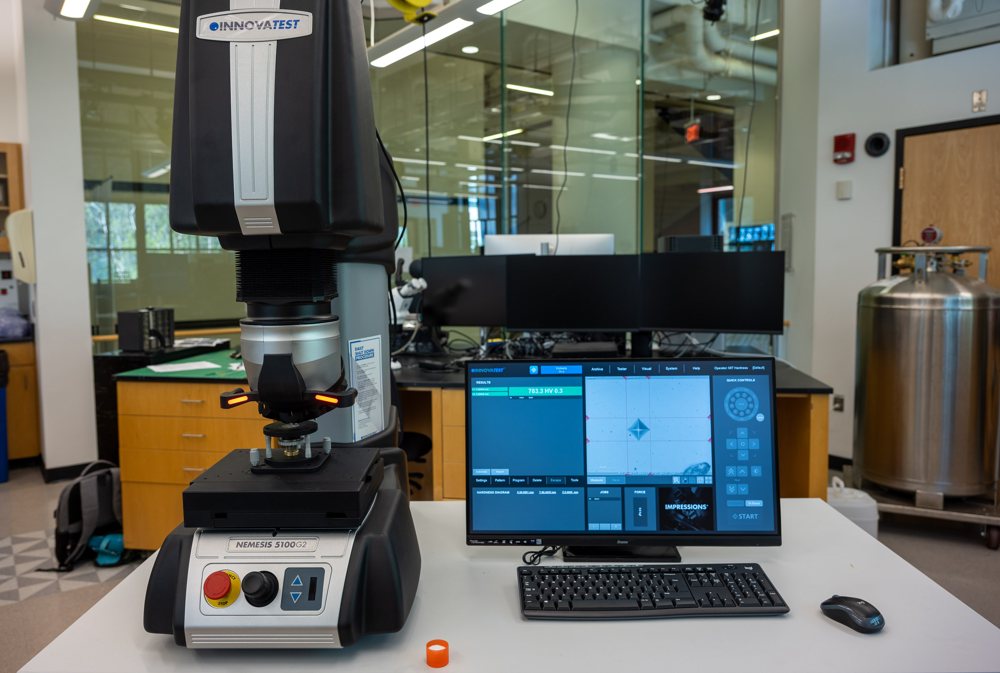

# Innovatest Nemesis 5100G2 Hardness Tester

## Overview

The Innovatest Nemesis 5100G2 measures the hardness of a material by pressing a hard indenter into its surface under a known load and measuring the size or depth of the resulting indent. A smaller indent means a harder material.

The Breakerspace system has a 9-position turret that automatically switches between indenters and objectives, a load cell to apply and measure the test force, and a motorized XY stage that can run programmed test patterns. It is equipped with indenters for Vickers, Rockwell, and Brinell tests and can run a range of scales.

This page is the operating page for the hardness tester. It combines the quick reference for trained users, detailed training notes, reservation link, manuals, and exercises.

### Quick Actions {#quick-actions}

<section markdown="1">
#### Get started

* [New to the hardness tester? Register for training](https://breakerspace.libcal.com/calendar?cid=19408&t=w&d=0000-00-00&cal=19408&ct=69558&inc=0)
* [Reserve time on the hardness tester](https://breakerspace.libcal.com/seat/181543)
* [Operating the tester now? Follow the standard operating protocol](#sop)
* [Learn the complete operating workflow](#details)
</section>
<section markdown="1">
#### Learn and reference

* [Learn what hardness testing can show you](#science)
* [Choose a hardness test method](#test-method)
* [Analyze and process your data](#data)
* [View manufacturer manuals](#manuals)
* [Try the practice exercises](#exercises)
</section>

### What This Instrument Shows You {#science}

#### The Basic Idea

Hardness is a measure of how well a material resists being permanently dented. To measure it, the instrument presses a hard, precisely shaped indenter into the surface with a controlled force, holds it briefly, and then withdraws it. The material's hardness is calculated from how big the leftover indent is (for methods that measure the indent optically) or how deep the indenter went (for methods that measure depth). Harder materials leave smaller, shallower indents.

Hardness is quick, requires little sample preparation compared with a full mechanical test, and only marks a small spot, so it is one of the most common ways to characterize metals and other solids. It also correlates usefully with other properties: for many metals, higher hardness tracks with higher strength and wear resistance.

There are several standard methods, and they differ mainly in the indenter shape and how the result is read:

* **Vickers** presses a diamond pyramid and measures the diagonals of the square indent under a microscope. It works across a very wide range of materials and loads.
* **Rockwell** presses a diamond cone or a hardened ball and measures the *depth* of penetration directly. It is fast and needs no microscope, but the indenter and scale must be matched to the material.
* **Brinell** presses a larger ball and measures the indent diameter. The larger indent averages over a bigger area, which suits coarse or non-uniform materials.

#### What Scientists Use It For

* A metallurgist can check whether a heat treatment worked, since hardening, tempering, and annealing all change hardness in predictable ways.
* A manufacturer can verify that incoming stock or a finished part meets a hardness specification.
* A materials scientist can map hardness across a weld, a coating, or a case-hardened surface to see how properties vary from point to point.
* A failure analyst can compare a broken part against spec to see whether the wrong material or treatment was used.
* A student can compare the hardness of different alloys, or see for themselves how cold-working or heat-treating a metal changes it.

#### What To Look For In The Results

The main output is a hardness number with its scale, such as `669 HV 40` (a Vickers value at a 40 kgf-equivalent load) or an HRC value for Rockwell. Always record the scale, not just the number, because a bare number is meaningless without it.

For Vickers and Brinell, the instrument also reports the measured indent dimensions (for example, the two diagonals d1 and d2 of a Vickers indent), which is how the hardness is calculated. A well-formed, symmetric indent gives a trustworthy number; a lopsided or ragged indent is a sign the sample was tilted, rough, or moving.

When you run a pattern of several points, look at the spread as well as the average. The instrument reports statistics such as mean, minimum, maximum, and standard deviation. A large spread can be real (a non-uniform material) or a setup problem (uneven surface, poor focus), so interpret it alongside the indent quality.

#### What This Instrument Cannot Tell You

* Hardness is not the same as strength or toughness. It correlates with them for many metals, but it does not directly measure how much load a part carries or how it fractures. For that, use the [Instron](./instron.html).
* Hardness numbers are method-specific. Vickers values at different loads are equivalent to each other, but Rockwell scales are not interchangeable with each other or with Vickers without a conversion table, and conversions are approximate.
* It only probes a small spot near the surface. A single indent may not represent a coating over a different substrate, or a material that varies internally.
* Results depend on a good surface. A rough, tilted, curved, or dirty surface gives unreliable numbers.
* It does not identify what a material is. It measures a property, not composition.

### Standard Operating Protocol {#sop}

Match the indenter and scale to your sample before testing. Using a scale whose indenter is too soft for a hard surface can damage the indenter or the machine (see [common failure modes](#failures)). If you are not sure which scale is safe for your material, ask staff.

#### Startup {#startup}

* Turn on the machine using the red power switch at the back.
* Log in to the Impressions software. The username is `mit hardness`; leave the password field empty.

#### Operation {#operation}

* Place your sample on the stage.
* Find a clean, flat spot using the camera, moving the stage with the joystick or the software.
* Focus with the 2.5x objective, then switch to 10x and refocus.
* Click **IN FOCUS**.
* Choose your scale with **SCALE SELECT**, the test button at the top left (see [test method selection](#test-method)).
* Confirm the pattern is set to **SINGLE POINT**, then click **START**; the test runs automatically.
* To test several points, use **TEST PATTERN** and choose your settings. Return to **SINGLE POINT** when you are done.

#### Shutdown {#shutdown}

* Confirm you are back in single-point mode (patterns are retained across users).
* Remove your sample and turn off the workstation.
* Toggle the power switch at the back of the machine to off.
* Leave the stage and work area clean.

### Compatible Materials And Sample Prep {#materials}

* All materials must be non-hazardous and safe to handle in the Breakerspace.
* Prepare a flat sample, ideally polished. An unpolished sample will not damage the machine but gives worse results, because the indent edges are harder to measure.
* The test surface should be flat and stable on the stage; a tilted, curved, or rocking sample gives unreliable numbers.
* Polishing equipment is available next to the sink.
* The sample must be hard enough that its scale does not risk damaging the indenter; confirm the method suits the material (see [test method selection](#test-method)).

<em>If you have any questions about whether a material is appropriate to characterize in the Breakerspace, please ask before bringing it to the lab.</em>

### Test Method Selection {#test-method}

| Method | Indenter | Read from | Good for |
| --- | --- | --- | --- |
| Vickers (HV) | Diamond pyramid | Optical measurement of the indent diagonals | A wide range of materials and loads; the general-purpose default. |
| Rockwell (HRA, HRB, HRC, etc.) | Diamond cone or hardened ball, depending on scale | Depth of penetration, read directly | Fast metal testing; the indenter and scale must match the material. |
| Brinell (HB) | Larger ball | Optical measurement of the indent diameter | Coarse or non-uniform materials, where averaging over a larger indent helps. |

Two things to get right before you start:

* **Match the Rockwell scale to your material.** Different Rockwell scales use different indenters and loads. A scale whose tip is too soft for your surface can damage the tip or the machine. For example, HRA uses a harder tip than HRB.
* **Know how the numbers compare.** Vickers values taken at different loads are equivalent to one another. Rockwell values are *not* equivalent across scales, and comparing Rockwell to Vickers (or one Rockwell scale to another) requires a conversion table and is only approximate.

#### Available Scales And Loads {#scales}

The Breakerspace machine is a Nemesis 5100G2/A, with a **test-force range of about 200 gf to 250 kgf**. The exact scales offered depend on which indenters and objectives are installed, so confirm the on-screen turret map before you rely on a particular scale. Within that force range the machine supports:

* **Vickers (HV):** a wide range of loads from roughly HV 0.01 up to HV 150.
* **Rockwell:** the regular scales (A, B, C, D, and others) with a 10 kgf preload and a 60, 100, or 150 kgf main load, plus the superficial scales (15N/30N/45N, 15T/30T/45T, and similar) with a 3 kgf preload.
* **Brinell (HBW):** ball-and-load combinations using 1, 2.5, 5, and 10 mm balls, subject to the 250 kgf force limit.

The dwell time is set in software (default 10 seconds, adjustable up to 999 seconds). For the complete scale and force tables see the Nemesis 5100G2 manual specifications (§10, pp. 37–38).

### Detailed Operating Instructions {#details}

The sections above are a quick reference for trained users. The section below is a training guide for new users. It is ordered by how often each test is run in the Breakerspace: single-point Vickers is by far the most common, followed by Vickers patterns, then Rockwell, and occasionally Brinell. The step names in **bold** are the on-screen buttons and menus in the Impressions software.

#### The Turret, Objectives, And Indenters {#turret}

The tester has a motorized nine-position turret. Eight positions hold the objectives and indenters (up to eight items total), and one fixed position holds the cross-laser locator and the load-cell probe. You never change tools by hand during a test: when you select a scale and press **START**, the turret rotates the correct indenter into place, makes the indent, and then rotates a viewing objective back automatically.

* Before testing, glance at the on-screen turret map and confirm the objectives and indenters it lists match what is physically fitted.
* Keep your hands clear of the turret, stage, and spindle whenever they move, especially during start-up initialization.
* The locator uses a Class 2 laser; do not stare into the beam.
* Changing which indenters or objectives are installed is a staff-only operation.

See the Nemesis 5100G2 manual (turret and stage, §5.1–5.3; safety, §3) and the Impressions 4 manual (turret configuration, §5.4.3) for the underlying detail.

#### Running A Single-Point Vickers Test {#vickers}

This is the default test and the one most students run. Vickers presses a diamond pyramid and the software measures the diagonals of the square indent.

1. **Load and locate.** Place the sample on the stage — the flat anvil for flat samples, the V-anvil for cylindrical ones — and center it with the surface parallel to the anvil. Move to a clean, flat, representative spot with the front-panel joystick or the on-screen virtual joystick, keeping indents away from edges and from each other.
2. **Select the scale.** Press **SCALE SELECT** (the test button at the top left). The button then shows the active scale and load, for example `VICKERS 1 KGF`. Changing the scale resets the other test settings, so choose the scale first. Confirm the scale suits your material (see [test method selection](#test-method)). *(Impressions 4 manual, §5.4.1, p. 17.)*
3. **Set the dwell time.** Open **TEST SETTINGS → DWELL TIME** and set the **MAINLOAD** dwell, the time the indenter is held at full load. The default is 10 seconds; only the mainload dwell applies to Vickers. *(Impressions 4 manual, §5.4.11.1, p. 38.)*
4. **Focus.** Start at low magnification and work up. Move the Z-axis with the **HEAD** control (coarse) and the scroll wheel (fine), or run **AUTOFOCUS**. Every manual Z move drops focus and disables **START**; when the surface is sharp, press **IN FOCUS**. *(Impressions 4 manual, IN FOCUS §5.4.22, p. 44; focusing §5.4.27, p. 45.)*
5. **Confirm single-point mode.** Make sure the pattern is set to **SINGLE POINT** so a single indent is made at the current location. This also clears any pattern left active by a previous user. *(Impressions 4 manual, §5.4.12, p. 40.)*
6. **Run the test.** Press **START**. The turret rotates in the Vickers indenter, applies the load, holds it for the dwell, withdraws, and rotates the viewing objective back. Keep hands clear while the turret and spindle move. *(Impressions 4 manual, START/STOP §5.4.30, p. 46; Nemesis 5100G2 manual, §5.3, p. 24.)*
7. **Let the software measure.** After about a second, four crosslines appear on the image and position themselves on the indent diagonals. The hardness value appears with its two diagonals, d1 and d2, for example `669.4 HV 1`. *(Impressions 4 manual, automatic measurement §5.4.8.1, p. 35.)*
8. **Check and adjust the indent.** A trustworthy indent is square and symmetric. If a diagonal box turns **red**, the two diagonals differ too much (the ISO rule flags a difference over 5%), which usually means the surface was tilted, rough, or moving — re-seat the sample and try another spot. To correct a mis-placed crossline, select it (it turns purple) and drag its marker onto the true corner using the on-screen arrows, the scroll wheel, or the mouse while watching the magnified zoom window, then confirm. *(Impressions 4 manual, results and quality §5.4.9.1, p. 36; crossline adjustment §5.4.17, p. 42; diameter check §5.4.5.6, p. 32.)*
9. **Save the reading.** Use **SAVE** to store it to the batch list, or turn on **AUTO SAVE** to save each reading automatically. Always keep the scale with the number. *(Impressions 4 manual, SAVE §5.4.16, p. 41; AUTO SAVE §5.4.3.4, p. 22.)*

For the exact measurement-adjustment procedure see the Impressions 4 manual (§5.4.8 and §5.4.17). For teaching, **Student Mode** (a system setting, §5.4.5.6, p. 31) hides the calculated hardness and shows only the diagonals so students compute the value by hand.

#### Running A Vickers Pattern {#patterns}

The motorized XY stage can run a grid or line of indents automatically, which is useful for averaging several points or mapping hardness across a weld, coating, or case-hardened surface.

1. Open **TEST PATTERN → TEST PATTERN** to open the pattern editor. *(Impressions 4 manual, §5.4.12, p. 40; pattern editor, chapter 6, pp. 48–68.)*
2. Choose a pattern type. For a rectangular map use a **GRID** and set the number of **ROWS** and **ROW DISTANCE** and the number of **COLUMNS** and column distance. For a traverse across a feature use a **LINE** and set the **NUMBER OF POINTS** and **POINT DISTANCE**. Space indents far enough apart that one does not affect the next. *(Impressions 4 manual, grid §6.2.1, pp. 52–53; line §6.4, pp. 56–58.)*
3. Set the pattern's start position on the sample (under **ALL PATTERNS → GENERAL PROPERTIES**, or by holding **Shift** and dragging the pattern on screen). *(Impressions 4 manual, §6.2.2, p. 52.)*
4. Check **INDENT AND MEASURE** if you want each point measured immediately after it is indented, then confirm with **OK** or **SAVE**. *(Impressions 4 manual, §6.1.7–6.1.8, p. 51.)*
5. With the pattern active, press **START** to run every point in turn. Press the red **STOP** to abort. *(Impressions 4 manual, §5.4.9.2 and START/STOP §5.4.30, p. 46.)*
6. **Return to SINGLE POINT when you are finished.** Patterns are retained across users, so leaving one active can disrupt the next person's measurement, and your own if you forget. *(Impressions 4 manual, §5.4.12, p. 40.)*

The full pattern editor is documented in Impressions 4 chapter 6 (pp. 48–68). Pattern statistics (mean, min, max, standard deviation, range) are covered under [data processing](#data).

#### Running A Rockwell Test {#rockwell}

Rockwell reads the *depth* of penetration directly, so there is no optical measurement or crossline step. *(Impressions 4 manual, §5.4.8 note, p. 35 — optical measurement does not apply to Rockwell.)*

1. **Match the scale to the material first.** Different Rockwell scales use different indenters and loads, and a tip too soft for a hard surface can be damaged (see [common failure modes](#failures)). Ask staff if you are unsure.
2. Press **SCALE SELECT** and choose the Rockwell scale, for example `HRC`. Regular scales use a 10 kgf preload with a 60, 100, or 150 kgf main load; superficial scales (15N, 30N, 45N, and similar) use a 3 kgf preload. *(Nemesis 5100G2 manual, hardness-scale table, §10, p. 37.)*
3. In **TEST SETTINGS → DWELL TIME**, note that the **PRELOAD**, **MAINLOAD**, and **RECOVERY** dwells all apply to depth scales. *(Impressions 4 manual, §5.4.11.1, p. 38.)*
4. Focus and press **IN FOCUS** to set the working height, then press **START**. The result is a Rockwell number derived from depth — there are no diagonals to measure or adjust.
5. Turning on **AUTO SAVE** is recommended for Rockwell, since there is no measurement step to pause on. The **FORCE DEPTH** diagram (under **TEST SETTINGS → DIAGRAMS**) plots force against depth if you want to see the indentation curve. *(Impressions 4 manual, AUTO SAVE §5.4.3.4, p. 22; FORCE DEPTH diagram §5.4.11.4, p. 39.)*

#### Running A Brinell Test {#brinell}

Brinell presses a larger ball and, like Vickers, measures the indent optically — but the ball and indent are larger.

* Press **SCALE SELECT** and choose a Brinell scale and ball, for example a 2.5 mm ball. Available ball-and-load combinations are listed in the Nemesis 5100G2 specifications. *(Nemesis 5100G2 manual, hardness-scale table, §10, p. 37.)*
* Use a lower-magnification objective (2.5x or 5x) so the larger indent fits in view. *(Impressions 4 manual, edge detection §5.4.4.5, p. 25.)*
* Focus, press **IN FOCUS**, then **START**. The software measures the indent diameter and reports the value as `HBW`, adjusting the crosslines the same way as for Vickers if needed. *(Impressions 4 manual, optical measurement §5.4.8, p. 35.)*

#### Worked Example: A Single Vickers Reading {#worked-example}

Place a flat, polished steel coupon on the flat anvil and center it. Press **SCALE SELECT** and choose `VICKERS 1 KGF`. Under **TEST SETTINGS → DWELL TIME**, set a 10 second mainload dwell. Focus at 2.5x, switch toward 10x, refocus, and press **IN FOCUS**. Confirm **SINGLE POINT** and press **START**; the indenter loads, holds for 10 seconds, and withdraws. The four crosslines land on the diagonals and the screen reads, for example, `669.4 HV 1`. The diagonal boxes stay black, meaning the two diagonals agree within 5%, so the reading is trustworthy — press **SAVE**. Report it with its scale as `669.4 HV 1`, not as a bare number.

### Data Processing And Analysis {#data}

The software reports each measurement as a hardness value with its scale (for example, `669.4 HV 40`), along with the test details: method, scale, dwell time, indent dimensions (such as the Vickers diagonals d1 and d2), and stage position.

* For a pattern, the software also reports statistics across the points: mean, minimum, maximum, standard deviation, and range. Report the mean with its spread rather than a single value when you have run a pattern.
* Always keep the scale with the number; a hardness value without its scale cannot be interpreted or compared.
* Save and review readings from the **RESULTS** tab and batch list. Use **REPORT** to build a report: **SNAPSHOTS** picks images, **PRINT** gives a preview you can export to PDF or XLSX, and **EXPORT** writes the measurements as CSV or Q-DAS to the export path set in system settings. Save a copy to your own storage. *(Impressions 4 manual, results §5.4.9, p. 35; report and export §5.4.21, p. 43; export path §5.4.5.6, pp. 31–32.)*
* To compare values across methods or Rockwell scales, use a hardness conversion table, and treat the conversion as approximate.

### Common Failure Modes {#failures}

| Symptom | Likely cause | What to try |
| --- | --- | --- |
| Next user's or your own test behaves unexpectedly | A test pattern was left active from a previous session | Return to single-point mode before measuring and before shutting down. |
| Indenter or machine damaged, or a warning during indent | Rockwell scale/tip too soft for a hard surface | Match the scale to the material; a harder surface needs a harder tip (HRA uses a harder tip than HRB). Ask staff if unsure. |
| Rockwell and Vickers numbers do not agree | The scales are not directly interchangeable | Use a conversion table; treat cross-method conversions as approximate. |
| Indent looks lopsided or hardness scatters a lot | Surface tilted, rough, unpolished, or unstable | Re-seat the sample flat, polish or find a smoother spot, and refocus. |
| Indent hard to measure or value looks wrong | Poor focus at 10x | Refocus carefully (2.5x then 10x) and click In Focus before testing. |

### Manufacturer Manuals {#manuals}

The two manuals that matter for operation are the **Impressions 4 software user manual** (the on-screen test workflow, patterns, and reporting) and the **Nemesis 5100G2 hardware user manual** (the turret, stage, scales, forces, and safety). Section references throughout this page point into these two documents.

* [Impressions 4 user manual](../assets/img/tutorials/hardness-tester/Impressions-4-User-Manual.pdf) — software workflow, test patterns (chapter 6), and reporting.
* [Nemesis 5100G2 user manual](../assets/img/tutorials/hardness-tester/Nemesis-5100G2-User-Manual.pdf) — hardware operation, scale and force tables, and safety.

### Exercises {#exercises}

* **Level 1 - Single Vickers test:** Prepare a flat metal sample, run a Vickers test, and report the hardness value with its scale and the measured indent diagonals.
* **Level 2 - Hardness pattern:** Use the pattern function to test several points in one run, and report the mean and standard deviation. Remember to return to single-point mode afterward.
* **Level 2 - Method comparison:** Measure the same sample with two methods or scales and use a conversion table to compare, discussing why the raw numbers differ.
* **Level 3 - Processing effect:** Compare the hardness of a metal before and after cold-working or a heat treatment, and relate the change to what happened to the material.
* **Level 3 - Hardness across a feature:** Map hardness across a weld, heat-affected zone, or case-hardened surface with a pattern, and interpret how hardness varies.
