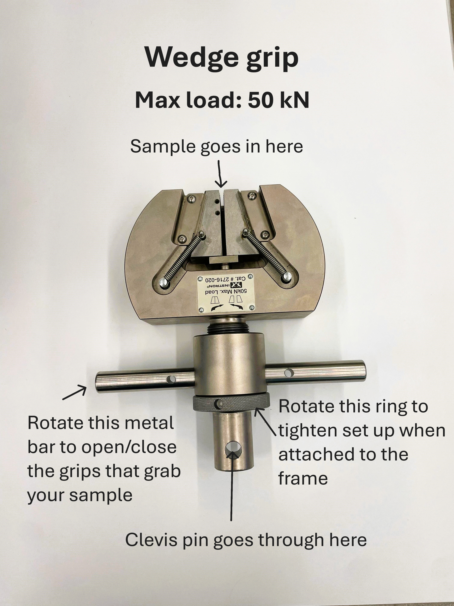
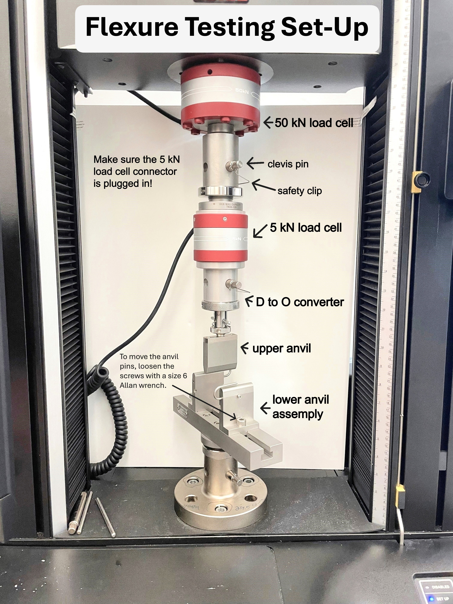
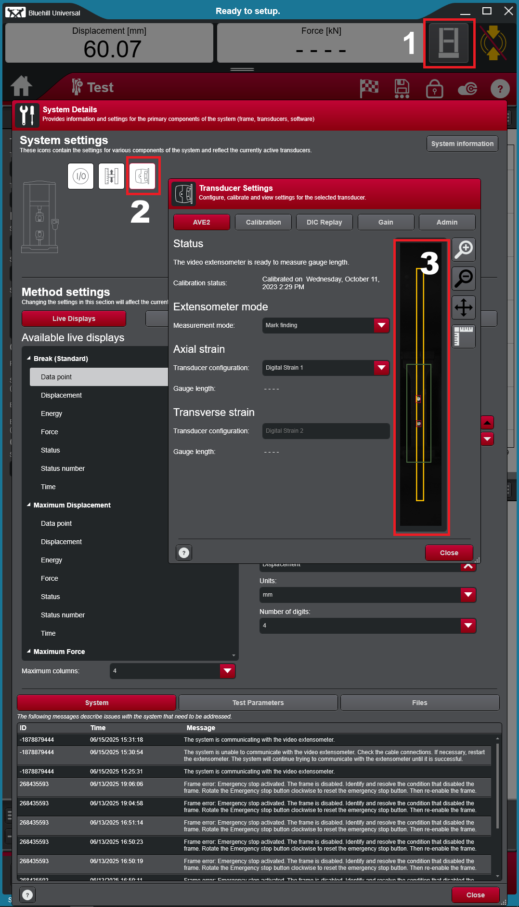

# Instron 68TM-50 Universal Testing System

## Overview

The Instron 68TM-50 is a universal testing machine (UTM): it pulls, pushes, or bends a sample while precisely measuring the force applied and how far the sample moves. From that it produces a force-displacement curve, the basic data behind mechanical properties such as strength, stiffness, and how much a material stretches before it breaks.

The Breakerspace system is equipped with 50 kN and 5 kN load cells and fixtures for tensile (pulling), compression (pushing), and flexure (bending) testing. A video extensometer is available for measuring strain optically.

This page is the operating page for the Instron. It combines the quick reference for trained users, detailed training notes, reservation link, manuals, and exercises.

### Quick Actions {#quick-actions}

<section markdown="1">
#### Get started

* [New to the Instron? Register for training](https://breakerspace.libcal.com/calendar?cid=19408&t=w&d=0000-00-00&cal=19408&ct=69558&inc=0)
* [Reserve time on the Instron](https://breakerspace.libcal.com/seat/174792)
* [Operating the Instron now? Follow the standard operating protocol](#sop)
* [Learn the complete operating workflow](#details)
</section>
<section markdown="1">
#### Learn and reference

* [Learn what mechanical testing can show you](#science)
* [Choose a mechanical test type](#test-type)
* [Analyze and process your data](#data)
* [View manufacturer manuals](#manuals)
* [Try the practice exercises](#exercises)
</section>

### What This Instrument Shows You {#science}

#### The Basic Idea

Every material pushes back when you deform it, up to a point. A universal testing machine measures exactly how hard it pushes back and how far it moves before it yields or breaks. The machine grips a sample and moves one end at a controlled rate while a load cell records the force. The result is a force-displacement curve: the story of how the material responded from the first gentle load all the way to failure.

With the sample's dimensions, that curve can be converted to a stress-strain curve, which is independent of the sample's size and reveals intrinsic properties. The slope of the early part tells you how stiff the material is (its modulus), the highest point relates to its strength, and how far it stretches before breaking tells you whether it is brittle (snaps early) or ductile (stretches a lot first).

The same machine does this in three modes. Tensile testing pulls a sample apart, compression testing squeezes it, and flexure testing bends it across supports. Each answers a different question about how a material behaves under real-world loads.

#### What Scientists Use It For

* A materials scientist can measure the strength and stiffness of a new material or compare candidates for a part.
* A mechanical or civil engineer can verify that a component, weld, joint, or adhesive can carry its intended load with a safety margin.
* A product designer can test whether a 3D-printed bracket, a packaging clip, or a plastic housing will survive normal use.
* A biomedical researcher can measure the mechanical properties of scaffolds, gels, or soft materials that must match living tissue.
* A student can settle a hands-on question: which 3D-print infill is actually strongest, how much weight fishing line really holds, or how a glue joint compares to the material around it.
* At a supervised outreach event, the Breakerspace has even crushed carved pumpkins to make force, cracking, and collapse visible (see [staff-guided event example](#pumpkin)).

#### What To Look For In The Results

Start with the overall shape of the curve. A steep initial rise means a stiff material; a gentle one means a compliant, stretchy material. The height of the curve shows how much force the sample carried, and where it drops shows where the sample failed.

Look at how the sample fails. A curve that rises then suddenly drops to zero suggests brittle fracture (a clean snap); one that rises, levels off, and stretches a long way before dropping suggests ductile behavior. The failure point on the curve should match what you saw happen to the sample.

Finally, sanity-check against the setup. A curve with a soft, curved "toe" at the start often means slack or slipping grips rather than real material behavior, and repeated breaks right at the grip face usually point to a gripping problem rather than the true strength (see [common failure modes](#failures)).

#### What This Instrument Cannot Tell You

* It measures mechanical response, not chemistry or structure. It tells you how strong or stiff something is, not what it is made of.
* Results depend heavily on sample geometry and gripping. A poorly prepared or misaligned sample gives a misleading curve, so preparation matters as much as the test.
* A single test is not the whole story. Materials vary, so meaningful conclusions usually need several samples, not one.
* It applies controlled, usually slow loading. It does not directly report impact resistance, fatigue over many cycles, or long-term creep unless a test is specifically designed for those.
* It has force and size limits. Samples must fit the fixtures and stay within the load-cell range; oversized or extremely strong samples may not be testable here.

### Standard Operating Protocol {#sop}

Mechanical testing involves stored energy, heavy fixtures, moving crossheads, and samples that can break suddenly. Keep the enclosure area clear, know where the emergency stop is before you start a test, and never place hands between the grips while the machine is enabled. Some tasks and heavy tooling may call for two people or additional precautions; when in doubt, ask staff and see the [Safety and Lab Use](../safety.html) page.

#### Instrument Startup {#startup}

* Log on to the instrument workstation using your MIT Kerberos.
* Open the Bluehill Universal software.
* If the event log opens, you can close it.

#### Operation {#operation}

* Set up your mechanical test (see [detailed operating instructions](#details) for each sample type).
* Confirm the correct load cell connector (5 kN or 50 kN) is inserted.
* On the [home screen](../assets/img/tutorials/instron/test_method_admin.PNG), click **Method** to create a method from a template or review existing methods.
* Return to the home screen with the house icon at the top left.
* Click **Test**. Run a basic **QuickTest** or choose a method.
* When prompted, set travel limits so the crosshead and fixtures cannot collide with anything.
* On the testing page, press **unlock** then **go** on the [hand controller](../assets/img/tutorials/instron/ANNOTATED_hand_controller_in_set_up.JPG) to start.
* The test ends when the sample fails. To stop early, press **stop** on the [hand controller](../assets/img/tutorials/instron/ANNOTATED_hand_controller_in_set_up.JPG) or push the red emergency [stop button](../assets/img/tutorials/instron/ANNOTATED_emergency_indicator.JPG).

#### Instrument Shutdown {#shutdown}

* Save your data.
* Disassemble your test setup and return all parts to the boxes they came from.
* Wipe up any debris.
* Close the Bluehill Universal software and log off the computer.
* Confirm the Instron is in disabled mode.

### Compatible Materials And Sample Prep {#materials}

* All materials must be non-hazardous and safe to handle in the Breakerspace.
* Avoid samples that may shatter dangerously, such as glass.
* Avoid wet samples or anything that would foul the machine.
* Some samples need cutting to fit the grips. The Breakerspace has scissors, razor blades, and a sectioning saw available.
* Check whether an [ASTM standard](https://www.astm.org/) exists for your test; standard sample geometries give more comparable, reliable results.

<em>If you have any questions about whether a material is appropriate to characterize in the Breakerspace, please ask before bringing it to the lab.</em>

### Test Type Selection {#test-type}

| Test | What it measures | Typical setup |
| --- | --- | --- |
| Tensile (small/weak samples) | Strength and stretch under pulling | Mini wedge grips, max load 1 kN |
| Tensile (standard) | Strength and stretch under pulling | Wedge grips, up to 50 kN |
| Compression | Response under squeezing | Compression platens on the 50 kN head |
| Flexure | Bending strength and stiffness | Flexure fixture on the 5 kN head |

Match the load cell to the sample: use the 5 kN cell for smaller, weaker samples and the 50 kN cell for stronger ones. If you are not sure which test or fixture fits your sample, ask staff.

### Detailed Operating Instructions {#details}

The sections above are a quick reference for trained users. The sections below are a training guide for new users, with the practical details and diagrams that are easiest to follow at the instrument.

The Instron performs tensile, compression, and flexure tests, and each uses different grips or fixtures. Every setup starts with choosing the load cell.

#### Load Cell

* Choose the load cell for your sample: 50 kN for stronger samples, or 5 kN for smaller, weaker ones.
* The 50 kN cell stays attached to the machine.
* To install the 5 kN cell, insert its thin end into the bottom of the 50 kN cell, push a clevis pin through both, and attach the safety clip. Rotate the metal ring clockwise until tight.
* When using the 5 kN cell, plug its connector into the [correct port](../assets/img/tutorials/instron/ANNOTATED_connection_port_instron.JPG). Push in the [side clips](../assets/img/tutorials/instron/ANNOTATED_load_cell_connector.JPG) as you insert it; this connector can take several tries.

#### Attaching Fixtures

Most parts attach the same way: align the internal holes, insert a clevis pin, add a safety clip, and rotate the metal ring to secure. Use a [spanner wrench](../assets/img/tutorials/instron/spanner_wrench.jpeg) to tighten the metal rings if needed.

#### Setup Diagrams

Each test type uses a different fixture arrangement. The annotated setups below are current reference photos.

<figure class="page-figure" style="max-width:32rem;">
  
  <figcaption>Tensile testing with mini wedge grips (max load 1 kN).</figcaption>
</figure>

<figure class="page-figure" style="max-width:32rem;">
  
  <figcaption>Tensile testing with wedge grips (max load 50 kN).</figcaption>
</figure>

<figure class="page-figure" style="max-width:32rem;">
  
  <figcaption>Anatomy of the 50 kN wedge grip.</figcaption>
</figure>

<figure class="page-figure" style="max-width:32rem;">
  
  <figcaption>Compression testing with the 50 kN head.</figcaption>
</figure>

<figure class="page-figure" style="max-width:32rem;">
  
  <figcaption>Flexure testing with the 5 kN head.</figcaption>
</figure>

#### Video Extensometer

The video extensometer measures strain optically by tracking marks on the sample.

* Press the [on](../assets/img/tutorials/instron/ANNOTATED_video_extensometer.JPG) button; confirm the red light appears.
* Draw dots on your sample a set distance apart using the [guide and paint markers](../assets/img/tutorials/instron/ANNOTATED_drawing_dots.JPG).
* Load your sample.
* Following the software diagram below, click 1, then 2. In field 3, click and hold over an area that includes your dots; they should be detected automatically. Click close and proceed with your test.

<figure class="page-figure" style="max-width:28rem;">
  
  <figcaption>Video extensometer software: click 1, then 2, then select region 3 around your dots.</figcaption>
</figure>

### Data Processing And Analysis {#data}

* By default the software outputs a force-versus-displacement graph.
* When you create a method, you can enter your sample dimensions and have the software automatically calculate properties such as modulus, strength, and strain, converting force-displacement into stress-strain.
* Save both the raw test data and any calculated results, and keep a copy on your own storage.
* Because materials vary, run several samples and compare rather than relying on a single test.

### Common Failure Modes {#failures}

| Symptom | Likely cause | What to try |
| --- | --- | --- |
| Video extensometer does not work | It is not actually on | Confirm the red light is lit; press the [on](../assets/img/tutorials/instron/ANNOTATED_video_extensometer.JPG) button again if not. |
| Load cell connector will not seat | Side clips not pushed in | Push in the [side clips](../assets/img/tutorials/instron/ANNOTATED_load_cell_connector.JPG) while inserting; it can take several tries. |
| Software will not start a test, or the hand controller is unresponsive; disabled light is blinking | Emergency stop is engaged | Hold the red emergency button and turn it clockwise about 15 degrees until it pops up. |
| Software will not start a test; disabled light is lit but not blinking | Machine is in disabled mode | Press [unlock](../assets/img/tutorials/instron/ANNOTATED_hand_controller_when_disabled.JPG) on the hand controller to enter setup mode. |
| Force-displacement curve looks wrong | Loose attachments | Confirm every attachment is tight; gently shake the setup, which should not move at all. |
| Sample keeps breaking right at the grip face | Grip pressure or grip type | Loosen the grips slightly, or try a different grip type. |

### Manufacturer Manuals {#manuals}

* [Video extensometer operator guide](https://www.dropbox.com/scl/fi/rgb05cbfo30mf80uwskek/video-extensometer-ave2-2663-901-and-sve2-2663-902-operator-guide.pdf?rlkey=qfhgbcfwtsl57fdbellgg206w&st=h7hcnio8&dl=0)
* [6800 Dual Column Table Model operator guide](https://www.dropbox.com/scl/fi/jppq0ifw1ricmdghsguca/6800-Dual-Column-Table-Model-Operator-Guide.pdf?rlkey=n7sm0h9v6vqqvu9ppnk0oessj&st=7ztz947o&dl=0)
* [Miniature grips for low-force testing operator guide](https://www.dropbox.com/scl/fi/zprr8ua5ma26lzqb31czo/2711-006-miniature-grips-for-low-force-testing-operators-guide.pdf?rlkey=a26sizgotrx3beaa1iujvgp0r&st=njxjs6bs&dl=0)
* [Screw action grips reference manual](https://www.dropbox.com/scl/fi/nf5pnttlapjawi8cm94ms/2710-11x-screw-action-grips-reference-manual.pdf?rlkey=7q1aeazj97xoshgy7n29297ed&st=ozgbhy08&dl=0)
* [5 kN flexure fixture reference manual](https://www.dropbox.com/scl/fi/59aeqcu8o9b7isv7gu93a/5kn-flexure-fixture-reference-manual.pdf?rlkey=f4wtjfybmg86kruq1hcp32nms&st=1u3dpdjr&dl=0)
* [5 kN, 10 kN, and 50 kN wedge grips reference manual](https://www.dropbox.com/scl/fi/3iaxhdxfo8pwxtj8t7m2i/5kn-10knand50kn-wedge-grips-reference-manual.pdf?rlkey=rjm1t839hzfv8yzly7mihjh2n&st=m76u4b4n&dl=0)

### Links {#links}

* [Instron FAQ](https://www.instron.com/en/service-and-support/technical-support/faqs)

### Exercises {#exercises}

* **Level 1 - Run a tensile test:** Set up a 50 kN tensile test, load a sample, and run it. Confirm that the sample's force-displacement curve appears, and identify where the sample failed on the curve.
* **Level 2 - Measure strain with the video extensometer:** Mark a sample, set up the video extensometer, and use it to measure strain during a test.
* **Level 2 - Compare a design variable:** Test several samples that differ in one way (for example, 3D-print infill percentage or orientation) and compare their curves.
* **Level 3 - Compute properties from stress-strain:** Enter sample dimensions in the method, run a test, and extract modulus, strength, and strain to failure. Discuss how sample preparation affected the result.

#### Staff-Guided Event Example: Pumpkin Compression {#pumpkin}

For the Infinite Halloween trick-or-treating event, the Breakerspace has hosted a staff-planned pumpkin compression activity that turns an everyday object into a visible mechanical-testing example. Participants can compare load, displacement, cracking, and collapse across pumpkins with different shapes and carved features.

This is a supervised event demonstration, not a standard independent-user workflow. Pumpkins, produce, and other wet or biological samples require explicit staff approval, containment, and a cleanup plan. Do not bring or test one without advance coordination; see [Samples And Materials](../safety.html#samples-and-materials).

  <figure class="page-figure">
    
    <figcaption>The event uses a planned compression setup with containment and staff supervision.</figcaption>
  </figure>
  <figure class="page-figure">
    
    <figcaption>Before compression, the carved pumpkin is centered between the platens.</figcaption>
  </figure>
  <figure class="page-figure">
    
    <figcaption>During the test, visible cracking and collapse can be connected to the force-displacement response.</figcaption>
  </figure>

