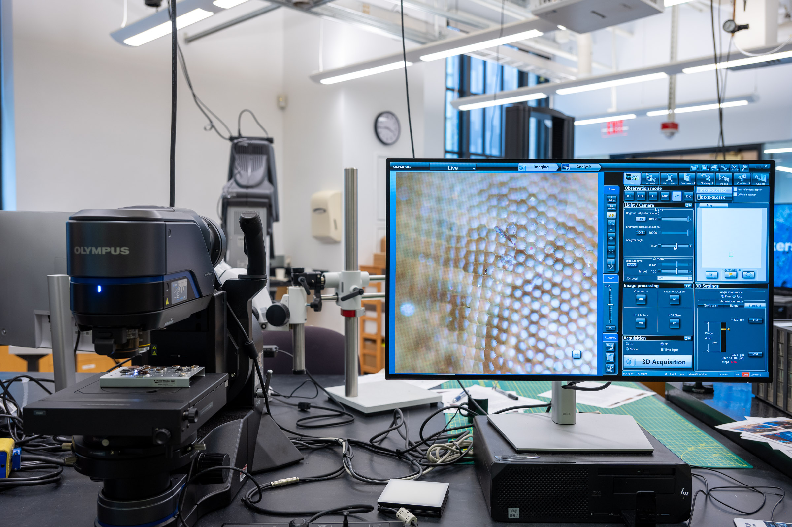
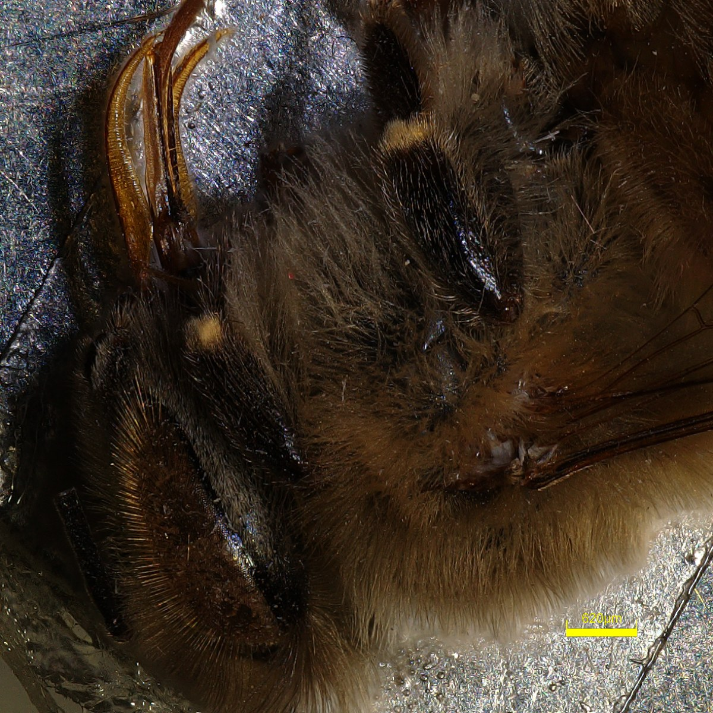
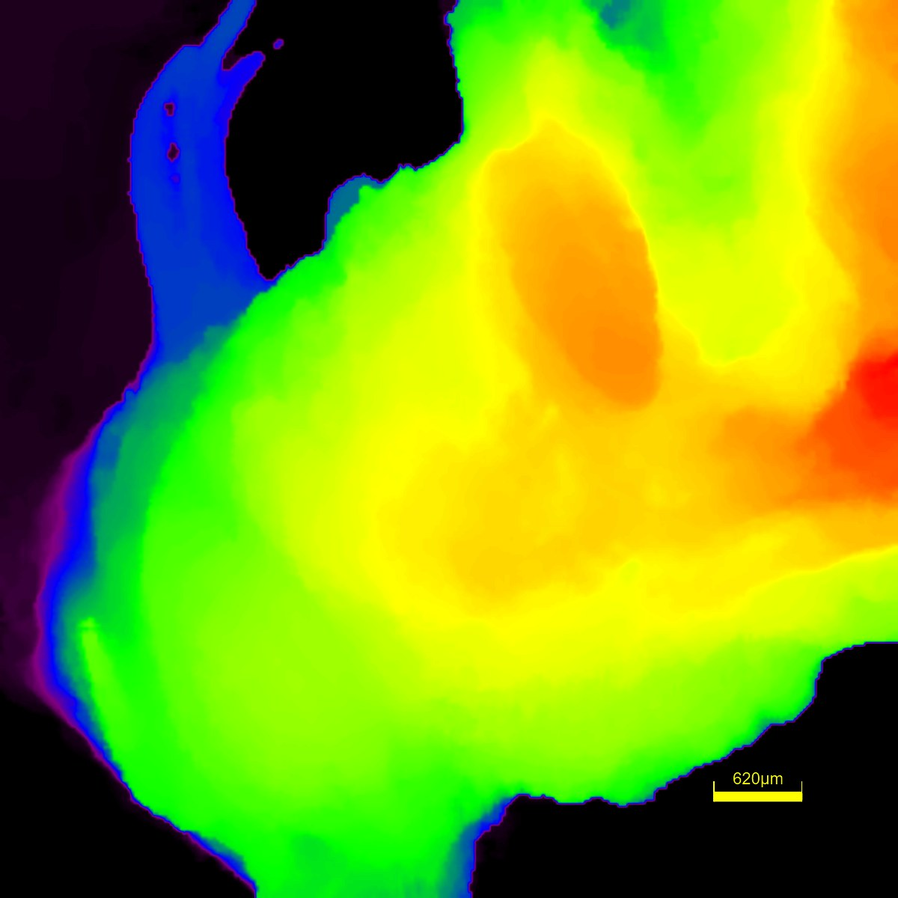
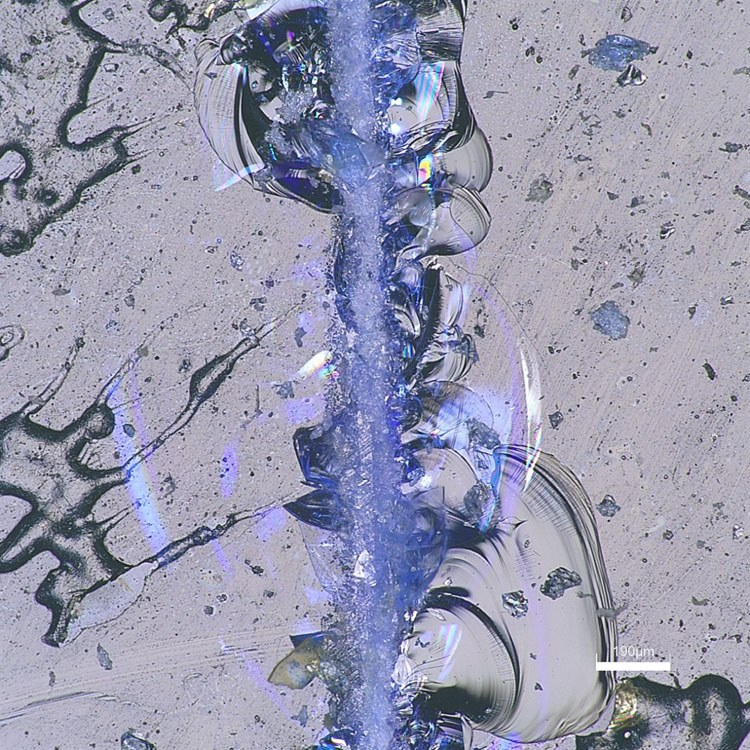
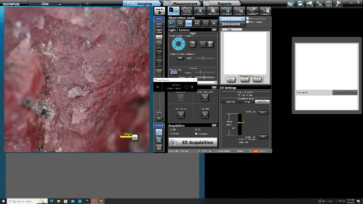
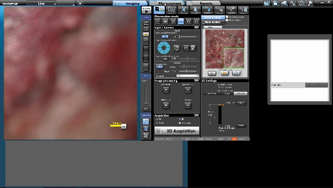
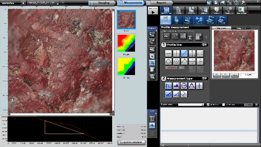

# Olympus DSX-1000 Digital Optical Microscope



## Overview

The Olympus DSX-1000 digital optical microscope is the Breakerspace instrument for full-color optical imaging, fast inspection, 2D and 3D image capture, stitched images, and basic measurement or surface-analysis workflows. It is a good starting point when you want to inspect a sample before choosing a higher-resolution or more specialized instrument.

The microscope can use brightfield, oblique, darkfield, brightfield/darkfield mix, simple polarization, and differential interference contrast observation modes. It also has motorized imaging features for 3D capture, image stitching, time-lapse capture, movies, and measurement tools.

This page is the operating page for the optical microscope. It combines the quick reference for trained users, detailed training notes, reservation link, manuals, and exercises.

### Quick Actions {#quick-actions}

<section markdown="1">
#### Get started

* [New to the optical microscope? Register for training](https://breakerspace.libcal.com/calendar?cid=19408&t=w&d=0000-00-00&cal=19408&ct=69558&inc=0)
* [Reserve time on the optical microscope](https://breakerspace.libcal.com/seat/174788)
* [Trained users: open or print the two-page Quick Guide]({{ page.url | relative_url }}?view=quick-guide#quick-guide)
* [Operating the microscope now? Follow the standard operating protocol](#sop)
* [Learn the complete operating workflow](#details)
</section>
<section markdown="1">
#### Learn and reference

* [Choose an observation mode](#quick-modes)
* [View manufacturer manuals](#manuals)
* [Try the practice exercises](#exercises)
</section>



### What This Instrument Shows You {#science}

#### The Basic Idea

An optical microscope uses visible light to make small features easier to see. In the simplest case, light reflects off a sample, passes through lenses, and forms a magnified image on a camera. That is similar to what your eye does, but the microscope gives you controlled lighting, interchangeable lenses, stable focusing, digital capture, and software tools for measurement.

The DSX-1000 is a digital optical microscope, so it is especially good at turning "I can see something interesting here" into images and measurements that can be saved, compared, and shared. It can also combine many images. For example, a 3D acquisition captures images at different focus heights and keeps the sharpest parts from each height, building a view where more of the sample appears in focus. A stitched image captures neighboring regions and joins them into a larger map.

Different lighting modes can make different features stand out. Brightfield often looks the most natural. Darkfield can make edges, dust, scratches, and particles glow against a dark background. Oblique and DIC lighting can make shallow texture easier to notice. Polarized light can reveal structure in crystals, fibers, plastics, minerals, and other materials that interact with light differently depending on direction.

#### What Scientists Use It For

* A biologist might inspect the shape, color, and texture of a plant surface, insect part, tissue scaffold, or bio-inspired material before deciding whether higher magnification is needed.
* A mechanical engineer might look at a fracture surface, scratch, worn coating, or printed part to ask where damage started and whether the feature is wide, deep, rough, or repeating.
* A materials scientist might compare polished metals, ceramics, polymers, composites, or coatings to look for grains, pores, cracks, layers, fibers, or contamination.
* An architect, artist, designer, or conservator might examine paper, pigments, textiles, printed objects, or surface finishes to understand how something was made or why it is changing.
* A student doing an exploratory project might use the microscope as a first stop: look closely, document what is visible, then decide whether SEM, FTIR, Raman, XRD, or another instrument can answer the next question.

#### What To Look For In The Results

In a normal 2D image, look first for shape, color, scale, and texture. Ask: are features isolated or connected, smooth or rough, random or patterned, uniform or changing across the sample?

<figure style="margin-left:0; margin-right:0;">
  
  
  
  <figcaption>Optical microscopy can show color and texture, estimate surface height, and document materials features such as the fracture surface of scored glass.</figcaption>
</figure>

In a stitched image, look for larger-scale organization. A single high-magnification image may show detail, while a stitched image can show whether that detail is common across the sample or only appears in one local region.

In a 3D image or height profile, look for surface relief. A scratch, pit, bump, fiber, printed trace, or worn region may be easier to understand when you can measure height or compare cross sections instead of relying on color and shadow alone.

When comparing observation modes, look for which mode makes the question easier to answer. The "best" image is not always the prettiest image; it is the image that makes the important feature easiest to see and explain.

#### What This Instrument Cannot Tell You

* It usually cannot identify chemical composition by itself. If you need chemistry, consider FTIR, Raman, SEM-EDS, or another method.
* It cannot see details smaller than the limits of visible-light optics. If you need nanoscale structure, SEM may be a better tool.
* It cannot see through opaque samples unless the surface or cross section is exposed.
* 3D height measurements depend on focus, surface reflectivity, lighting, and software assumptions, so they should be treated as measurements to understand and verify, not magic truth.
* A beautiful image is not automatically a complete answer. Good microscopy still depends on sample prep, scale bars, notes, comparison images, and a clear question.

### Standard Operating Protocol {#sop}

#### Instrument Startup {#startup}

* Wear nitrile gloves when handling samples, stage plates, objectives, or sample-prep tools.
* [Switch](../assets/img/tutorials/optical/switch.JPG) the microscope [on](../assets/img/tutorials/optical/status-on.JPG).
* Log on to the instrument workstation using your MIT Kerberos.
* Clear the [stage](../assets/img/tutorials/optical/stage.JPG) of any samples or other materials.
* Start the [DSX software](../assets/img/tutorials/optical/desktop.PNG) and [log on as Guest](../assets/img/tutorials/optical/guest.PNG) with no password.
* [Acknowledge that it is safe for the stage and head to move](../assets/img/tutorials/optical/acknowledge.PNG).
* Use the manual focusing knob to [lower the microscope stage](../assets/img/tutorials/optical/lower.GIF).
* Load or change [objectives](#objectives) if needed.
* Lower the microscope head into the tilt position using [the button on the console](../assets/img/tutorials/optical/tilt-console.JPG) or the [software button](../assets/img/tutorials/optical/tilt-software.PNG).

#### Operation {#operation}

* [Place the sample on the stage](#sample-prep).
* Remove gloves before using the keyboard, mouse, or instrument workstation.
* Use the [manual focusing knob](../assets/img/tutorials/optical/focus.GIF) to bring the sample into rough focus.
* Use the [joystick](../assets/img/tutorials/optical/joystick.GIF) to move the stage and position the sample area under observation.
* Fine-tune focus by moving the zoom head with the console buttons, [focus wheel](../assets/img/tutorials/optical/focus-wheel.GIF), or software buttons.
* Select an observation mode with Best Image, or choose the mode manually.
* Capture 2D, 3D, stitched, movie, time-lapse, or path images as needed.
* Verify that files are saved where you intend.
* Wear gloves again before unloading or handling samples.

#### Instrument Shutdown {#shutdown}

* Save and copy any data you need.
* Remove your sample from the stage.
* Close the DSX software.
* Click [yes](../assets/img/tutorials/optical/exit.PNG) to exit the microscope system and retract the head.
* Once the software fully closes, [switch](../assets/img/tutorials/optical/switch.JPG) the microscope [off](../assets/img/tutorials/optical/status-off.JPG).
* Log out of Windows.
* Place the [dust cover](../assets/img/tutorials/optical/cover.JPG) on the microscope.
* Leave the stage, sample area, and workstation clean.

### Compatible Materials And Quick Sample Prep {#materials}

* Samples must be non-hazardous and safe to handle in the Breakerspace.
* Samples must weigh less than the 5 kg stage loading capacity.
* Samples must fit under the microscope head with enough clearance to focus safely.
* Liquids must be contained so they cannot spill on the stage or microscope.
* Samples should be stable on the stage and should not rest on fixed parts of the stage that prevent normal movement.
* Sharp, fragile, wet, loose, powdery, odorous, unknown, or unusually heavy samples should be discussed with staff before imaging.

<em>If you have any questions about whether a material is appropriate to observe in the Breakerspace, please ask before bringing it to the lab.</em>

#### Sample Prep {#sample-prep}

The optical microscope has few special sample-prep requirements. If a sample is non-hazardous, safe to handle, under the stage weight limit, short enough to focus on, and unlikely to contaminate the microscope, it can usually be observed.

Better sample preparation can still improve results. A clean, flat, stable sample is easier to focus, stitch, and measure. Careful cutting, mounting, or cleaning may be useful depending on the material and characterization goal.

### Quick Observation Mode Selection {#quick-modes}

| Goal | Starting mode or feature | Notes |
| --- | --- | --- |
| Fast inspection of a flat sample | Brightfield | Good first view for many samples. |
| Emphasize scratches, relief, or unevenness | Oblique or DIC | Try Best Image to compare quickly. |
| Find dust, edges, scratches, or defects | Darkfield or brightfield/darkfield mix | Useful when features are hard to see in brightfield. |
| Observe crystals, rocks, minerals, or orientation contrast | Simple polarization | The 3x long-working-distance objective cannot be used in polarized mode. |
| Capture a larger area | 2D or 3D stitching | Make sure the sample is stable and the stage can move freely. |
| Capture height or surface-shape information | 3D acquisition | Requires a good focus range and stable sample. |
| Measure distances, profiles, volumes, or roughness | Measurement tools after acquisition | Save the raw image/data before exporting reports or derived files. |

### Detailed Operating Instructions {#details}

The sections above are meant as a quick reference for trained users. The sections below are written as a training guide for new users and include the practical details, images, and troubleshooting cues that are easiest to understand at the instrument.

The DSX-1000 has motorized stage and head movement. Before starting the software, changing objective configuration, tilting the head, or running stitched/3D acquisitions, make sure the sample and stage area have enough clearance for movement. Stop and ask staff if a sample looks like it could collide with the objective, head, stage, or fixture.

#### What The Optical Microscope Does {#features}

The DSX-1000 is useful for:

* Quick preview and switching between six observation modes.
* Full-color 2D image capture.
* 3D image capture and focus stacking.
* Automated 2D or 3D image stitching.
* Tilted-head imaging to observe samples from different angles.
* Rotatable-stage inspection.
* Post-processing and analysis, including annotations, distance measurements, profiles, roughness, volume estimates, and 3D mesh export.

#### Objectives And Magnification {#objectives}

Available objectives include:

* Long working distance: 3x, 10x, 20x, 40x.
* Extra long working distance: 1x, 3x, 10x.

The 3x long-working-distance objective cannot be used in polarized observation mode.

Instructions for replacing the objective unit are on page 11 of the [Quick Reference Guide](https://www.dropbox.com/scl/fi/npmn40ndidrc329ev1eze/DSX1000_QRG_EN_AX9342_03.pdf?rlkey=qwg423vnbo5o3811uyjbzhmlh&dl=0).

The microscope also has an internal optical zoom system that boosts magnification from 14x to 140x. Total magnification is the external objective magnification multiplied by the internal zoom factor, for an overall range of about 14x to 5600x depending on the configuration.

#### Observation Modes {#observation-modes}

Many observation modes are available from the desktop application or console:

| Mode | Useful for |
| --- | --- |
| Brightfield (BF) | Flat samples and general inspection. |
| Oblique | Scratches, unevenness, and subtle surface relief. |
| Darkfield (DF) | Edges, dust, scratches, and features that are difficult to see in brightfield. |
| Brightfield/darkfield mix | Searching for scratches or defects while keeping easy brightfield visibility. |
| Simple polarization | Crystals, rocks, minerals, fibers, and other samples with orientation or polarization contrast. |
| Differential interference contrast (DIC) | Fine unevenness, waves, or surface relief not obvious in other modes. |

The Best Image feature previews how the sample looks in each observation mode and lets you apply the preferred mode. The [DSX1000 Digital Microscope Operation Manual](https://www.dropbox.com/scl/fi/bmfph79975i1p0wv4pbuf/DSX1000-Application-M-E.pdf?rlkey=fzmbq39hr926gpbbtgft9fxxt&dl=0) describes Best Image on page 52 and explains the observation modes starting on page 63.

<figure style="margin-left:0; margin-right:0;">
  
  <figcaption>Using the Best Image feature to choose an observation mode.</figcaption>
</figure>

#### Image Acquisition {#acquisition}

The microscope can acquire and save images in 2D or 3D, and can automatically stitch images to cover a wider field of view or create higher-resolution composite images.

##### 2D Acquisition

A 2D acquisition saves the current live image. This is the simplest capture mode and is usually the right first step when documenting a sample or comparing observation modes. A detailed walkthrough starts on [page 106 of the DSX application manual](https://www.dropbox.com/scl/fi/bmfph79975i1p0wv4pbuf/DSX1000-Application-M-E.pdf?rlkey=fzmbq39hr926gpbbtgft9fxxt&dl=0).

##### 3D Acquisition

A 3D acquisition captures a series of images at different focal planes, composites the sharpest pixels into an image where the full selected region appears in focus, and records height data. Height data can be used for profile measurements or exported as an [STL file](https://en.wikipedia.org/wiki/STL_(file_format)).

Several methods are available to set the start height, stop height, and step size. The application manual describes these options starting on [page 112](https://www.dropbox.com/scl/fi/bmfph79975i1p0wv4pbuf/DSX1000-Application-M-E.pdf?rlkey=fzmbq39hr926gpbbtgft9fxxt&dl=0).

##### Stitching

Stitching captures multiple frames while the stage travels, then combines them into a larger 2D or 3D image. Before stitching, make sure the sample is stable, the stage can move freely, and no part of the sample is catching on fixed stage components. Further information starts on [page 132 of the application manual](https://www.dropbox.com/scl/fi/bmfph79975i1p0wv4pbuf/DSX1000-Application-M-E.pdf?rlkey=fzmbq39hr926gpbbtgft9fxxt&dl=0).

##### Other Acquisition Methods

The DSX application can also capture time-lapse sequences, movies, and images along a path. These options are described in chapter 9 of the application manual, beginning on page 106.

### Data Processing And Analysis {#data}

The measurement feature can be used to extract information from captured images and 3D data, including height changes, horizontal distance, angle, profiles, roughness, and volumes of raised or depressed features.

To start a measurement workflow:

1. Open the measurement tab next to imaging.
2. Click the measurement option below the reports tab.
3. Use the profile option for distance, height, or angle between points.
4. Use the 2D-to-3D wireframe button to visualize surface shape.
5. Use the volume option to estimate the volume of a raised feature or depression.
6. Save the original image/data and export reports or derived files as needed.

<figure style="margin-left:0; margin-right:0;">
  
  
  <figcaption>Examples of DSX measurement and 3D visualization tools.</figcaption>
</figure>

For useful records:

* Record the sample name, objective, zoom level, observation mode, acquisition type, and any stitching or 3D settings.
* Save raw images or project files before exporting compressed images or reports.
* Keep notes on sample preparation and orientation if you need to compare regions later.

### Common Failure Modes {#failures}

| Symptom | Likely cause | What to try |
| --- | --- | --- |
| Software shows a control error or fails to connect | Microscope was not switched on before starting software | Close the software, switch the microscope on, then restart the DSX software. |
| Software cannot connect to the camera | Camera or workstation communication issue | Reboot the workstation. Ask staff if the error repeats. |
| Sample rotates or shifts when the stage moves | Part of the sample is resting on a fixed part of the stage or is not stable | Stop stage motion, reposition or stabilize the sample, and keep the moving stage area clear. |
| Cannot achieve focus | Microscope may be in the lens-exchange position instead of tilt position, or sample height/objective choice is wrong | Follow startup steps to move into tilt position; lower the stage and re-approach focus carefully. |
| Image is low contrast | Observation mode is not well matched to the sample | Use Best Image to compare modes; try oblique, darkfield, polarization, or DIC. |
| 3D capture or stitching fails | Poor focus range, sample movement, insufficient clearance, or stage travel issue | Recheck focus limits, sample stability, and stage clearance before retrying. |
| Measurement result seems wrong | Wrong calibration, objective, zoom, or acquisition data used | Confirm objective/zoom settings, save the original file, and repeat with a known scale if needed. |

### Manufacturer Manuals {#manuals}

* [DSX Quick Reference Guide](https://www.dropbox.com/scl/fi/npmn40ndidrc329ev1eze/DSX1000_QRG_EN_AX9342_03.pdf?rlkey=qwg423vnbo5o3811uyjbzhmlh&dl=0)
* [DSX Application Manual](https://www.dropbox.com/scl/fi/bmfph79975i1p0wv4pbuf/DSX1000-Application-M-E.pdf?rlkey=fzmbq39hr926gpbbtgft9fxxt&dl=0)
* [DSX Hardware Manual](https://www.dropbox.com/scl/fi/xg225i22sji3ap6mbdxxb/DSX1000_HardwareManual_EN_AX9336_07.pdf?rlkey=t9ndinow4wd8wwt9l1mlmtzzl&dl=0)
* [All DSX documentation](https://www.dropbox.com/scl/fo/lpmj7kw7kjfzrwzpy3s31/AHTufXDD4RDfEImJssdaxjc?rlkey=t1rl3ywuxnde1129767txmfgw&dl=0)

### Links {#links}

* [Manufacturer overview](https://www.olympus-ims.com/en/microscope/dsx/?nis=8)

### Exercises {#exercises}

* **Level 1 - General training:** Image a simple textured sample in brightfield, use Best Image to compare observation modes, capture a 2D image, and save the file in the correct project folder.
* **Level 1 - General training:** Capture the same region at two magnifications and record the objective, zoom setting, observation mode, and save location.
* **Level 2 - 3D capture:** Use a sample with visible surface relief to acquire a 3D image, generate a profile, and report the measured height difference between two points.
* **Level 2 - Stitching:** Capture a stitched image of a larger sample region and compare the stitched result with a single-frame image.
* **Level 3 - Specialist training:** Develop a repeatable imaging workflow for a recurring sample type, including sample prep, objective, observation mode, acquisition type, measurement outputs, and export settings.
