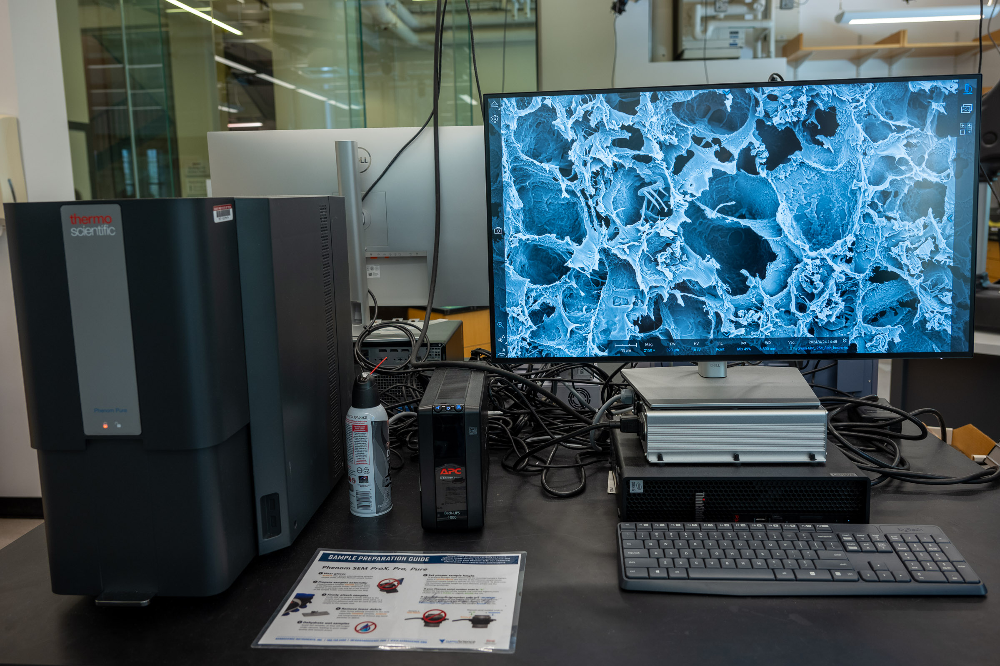
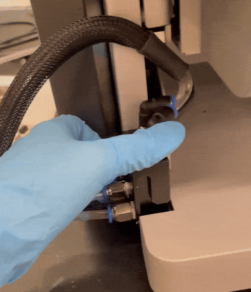
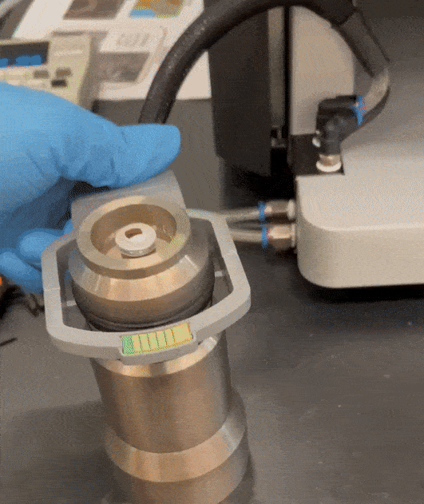
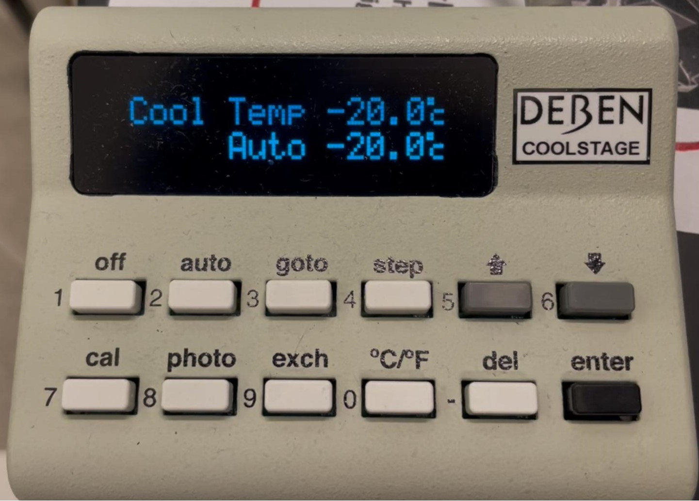
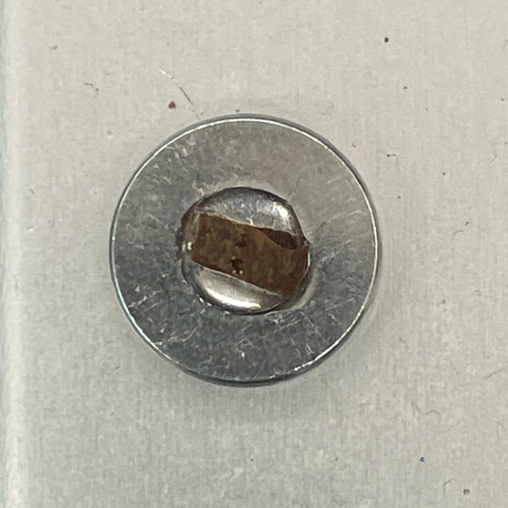
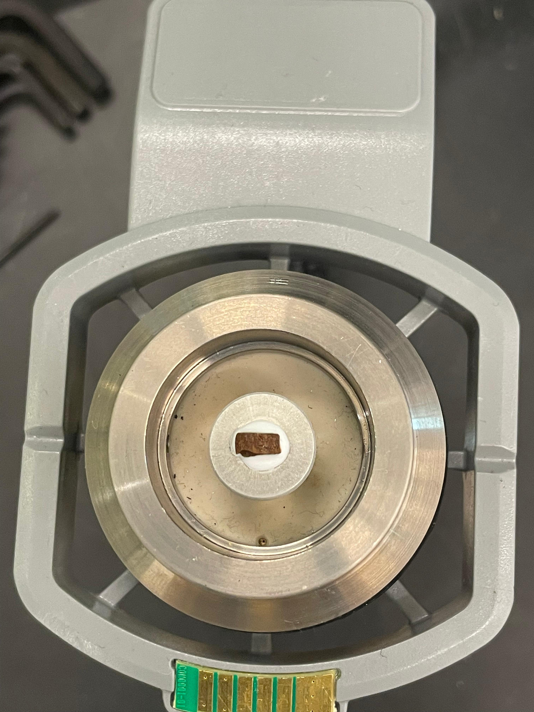

# Thermo Fisher Phenom Pure SEM

## Overview

The Phenom Pure is the Breakerspace SEM for small mounted samples, straightforward imaging, low-vacuum imaging, and cold-stage work. It accepts one sample on an 18 mm or smaller stub, has BSD and SED detectors, and can use a temperature-controlled cold stage for frozen or beam-sensitive samples. It does not have EDS.

This page is the operating page for the Phenom Pure only. For the Phenom XL, use the [Phenom XL operating page](./phenom-xl.html). For help choosing between the two SEMs, use the [shared SEM hub](./sem.html).

### Quick Actions

| Need | Use this link |
| --- | --- |
| New lab user or untrained SEM user | [Register for a Breakerspace lab training](https://breakerspace.libcal.com/calendar?cid=19408&t=w&d=0000-00-00&cal=19408&ct=69558&inc=0) |
| Reserve instrument time | [Open Phenom Pure SEM reservations](https://breakerspace.libcal.com/seat/174787) |
| Compare XL and Pure | [Open the shared SEM hub](./sem.html) |
| Need manufacturer documentation | [Phenom Pure manuals](#manuals) |
| Need practice tasks | [Exercises](#exercises) |

### Page Index

* [Standard operating protocol](#sop) - ([startup](#startup), [operation](#operation), [shutdown](#shutdown))
* [Compatible materials and shared sample rules](#materials)
* [Phenom Pure sample limits](#pure-limits)
* [Sample prep at a glance](#prep)
* [Quick imaging settings](#quick-settings)
* [Detailed operating instructions](#details)
* [Cold stage](#cold-stage)
* [Data processing and analysis](#data)
* [Common failure modes](#failures)
* [Manufacturer manuals](#manuals)
* [Exercises](#exercises)
* [Tutorial to-do list](#todo)

### Standard Operating Protocol

#### Instrument Startup

* Log on to the instrument workstation using your MIT Kerberos.
* Start the Phenom User Interface software.
* Wake the instrument if needed.
* If the instrument does not connect automatically, open [Settings / Phenom / Status](../assets/img/tutorials/sem/connect.PNG) and connect to the microscope.
* If using the cold stage, switch on the chiller unit about 30 minutes before imaging so the cooling water reaches operating temperature.

#### Operation

* Wear nitrile gloves when handling samples, stubs, sample holders, stages, and sample-prep tools.
* [Prepare samples](#prep) externally at the sample prep table.
* Confirm that the sample is dry or fully frozen, firmly attached, free of loose particles, and below the Pure holder height limit.
* The highest part of the sample must sit below the top edge of the Phenom Pure holder.
* [Load](#loading) the sample holder into the instrument.
* Remove gloves before using the computer.
* Set the image [label and save location](#customize).
* Use NavCam to navigate, move to SEM view, adjust imaging settings, focus, and acquire images.
* Wear gloves again, unload samples, and leave the holder clean and stored correctly.

#### Instrument Shutdown

* Save and copy any data you need.
* Close the Phenom software. Press F11 if you need to exit fullscreen view.
* Log off Windows.
* The microscope will put itself in standby.
* If you used the cold stage, turn cooling off at the controller, allow the stage to return toward room temperature, then switch off the chiller unit.



### Phenom Pure Sample Limits

* Mount one sample on an 18 mm or smaller stub.
* The highest part of the sample must sit below the top edge of the sample holder.
* Use the holder or stage appropriate for the intended vacuum mode.
* Do not use the Phenom XL tray-height rule on the Pure.
* Never load a loose, wet-unfrozen, shedding, or over-height sample.





The Phenom Pure does not have EDS. Use the [Phenom XL](./phenom-xl.html) if elemental analysis is required.

### Detailed Operating Instructions



#### Phenom Pure Sample Loading

1. Use the holder or stage appropriate for your intended vacuum mode. Follow the labels on the actual holders and ask staff if the holder choice is unclear.
2. Mount one sample on an 18 mm or smaller stub.
3. Adjust height so the highest part of the sample is below the top edge of the holder.
4. Unlock the sample compartment with the software eject button.
5. Open the door manually and insert the holder.
6. Close the door firmly and wait for the sample to move to the optical NavCam position.

The sample must never sit above the holder edge. An over-height sample can be destroyed during loading and can damage the microscope.

#### Phenom Pure Cold Stage

Use the cold stage for wet, vacuum-sensitive, or heat-sensitive samples that need to be frozen or cooled during imaging. Smaller samples usually work better because they freeze faster and are less likely to deform or frost over.

##### Cold Stage Setup

1. Switch on the chiller unit about 30 minutes before use.
2. Confirm the chiller has airflow around it and is not against a heat source.
3. Check whether the [water reservoir](../assets/img/tutorials/sem/cold_stage_refilling_water.jpeg) needs refilling. Use deionized water only.
4. Place the cold-stage sample holder in its stand.
5. Mount the sample on the metal stub using [cryo-embedding compound](../assets/img/tutorials/sem/cold_stage_cryo_embedding_fluid.jpeg), not normal SEM adhesive.
6. Use a 1.5 mm Allen wrench to [adjust sample height](../assets/img/tutorials/sem/cold_stage_adjusting_sample_height.jpeg). The sample must sit below the top edge of the holder.
7. Insert the [connector block](../assets/img/tutorials/sem/cold_stage_gif_putting_in_connector.gif) into the SEM.
8. Turn on the [main unit](../assets/img/tutorials/sem/cold_stage_on_switch.jpeg), then use the controller to set the target temperature.

<figure style="margin-left:0; margin-right:0;">
  
  
  <figcaption>Cold-stage connector and sample-holder loading.</figcaption>
</figure>

##### Freezing Workflow

1. Remove excess liquid from the outside of the sample. Extra water encourages frost.
2. Keep the feature of interest away from the cryo gel, because the gel can obscure surface features.
3. Find the warmest temperature that reliably freezes your sample. Lower temperatures are not automatically better; excessive cooling can promote ice growth.
4. Wait until the cryo gel turns fully white before loading. Unfrozen gel can bubble or splatter in vacuum.
5. If your sample is thick, wait until the top surface is also frozen, but avoid leaving it exposed long enough to accumulate condensation.
6. Load the cold stage into the SEM.
7. After you find an area of interest, use photo mode on the controller before acquiring a final image to reduce drift.

<figure style="margin-left:0; margin-right:0;">
  
  
  
  <figcaption>Cold-stage controller, mounted sample, and frozen cryo gel.</figcaption>
</figure>

If the image flickers, bright bands streak across the field of view, or the sample appears to bubble, boil, collapse, or drift rapidly, eject the sample immediately and ask staff for help. These are signs that the sample may be outgassing or changing under the beam.



#### Phenom Pure Sample Unloading

1. Stop image acquisition if any collection is running.
2. Return to the normal SEM interface if needed.
3. Use the eject/unload control to bring the sample back to the loading position.
4. Wear gloves before touching the sample holder.
5. Open the sample compartment.
6. Remove your sample.
7. Return the holder to its drawer or stand.
8. If a holder is dirty, ask staff whether it should be cleaned before storage.





#### Phenom Pure Specific Failure Modes

| Symptom | Likely cause | What to try |
| --- | --- | --- |
| "Place sample holder correctly" or similar holder error | Holder seal/contact may be dirty or mis-seated | Remove and reseat the holder; check the seal; ask staff before cleaning or disassembling anything. |
| Cold-stage image flickers or bright bands streak across the image | Wet sample outgassing or not fully frozen | Eject immediately; use a fresh smaller sample, freeze more carefully, remove excess water, or use a lower target temperature. |
| Sample holder will not load smoothly | Sample may be above the holder edge or holder may not be seated correctly | Stop, unload if safe, and verify the sample is below the top edge of the holder. Ask staff before retrying. |

### Manufacturer Manuals

* [Phenom Pure user manual](https://www.dropbox.com/scl/fi/7ju8ldfdm0p04m6n81men/Phenom-ProX-G6-User-Manual.pdf?rlkey=l6gg1ld4zpmtxgrsxfgw00jpb&dl=0)
* [Phenom Pure temperature controlled stage manual](https://www.dropbox.com/scl/fi/nqcrhb3axctk6782k5hqk/User-Manual_Phenom_Temperature-Stage.pdf?rlkey=r01r9dl6k1km22to13s0nir24&dl=0)
* [Phenom Pure all docs](https://www.dropbox.com/scl/fo/th7xj2e2ul1sed2vobibt/ACVAySN_rjR_JnEXtPfs3_8?rlkey=3j90cjbe0akxyu7o3fanrxvn5&dl=0)

### Exercises

* **Level 1 - General Phenom Pure training:** Prepare and image a small piece of hair. Load it on the Pure holder, navigate with NavCam, focus in LiveSEM, acquire images at several magnifications, and compare a cut end with a torn or broken end.
* **Level 2 - Non-conductive sample comparison:** Image an uncoated non-conductive sample in low vacuum, then sputter coat a similar sample and compare resolution, charging, and surface contrast.
* **Level 2 - Cold-stage observation:** Use a staff-approved small wet or heat-sensitive sample. Document the freezing temperature, imaging behavior, and signs of frost, outgassing, or beam damage.
* **Level 3 - Specialist training:** Prepare a beam-sensitive sample and compare image quality at different voltage/intensity combinations.

### Tutorial To-Do List

* Add a complete Pure level 1 training example using a specific material-library sample, including bin number/location once the cabinet is organized.
* Add photos or GIFs showing Phenom Pure holder selection, stub loading, and the correct below-holder-edge height check.
* Add a GIF of setting the image label and save location in the Phenom software.
* Add a GIF of moving from NavCam to LiveSEM, focusing, and acquiring the first image.
* Add cold-stage photos or GIFs showing cryo gel turning fully white, acceptable vs excessive frost, and black wire/connector placement during loading.
* Add before/after image examples of cold-stage drift, frost, and sample outgassing.
