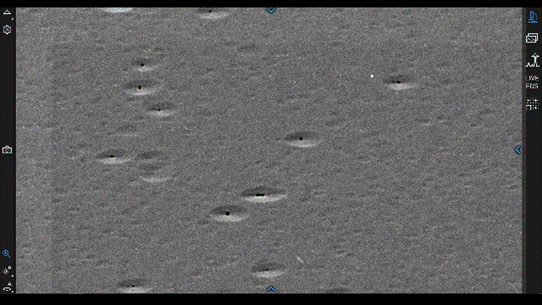

# Thermo Fisher Phenom XL SEM

## Overview

The Phenom XL is the Breakerspace SEM for large samples, multiple stubs, and EDS elemental analysis. It has a 100 mm x 100 mm stage, BSD and SED detectors, low-vacuum imaging for non-conductive samples, and energy dispersive spectroscopy (EDS).

This page is the operating page for the Phenom XL only. For the Phenom Pure, use the [Phenom Pure operating page](./phenom-pure.html). For help choosing between the two SEMs, use the [shared SEM hub](./sem.html).

### Quick Actions

| Need | Use this link |
| --- | --- |
| New lab user or untrained SEM user | [Register for a Breakerspace lab training](https://breakerspace.libcal.com/calendar?cid=19408&t=w&d=0000-00-00&cal=19408&ct=69558&inc=0) |
| Reserve instrument time | [Open Phenom XL SEM reservations](https://breakerspace.libcal.com/seat/174786) |
| Compare XL and Pure | [Open the shared SEM hub](./sem.html) |
| Need manufacturer documentation | [Phenom XL manuals](#manuals) |
| Need practice tasks | [Exercises](#exercises) |

### Page Index

* [Standard operating protocol](#sop) - ([startup](#startup), [operation](#operation), [shutdown](#shutdown))
* [Compatible materials and shared sample rules](#materials)
* [Phenom XL sample limits](#xl-limits)
* [Sample prep at a glance](#prep)
* [Quick imaging settings](#quick-settings)
* [Detailed operating instructions](#details)
* [EDS and Live EDS](#eds)
* [Data processing and analysis](#data)
* [Common failure modes](#failures)
* [Manufacturer manuals](#manuals)
* [Exercises](#exercises)
* [Tutorial to-do list](#todo)

### Standard Operating Protocol

#### Instrument Startup

* Log on to the instrument workstation using your MIT Kerberos.
* Start the Phenom User Interface software.
* Wake the instrument if needed.
* If the instrument does not connect automatically, open [Settings / Phenom / Status](../assets/img/tutorials/sem/connect.PNG) and connect to the microscope.

#### Operation

* Wear nitrile gloves when handling samples, stubs, sample holders, stages, and sample-prep tools.
* [Prepare samples](#prep) externally at the sample prep table.
* Confirm that the sample is dry, firmly attached, free of loose particles, and below the XL height limit.
* Set the tallest point of the sample approximately 5-7 mm below the top edge of the XL sample tray unless staff instruct otherwise.
* [Load](#loading) the sample tray into the instrument.
* Remove gloves before using the computer.
* Set the image [label and save location](#customize).
* Use NavCam to navigate, move to SEM view, adjust imaging settings, focus, and acquire images.
* For EDS or Live EDS, stop acquisition before moving to another area or returning to SEM observation.
* Wear gloves again, unload samples, and leave the tray clean and stored correctly.

#### Instrument Shutdown

* Save and copy any data you need.
* Close the Phenom software. Press F11 if you need to exit fullscreen view.
* Log off Windows.
* The microscope will put itself in standby.



### Phenom XL Sample Limits

* Maximum sample footprint: 100 mm x 100 mm.
* Maximum sample height: 35 mm absolute instrument limit, but normal loaded samples should sit approximately 5-7 mm below the top edge of the sample tray unless staff instruct otherwise.
* Use stub tweezers when loading mounted stubs into the tray.
* For EDS, a working distance around 4-7 mm is usually a useful target after the sample is loaded and in SEM view.
* Never load a loose, wet, shedding, or over-height sample.



For EDS samples, prefer conductive mounting and avoid coating materials that interfere with the elements of interest. Gold coating is excellent for imaging but can complicate EDS; carbon coating is often better for inorganic EDS.



For EDS, start with 15 kV, Map intensity, and a working distance around 4-7 mm. Stop EDS before moving to another area.

### Detailed Operating Instructions



#### Phenom XL Sample Loading

1. Open the sample compartment using the software eject button.
2. Remove the sample tray.
3. Using stub tweezers, push each stub pin into an open hole in the tray.
4. Confirm that every sample is firmly attached and no loose particles are present.
5. Set the tallest point of the tallest sample approximately 5-7 mm below the top edge of the sample tray unless staff instruct otherwise.
6. Insert the sample tray into the loading bay.
7. Close the compartment using the software eject button.
8. Wait for the stage to move to the optical NavCam position.

The height rule is instrument-critical. Do not use the Phenom Pure holder-edge rule on the XL, and do not estimate height by eye if a sample is tall or irregular.



#### EDS And Live EDS

[Energy dispersive spectroscopy (EDS)](https://www.thermofisher.com/blog/materials/edx-analysis-with-sem-how-does-it-work/) uses X-rays generated by the electron beam to estimate which elements are present in a region of the sample. On the Phenom XL, use EDS for elemental spot checks, line scans, maps, and reports.

Start with:

* 15 kV accelerating voltage.
* Map beam intensity.
* Working distance between about 4 mm and 7 mm.
* A stable, well-focused image before starting analysis.
* Conductive mounting or low-vacuum/coating strategy appropriate for the sample.

Live EDS is useful for quick spot checks. Formal EDS/EID projects are better when you need saved spectra, maps, reports, or raw CSV data.

Always stop EDS or Live EDS before navigating to another area, returning to normal SEM observation, or unloading. If the software complains when you try to leave EDS, return to the EDS interface and press stop.

For EDS data:

* Save EDS/EID projects if you need to return to the analysis later.
* Export reports, maps, spectra, and CSV data as needed.
* Be cautious with automatic peak labels. Check whether peaks overlap and whether coating, tape, stub, or mounting materials contributed elements.

<figure style="margin-left:0; margin-right:0;">
  
  
  <figcaption>Live EDS is good for quick checks; EDS/EID projects are better for saved spectra, maps, and reports.</figcaption>
</figure>

#### Phenom XL Sample Unloading

1. Stop EDS, Live EDS, or image acquisition if any collection is running.
2. Return to the normal SEM interface if needed.
3. Use the eject/unload control to bring the sample tray back to the loading position.
4. Wear gloves before touching the sample tray.
5. Open the sample compartment.
6. Remove your sample.
7. Return the tray to the sample compartment and close the door.
8. If the tray is dirty, ask staff whether it should be cleaned before storage.





#### Phenom XL Specific Failure Modes

| Symptom | Likely cause | What to try |
| --- | --- | --- |
| Sample appears too close to the detector or stage will not move as expected | Sample may be too tall for the XL tray position | Stop, unload if safe, and verify the sample is approximately 5-7 mm below the top edge of the tray. Ask staff before retrying. |
| EDS has low or no counts | Working distance, voltage, intensity, or geometry is wrong | Use 15 kV, Map intensity, and working distance about 4-7 mm; confirm the detector is collecting before a long map. |
| Cannot leave EDS or Live EDS | Acquisition is still running | Return to the EDS interface and press stop before navigating away. |

### Manufacturer Manuals

* [Phenom XL user manual](https://www.dropbox.com/scl/fi/iyd538gtkj79kg0bc8113/2020-MS-Phenom-XL_User-Manual.pdf?rlkey=0yk985nvgz3lckqnrtxwo7afv&dl=0)
* [Phenom XL tensile stage manual](https://www.dropbox.com/scl/fi/fu39pi9pamr2top97cv6m/Tensile-Stage-Training-Manual.pdf?rlkey=xs9dkadn6k16f9vpo3vc3y2h7&dl=0)
* [Phenom XL all docs](https://www.dropbox.com/scl/fo/mk2sedrkfsvpllralaj4c/AMh_Ma2bU_Tl8Ul0u6xmiG4?rlkey=962g3kifk9bll59jv1ib9w86d&dl=0)

### Exercises

* **Level 1 - General Phenom XL training:** Prepare and image a small piece of hair. Load it on the XL tray, navigate with NavCam, focus in LiveSEM, acquire images at several magnifications, and compare a cut end with a torn or broken end.
* **Level 2 - EDS practice:** Prepare salt and sugar on the same stub. Use morphology first, then EDS on the Phenom XL, to decide which is which.
* **Level 2 - Non-conductive sample comparison:** Image an uncoated non-conductive sample in low vacuum, then sputter coat a similar sample and compare resolution, charging, and surface contrast.
* **Level 3 - Specialist training:** Prepare a powder sample sparse enough for particle sizing. Acquire images suitable for measuring particle diameter and compare the result with a poorly dispersed sample.

### Tutorial To-Do List

* Add a complete XL level 1 training example using a specific material-library sample, including bin number/location once the cabinet is organized.
* Add photos or GIFs showing XL tray removal, stub loading, and the correct 5-7 mm below-tray height check.
* Add a GIF of setting the image label and save location in the Phenom software.
* Add a GIF of moving from NavCam to LiveSEM, focusing, and acquiring the first image.
* Add a GIF of starting and stopping Live EDS, emphasizing the stop button before navigating away.
* Add screenshots of a complete EDS report/export workflow and example CSV/raw-data export.
