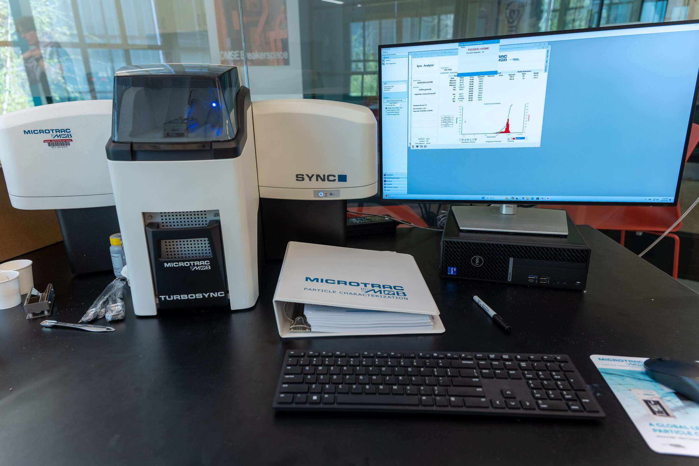

# Microtrac Sync Particle Size Analyzer

## Overview

The Microtrac Sync particle size analyzer measures the particle size distribution of dry powders using laser diffraction. It reports how much of a sample falls into each size range, for particles from roughly 0.24 to 2,000 micrometers, in a measurement that takes only a few minutes.

In the Breakerspace configuration, the sample is carried on a vibrating tray, pulled through the measurement zone, and collected in a shop vacuum below the instrument. That means cleanup is minimal, but the analyzed powder cannot be recovered afterward.

This page is the operating page for the particle size analyzer. It combines the quick reference for trained users, detailed training notes, reservation link, manuals, and exercises.

### Quick Actions {#quick-actions}

<section markdown="1">
#### Get started

* [New to the particle size analyzer? Register for training](https://breakerspace.libcal.com/calendar?cid=19408&t=w&d=0000-00-00&cal=19408&ct=69558&inc=0)
* [Reserve time on the particle size analyzer](https://breakerspace.libcal.com/seat/181544)
* [Operating the analyzer now? Follow the standard operating protocol](#sop)
* [Learn the complete operating workflow](#details)
</section>
<section markdown="1">
#### Learn and reference

* [Learn what particle sizing can show you](#science)
* [Analyze and process your data](#data)
* [View manufacturer manuals](#manuals)
* [Try the practice exercises](#exercises)
</section>

### What This Instrument Shows You {#science}

#### The Basic Idea

Most real powders are not a single size. A spoonful of flour, sand, pigment, or powdered drug is a mixture of many particles spanning a range of sizes, and that range often matters more than any single average. Particle size analysis measures that whole distribution.

This instrument uses laser diffraction. When a laser beam hits a particle, the light scatters, and the pattern of scattered light depends on the particle's size: small particles scatter light through wide angles, while large particles scatter it through narrow angles near the original beam direction. The analyzer shines a laser through a stream of your powder, records the scattered-light pattern with an array of detectors, and works backward to the distribution of sizes that would produce that pattern.

The result is a curve showing how much of the sample sits in each size range, rather than one number. You can look at that curve as a distribution by volume, by particle count, or by other bases, depending on what your question is.

#### What Scientists Use It For

* A materials scientist can check whether a milled or ground powder reached the target size range, and how wide the spread is.
* A pharmaceutical or food scientist can relate particle size to dissolution rate, texture, or how a powder flows and packs.
* A ceramics or metal-powder user (for example, someone preparing feedstock for pressing or 3D printing) can confirm the powder is neither too fine nor too coarse for the process.
* An environmental or geology researcher can characterize sediments, soils, dusts, or airborne particulate samples.
* A manufacturing or quality role can compare batches to catch a process that has drifted toward coarser or finer output.
* A curious student can measure everyday powders (flour, sugar, cocoa, spices, cosmetics, sand) and connect a number to something they can see and feel, then ask why the size turned out the way it did.
* A coffee-loving student in [3.000 Coffee Matters](../3000.html) can measure how a grinder's setting changes the size distribution of the grounds, and connect that to extraction: finer grounds have more surface area and extract faster, which is a big part of why grind size changes how a cup tastes.

#### What To Look For In The Results

Start with the shape and center of the distribution. Common summary values are D10, D50, and D90: the sizes below which 10%, 50%, and 90% of the sample falls. D50 is the median size, and the spread between D10 and D90 tells you how wide the distribution is.

Next, look for more than one peak. A single hump means a fairly uniform powder; two or more humps (a bimodal distribution) can mean a mix of two populations, or that fine particles are sticking together into larger clumps (agglomerates).

Finally, remember the measurement basis matters. A volume-based distribution is dominated by the larger particles (a few big particles hold a lot of volume), while a number-based distribution emphasizes the many small ones. The same sample can look quite different depending on which basis you plot, so note which one you are reading.

#### What This Instrument Cannot Tell You

* It measures size, not chemistry. It cannot tell you what a powder is made of, only how big its particles are.
* It sees an equivalent size, not shape. Laser diffraction reports the size of a sphere that would scatter light the same way, so a needle or flake is reported as an equivalent diameter rather than described as a needle or flake.
* It cannot separate a true large particle from a clump of small ones. Agglomerated fines can be measured as single larger particles, which is why sample loading matters.
* It works here only with dry, free-flowing powders in the 0.24-2,000 µm range. Wet samples, sticky powders, and particles outside that range are not appropriate for this configuration.
* It gives a distribution, not a picture. To see actual particle shapes, pair it with microscopy (the optical microscope or SEM).

### Standard Operating Protocol {#sop}

#### Instrument Startup {#startup}

* [Power on the instrument](../assets/img/tutorials/psa/power-switch.JPG) [if needed](../assets/img/tutorials/psa/status-light.JPG). The instrument may be left powered on, so it is often already on.
* Log on to the instrument workstation using your MIT Kerberos.
* Open the Microtrac FLEX software.
* From the [_Open Analyzer_ menu, select _Sync Analyzer_](../assets/img/tutorials/psa/connect.png).
* Wait while the instrument initializes. Keep the sample compartment door closed during initialization.

#### Operation {#operation}

* [Check the active database](../assets/img/tutorials/psa/database.png) and [change or create a new one](../assets/img/tutorials/psa/database-change.png) if needed, so your data is saved where you expect.
* [Load a measurement SOP](../assets/img/tutorials/psa/load-sop.png). If no suitable SOP exists, ask lab staff for assistance.
* Clean loose particles from the sample area (see [cleaning the sample area](#cleaning)).
* Load the sample: about 1/4 teaspoon for the shallow sample tray, spread evenly and not compressed (see [loading a sample](#loading)).
* Close the sample compartment door.
* Run the Auto-Sequence, editing the title, sample ID, and notes as appropriate.
* Repeat as needed.

#### Instrument Shutdown {#shutdown}

* Export data as needed (data is also saved automatically to the active database).
* Close the FLEX software.
* Log off the Windows workstation.
* The instrument may be left powered on.
* Leave the sample area and work surface clean.

### Compatible Materials And Sample Prep {#materials}

* Any non-hazardous, dry, free-flowing powder with particles between 0.24 and 2,000 micrometers.
* The powder must be dry. Wet, damp, sticky, oily, or paste-like samples are not appropriate for this dry configuration.
* Powders that are hazardous, reactive, toxic, or that produce harmful dust are not appropriate. Because the sample is drawn into the instrument and its vacuum as airborne powder, the material must be safe to aerosolize.
* Remember that the analyzed sample is pulled into the shop vacuum and cannot be recovered, so do not run a powder you need to keep.
* Very cohesive or clumping powders may be measured as larger particles than they really are; mention this to staff if it matters for your sample.

<em>If you have any questions about whether a material is appropriate to characterize in the Breakerspace, please ask before bringing it to the lab.</em>

### Quick Method Selection {#quick-method}

| Situation | Approach | Starting thought |
| --- | --- | --- |
| Typical dry powder in the size range | Shallow sample tray, standard measurement SOP | Use about 1/4 tsp, spread evenly and uncompressed. |
| You think you need the deep tray | Ask staff first | The shallow tray is standard; the deep tray is a staff-guided exception. |
| No suitable measurement SOP is loaded | Ask staff to help select or create one | Do not guess at SOP parameters; the SOP controls how the sample is measured. |
| Results look bimodal or coarser than expected | Re-check loading and cleaning, then re-run | Clumping or contamination from a previous sample is a common cause. |

### Detailed Operating Instructions {#details}

The sections above are a quick reference for trained users. The sections below are a training guide for new users, with the practical details and videos that are easiest to follow at the instrument.

The workflow is short: start the software, connect to the instrument, let it initialize, confirm the active database, load a measurement SOP, clean and load the sample tray, run the auto-sequence, then save and close. The videos below cover the physical steps (cleaning, loading, collection) on their own, out of sequence; see the [standard operating protocol](#sop) for the full order.

#### Cleaning The Sample Area {#cleaning}

Loose particles left from a previous sample can be drawn into the instrument and skew your result. Wipe them up with a Kimwipe lightly wetted with isopropanol. For a more thorough cleaning, the sample tray and its carrier can be removed.

  <iframe class="responsive-iframe" title="Cleaning the particle size analyzer sample area" src="https://www.youtube.com/embed/CEDb8fk9C0I?si=O2J6BDKxPWnC9m0C"></iframe>

#### Loading A Sample {#loading}

* The instrument has a shallow and a deep sample tray. Use the shallow tray for normal work; if you think you need the deeper tray, talk with lab staff first.
* Load the shallow tray with about 1/4 teaspoon of dry powder. The amount is forgiving, so a little more or less is fine. Wipe the measuring spoon with an isopropanol-wetted Kimwipe before and after loading.
* Keep the powder behind the line on the tray, and spread it along the tray's length. It need not be perfectly even, and a little in front of the line is fine.
* **Do not compress the powder.** Packing it down creates clumps that the instrument can read as single large particles, which is the most common way to distort a result.
* Close the sample compartment door before analyzing; the sample cannot be measured with the door open.

  <iframe class="responsive-iframe" title="Loading a sample into the particle size analyzer" src="https://www.youtube.com/embed/IbPc-y7S9tU?si=WVRutCo-v9ow8Bwf"></iframe>

#### Full Sequence Of Software Operation {#software}

The software layout can be confusing, so this screen capture walks through the full sequence: starting the software, initializing the instrument, and collecting and exporting data. Remember to load your sample after selecting the measurement SOP and before starting the auto-sequence.

  <iframe class="responsive-iframe" title="Particle size analyzer software workflow" src="https://www.youtube.com/embed/TvgfB1BDVO4?si=zmK_IY1oiU3FRg6B"></iframe>

#### Sample Collection {#collection}

After your sample is loaded and the tray door is closed, run the auto-sequence (editing title, sample ID, and notes as appropriate). The sequence then proceeds on its own:

* The shop vacuum under the instrument runs for several seconds to pull any loose particles into the instrument and clear the analysis chamber before the setzero.
* The setzero runs next. Setzero measures the background signal while the instrument is collecting data with no sample being fed in.
* Once setzero is complete, the sample tray moves under the collection nozzle and the sample is pulled into the instrument.
* After passing through the analysis chamber, the sample is collected in the shop vacuum below. This means there is little to no cleanup for you, and there is no way to recover the analyzed powder.

  <iframe class="responsive-iframe" title="Particle size analyzer sample collection process" src="https://www.youtube.com/embed/Mt9QangPK5A?si=Q_4IEbZVe66QyiD5"></iframe>

### Data Processing And Analysis {#data}

Data is automatically saved in the database that is active when the auto-sequence starts, so it will not be lost short of a workstation hardware failure. You can review and export it at any time. The software also prompts you to save the report generated after the sample is collected.

The distribution in the report can be recalculated to show a distribution based on particle diameter, particle volume, or the number of particles in a given size range. Keep in mind:

* Note which basis (volume, number, diameter) you are reporting, because the same sample looks different on each.
* Summary values such as D10, D50, and D90 describe the center and spread of the distribution; report them together rather than a single average.
* Watch for a second peak, which can indicate a mixed population or agglomerated fines.

The data from this instrument is fairly straightforward, but please ask lab staff if you have questions about data processing and analysis.

### Common Failure Modes {#failures}

| Symptom | Likely cause | What to try |
| --- | --- | --- |
| Error when connecting, initializing, or running | Sample compartment door was open | Close the door and retry; keep it closed during initialization and measurement. |
| Result is coarser than expected, or shows an extra large-size peak | Sample was compressed into clumps, or loose particles from a previous sample were present | Reload without compressing the powder, clean the sample area first, and re-run. |
| Distribution drifts between repeat runs | Contamination in the sample area, or uneven loading | Clean the tray and carrier, load evenly, and repeat on a representative portion. |
| Software will not connect to the analyzer | Instrument not finished initializing, or wrong analyzer selected | Confirm the instrument is powered and initialized, then reselect _Sync Analyzer_ from the _Open Analyzer_ menu. |
| Data cannot be found later | Saved to the wrong database | Check and set the active database before running the auto-sequence. |

### Manufacturer Manuals {#manuals}

* [FLEX Software user manual](https://www.dropbox.com/scl/fi/3ddebzi863eyws7p2mng7/FLEXUserManual.pdf?rlkey=v3t5hi943n80f5qel6b9jsava&dl=0)
* [Sync Analyzer operating manual](https://www.dropbox.com/scl/fi/7bdbl13wf2qp0opfyu7kf/SyncOps.pdf?rlkey=cngpmueowutw93dp6owwodvwf&dl=0)
* [Folder with all Microtrac manuals](https://www.dropbox.com/scl/fo/7zzq8zavh4sdgp6ocsvxp/AOtHdsXKGdp0zR7qAeWuJnA?rlkey=fx9idwfle5tvuod39w0djj7ew&dl=0)

### Links {#links}

* [Microtrac Sync video library](https://www.microtrac.com/downloads/videos/)

### Exercises {#exercises}

* **Level 1 - Measure a known powder:** Run a provided standard powder through the full workflow, save the report, and record the D10, D50, and D90. Note which measurement basis (volume or number) you used.
* **Level 2 - Loading effect:** Run the same powder loaded carefully and evenly, then loaded compressed or mounded. Compare the distributions and explain how loading changed the apparent size.
* **Level 2 - Compare two powders:** Measure a fine powder and a coarse powder and compare their distributions, describing the difference in D50 and spread.
* **Level 3 - Volume vs. number basis:** Take one measurement and recalculate it on volume and number bases. Explain why the same sample looks different and when each basis is appropriate.
* **Level 3 - Size and shape together:** Measure a powder here, then image the same powder on the optical microscope or SEM, and discuss what the equivalent-diameter distribution does and does not capture about the real particle shapes.
