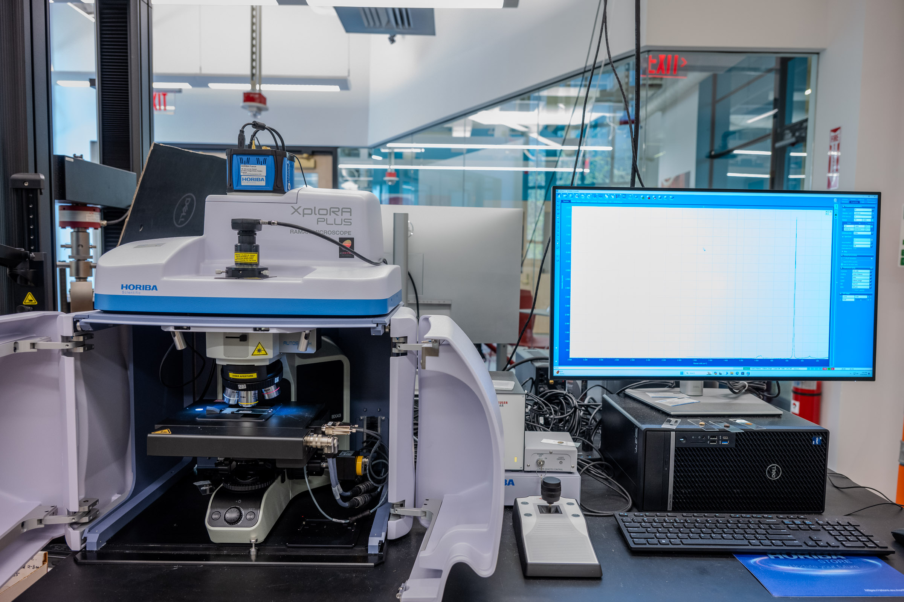

# Horiba XploRA Confocal Raman Microscope

## Overview

The Horiba XploRA is a confocal Raman microscope: it combines an optical microscope with a Raman spectrometer, so you can focus on a specific spot of a sample and collect a spectrum that helps identify what it is made of. It works on solids, powders, liquids, and gases, and is especially useful for organics, polymers, and many inorganic compounds.

The Breakerspace system is configured with three lasers (532 nm, 638 nm, and 785 nm) and four diffraction gratings (600, 1200, 1800, and 2400 grooves/mm), which let you trade off signal strength, spectral resolution, and fluorescence to suit different samples.

This page is the operating page for the Raman microscope. It combines the quick reference for trained users, detailed training notes, reservation link, manuals, and exercises.

### Quick Actions {#quick-actions}

<section markdown="1">
#### Get started

* [New to the Raman microscope? Register for training](https://breakerspace.libcal.com/calendar?cid=19408&t=w&d=0000-00-00&cal=19408&ct=69558&inc=0)
* [Reserve time on the Raman microscope](https://breakerspace.libcal.com/seat/174794)
* [Operating the Raman now? Follow the standard operating protocol](#sop)
* [Learn the complete operating workflow](#details)
</section>
<section markdown="1">
#### Learn and reference

* [Learn what Raman spectroscopy can show you](#science)
* [Choose a laser and grating](#laser-grating)
* [Map measurements across an area](#mapping)
* [Measure depth in a clear sample with confocal z-depth profiling](#z-profiling)
* [Analyze and process your data](#data)
* [Try the practice exercises](#exercises)
</section>

### What This Instrument Shows You {#science}

#### The Basic Idea

Raman spectroscopy identifies materials by how their molecules vibrate. When you shine a laser on a sample, almost all the light bounces off unchanged, but a tiny fraction exchanges a little energy with the molecule's vibrating bonds and comes back at slightly shifted wavelengths. Measuring those small shifts produces a spectrum with peaks at characteristic positions, a molecular "fingerprint" that often identifies a compound outright.

Because the XploRA is a *microscope*, you aim that laser through an objective lens at a specific spot, often just a few micrometers across. You can see the sample on screen, pick the exact feature you care about, and collect a spectrum from that point.

It is also a *confocal* Raman microscope, but with an important detail: the confocality applies only to the Raman signal path, not to the optical camera image. A confocal hole in the Raman path rejects light from above and below the focal plane, which lets the instrument probe specific depths within a transparent or layered sample. The optical microscope image itself is not confocal, so what you see on the camera is a normal (widefield) view.

Raman is often described as complementary to FTIR. Both probe molecular vibrations, but they respond to different kinds of bonds, so a feature that is weak in one is frequently strong in the other. A material that is difficult in the FTIR may be straightforward in the Raman, and vice versa.

#### What Scientists Use It For

* A chemist or materials scientist can identify an unknown solid, powder, or liquid by matching its Raman fingerprint to reference spectra.
* A pharmaceutical scientist can tell apart the active ingredients in a combination tablet, and even map where each is distributed across the surface.
* A geologist or gemologist can identify minerals and gemstones nondestructively, without cutting or dissolving the sample.
* An art conservator or forensic examiner can identify pigments, inks, fibers, or residues from a tiny spot without damaging the object.
* A semiconductor or 2D-materials researcher can measure strain, layer number, and quality in materials such as silicon, diamond, and graphene.
* A curious student can compare everyday plastics (is this container PET, HDPE, or polystyrene?), check whether two white powders are actually the same thing, or probe the layers of a snack-bag film.

#### What To Look For In The Results

Start with the peak positions. Raman peaks are plotted against "Raman shift" in wavenumbers (cm-1), and their positions are the primary fingerprint. Matching that pattern of positions against reference spectra is how compounds are identified, and a good match lines up several peaks rather than one.

Watch for a broad, sloping background swamping the peaks. That usually means fluorescence, where the sample re-emits light far more strongly than it Raman-scatters. It is the most common reason a Raman measurement fails, and the usual fix is a longer-wavelength laser (see [laser and grating selection](#laser-grating)).

Finally, judge peak sharpness and signal strength against your settings. Sharp, well-separated peaks may need a finer grating to resolve; a weak signal may need a shorter-wavelength laser or longer collection. The [detailed instructions](#details) explain these trade-offs.

#### What This Instrument Cannot Tell You

* It does not work well on metals, which do not produce a useful Raman signal, or on simple ionic salts such as NaCl.
* Strongly fluorescing materials can overwhelm the Raman signal entirely; if a sample still fluoresces with the 785 nm laser, it may simply not be suitable.
* It reports which molecules or bonds are present, not a full quantitative composition by default.
* It samples a tiny spot. That is powerful for targeting a feature, but it means one spectrum may not represent a non-uniform sample; sample several spots.
* Higher-energy lasers can heat or burn delicate, dark, or temperature-sensitive samples, so the "strongest signal" setting is not always safe to use.

### Standard Operating Protocol {#sop}

#### Instrument Startup {#startup}

* Log on to the instrument workstation using your MIT Kerberos.
* Open the LabSpec 6 software.
* Confirm the instrument is powered on. It should always be left powered on.
* Turn the laser emission remote-control power to on if needed. This enables the lasers but does not fire one.

#### Operation {#operation}

* Prepare your sample on a glass microscope slide (see [compatible materials and sample prep](#materials)).
* Lower the microscope stage with the coarse focus knob.
* Load the slide into the slide holder on the stage.
* Set the brightfield light source to full brightness.
* Find approximate focus with the coarse knob, adjusting brightness as needed.
* Refine the focus by rotating the joystick.
* Close the doors on the microscope enclosure.
* Collect Raman spectra as appropriate for your sample (see [detailed operating instructions](#details)).
* Repeat as needed.

#### Instrument Shutdown {#shutdown}

* Remove your sample from the stage and close the doors.
* Turn the laser emission remote-control power to off.
* Save all data. Each spectrum must be selected and saved individually.
* Close LabSpec 6.
* Log off the workstation.

### Compatible Materials And Sample Prep {#materials}

* All materials must be non-hazardous and safe to handle in the Breakerspace.
* The instrument can measure solids, powders, liquids, and gases.
* It works well for organics, polymers, acids and bases, metal oxides, and semiconductors.
* It is not useful for metals, ionic salts such as NaCl, or strongly fluorescing materials.

<em>If you have any questions about whether a material is appropriate to characterize in the Breakerspace, please ask before bringing it to the lab.</em>

#### Sample Prep

* Place the sample on a glass microscope slide.
* The objectives have a short working distance, so grind powders finely and keep the surface level and smooth.
* For a solid without a flat face, mount it to the slide with the sample press and Plastilina mounting clay to create a stable surface to focus on.

### Laser And Grating Selection {#laser-grating}

Choosing the laser and grating is the heart of getting a good Raman spectrum. The tables below summarize the trade-offs explained in the [detailed instructions](#details).

| Laser | Relative energy | When to use it |
| --- | --- | --- |
| 638 nm | Medium | Recommended starting point for most samples. |
| 532 nm | Highest | Switch to it when you need a stronger signal or better signal-to-noise, but avoid it for temperature-sensitive, dark, or delicate samples that could burn. |
| 785 nm | Lowest | Switch to it when the sample fluoresces. If it still fluoresces at 785 nm, it may not be suitable for Raman. |

| Grating (gr/mm) | Resolution | Signal strength | Note |
| --- | --- | --- | --- |
| 600 | Lower | Higher | The CCD usually captures the whole spectrum in one position; good for a first look. |
| 1200 | Medium | Medium | A balance between resolution and signal. |
| 1800 / 2400 | Higher | Lower | May need the grating repositioned five or more times to capture the full spectrum. |

### Detailed Operating Instructions {#details}

The sections above are a quick reference for trained users. The sections below are a training guide for new users that explains why the laser and grating choices matter.

#### Choosing A Laser

The system includes three lasers: 532 nm, 638 nm, and 785 nm. Shorter wavelengths carry more energy and generally produce a stronger Raman signal, which is usually what you want. But higher energy has two costs. First, it can burn temperature-sensitive samples, especially at 532 nm. Second, materials that fluoresce fluoresce more strongly at shorter wavelengths, and that fluorescence can swamp the detector until the Raman peaks are lost in the background.

A practical approach is to start with the 638 nm laser. Move to 532 nm if you need a stronger signal or better signal-to-noise. If you see fluorescence, switch to 785 nm. If the sample still fluoresces at 785 nm, it may not be a good candidate for Raman spectroscopy.

#### Choosing A Grating {#choosing-a-grating}

Scattered light must be spread out by a diffraction grating before the detector can measure its intensity at each wavelength. The system has four gratings: 600, 1200, 1800, and 2400 grooves/mm.

A coarser grating (600 gr/mm) spreads the light less, so more signal lands on the detector at once: higher signal strength but lower resolution, and closely spaced peaks can merge. Finer gratings spread the light more, giving higher resolution at the cost of signal strength.

Finer gratings also produce a [wider dispersion](https://www.dropbox.com/scl/fi/0kcumhfxxhycy8b47l32d/Raman-Spectral-Resolution-Tech-Note.pdf?rlkey=321k53nqc9jn6cdqkqhpb0rzd&st=dr66nh85&dl=0) than the CCD detector chip is wide. The instrument handles this by moving the grating to aim different segments of the spectrum onto the detector in turn. With an 1800 or 2400 gr/mm grating you may need five or more grating positions to capture a full spectrum, whereas the 600 gr/mm grating usually captures it in a single position.

#### Standard Workflow

This is the recommended sequence for a normal session: calibrate the instrument against a silicon standard, then load and measure your own sample. The pattern of "get a camera image, verify the laser, look at a live spectrum, optimize focus for signal" repeats for both the calibration sample and your real sample.

A key habit throughout: **use the "stop all" control to end the current live view before starting the next step.** The camera video and the real-time spectrum use the light path differently, so stop one before starting the other.

**A note on objectives.** The system has 5x, 10x, and 100x objectives. Use the **5x for wayfinding only** — it is handy for locating a feature on the sample, but it is not high enough magnification to collect a Raman signal. Collect spectra with the **10x or 100x** objective. Whichever objective you use, select the matching objective in the software (Acquisition > Instrument Setup), because the software needs to know which one is in place.

##### Part 1: Calibrate With The Silicon Standard

Calibrating against a silicon sample first confirms the instrument is reading the correct Raman shift before you trust any data from your own sample. Silicon has a strong, well-known peak (near 520 cm-1), which makes it the standard reference.

1. **Load the silicon calibration sample** on the stage.
2. **Focus with the top camera** using the 10x or 100x objective. The top camera gives better resolution for a sharp optical focus on the surface. (You can use the 5x to find your way to a feature first, but switch to 10x or 100x to collect.)
3. **Switch to the internal camera and verify the laser comes on.** You should see the laser spot. If no laser is visible, check that the enclosure door is closed, the door interlock is engaged, and the interlock key is in the correct position, then check again. The laser will not fire unless the interlocks are satisfied.
4. **Stop the camera** view.
5. **Start the real-time display (RTD)** to show a quick, continuously refreshing spectrum. Use a short RTD acquisition time (around 1 second) so the display updates quickly, and set the spectro (the center of the spectral window) where you expect the silicon peak.
6. **Refine focus for Raman collection using the joystick knob.** Make small focus adjustments and watch whether the signal goes up or down; focus to maximize the signal. The best optical focus and the focus that maximizes Raman signal are not always identical, which is why you optimize against the live spectrum.
7. **Stop the RTD.**
8. **Run the AutoCalibration routine** (in the Maintenance tab).
9. **Verify the calibration passes** before continuing. If it does not pass, ask staff rather than proceeding.

<em>Note: system AutoAlignment is handled by Breakerspace staff and is done for each laser before it is used. If your calibration will not pass, or a laser seems misaligned, ask staff rather than adjusting alignment yourself.</em>

##### Part 2: Load And Measure Your Sample

With calibration confirmed, measure your own sample using the same get-image / verify-laser / live-spectrum / optimize-focus pattern. **Use "stop all" between each step** to end the current live view before starting the next.

1. **Lower the stage** and remove the silicon sample.
2. **Load your sample** (see [sample prep](#materials)).
3. **Focus with the top camera.** Use the 5x to locate your feature if helpful, then switch to the 10x or 100x to collect. Select the matching objective in the software.
4. **Switch to the internal camera and verify the laser** appears on the sample (re-check the interlocks if it does not).
5. **Use the RTD** to see a live spectrum, and confirm the spectro position covers the wavenumber range where you expect key peaks.
6. **Optimize the focus for signal** with the joystick knob, making small adjustments to maximize the Raman signal, then stop the RTD.
7. **Set up and run your sample collection.** Configure the collection parameters below for your goal and start the measurement.

##### Collection Parameters

RTD is only for checking and optimizing the setup; it does not average spectra. When you are ready to record real data, use the full spectrum acquisition, which averages multiple accumulations over your chosen range. The parameters that matter most:

* **Spectro / spectral range:** the spectro value sets the center of a single detector window; hovering over the box shows the window's width. For a wider spectrum than one window covers, enable the extended **Range** option and enter start and stop values, and the instrument will step the grating through as many positions as needed to cover it.
* **Acquisition (exposure) time:** how long the detector collects for each spectrum. Longer times give more signal and better signal-to-noise, but take longer. Two practical checks: the signal-to-noise should be good enough to see your peaks clearly, and the maximum intensity should stay below about 65,000 counts (above that the detector saturates).
* **Accumulations:** how many spectra are averaged together. More accumulations improve signal-to-noise and let the software reject cosmic-ray spikes, at the cost of time.
* **Number of spectra / positions:** because a Raman spectrum comes from a tiny spot, measuring several spots is often worthwhile for a non-uniform sample.
* **Confocal hole and slit:** these set the confocal behavior and spectral resolution (see [confocal z-depth profiling](#z-profiling) below).
* **ND filter (laser power):** reduces the laser power reaching the sample. Lower the power for delicate, dark, or temperature-sensitive samples; watch the live spectrum to confirm the sample is not being burned (a spectrum that keeps changing during exposure is a warning sign).

Start conservative on exposure time and laser power for an unfamiliar or delicate sample, check the result, then increase if you need more signal. If you are unsure what settings suit your sample, ask staff.

#### AutoFocus {#autofocus}

LabSpec 6 includes an AutoFocus function that steps the focus through a range, watches the signal, and settles at the position that maximizes it. It can help on samples where manual focusing is difficult or unreliable, such as highly polished or featureless surfaces, and it can hold focus across a rough surface during a map.

AutoFocus is slow, however, because it collects signal at many focus positions. **We do not recommend it as a default focusing method.** For a normal measurement, focus manually with the joystick against the live RTD spectrum (see the [standard workflow](#details)). Reach for AutoFocus only when manual focus is not possible or not reliable.

#### Mapping And Area Scanning {#mapping}

Instead of a single spectrum from one spot, the XploRA can collect a grid of spectra across an area and build a map showing how the material varies from place to place. This is how you turn Raman into a chemical image: for example, showing where each active ingredient sits across a combination tablet, or where a contaminant is distributed on a surface.

To set up a map:

1. Acquire a video image of the region you want to map so you can see the area. (For an area larger than one field of view, the video Montage function can stitch several frames together.)
2. In the **Map** section of the Acquisition tab, choose the variables to scan: X and Y for a surface area, Z for depth (see below), or combinations.
3. Set the **step size** between points. Smaller steps give finer detail but many more points.
4. Choose the map area and shape with the map tools (rectangle, circle, line, or a set of chosen points).
5. Set acquisition parameters as for a single spectrum, but keep in mind that a map collects one spectrum per point and can involve hundreds or thousands of points. Favor a single spectral window and shorter per-point acquisition times to keep the total time reasonable.

Because a map can run for a long time, estimate the total time (points times per-point time) before you start. If the sample surface is rough, [AutoFocus](#autofocus) can keep each point in focus during the map, though it adds time.

#### Confocal Z-Depth Profiling {#z-profiling}

Confocal Z-profiling uses the confocal hole to collect spectra at different depths *within* a transparent or translucent sample, rather than only at the surface. It is what lets Raman act like a non-destructive optical "core sample."

**How it works.** A confocal hole (pinhole) sits in the Raman signal path at a plane matched to the focal point. Closing the hole down blocks Raman light coming from above and below the focal plane, so the spectrometer sees mostly the light from the thin layer you are focused on. By stepping the focus deeper (a Z scan) and collecting a spectrum at each depth, you build a depth profile. Remember that this confocality applies to the Raman signal only, not to the optical camera image.

**Why do it.** It is ideal for samples that change with depth: multilayer polymer films, coatings, inclusions inside a transparent matrix, or a material measured through a transparent cover. A confocal depth profile can show where one layer ends and the next begins without physically sectioning the sample.

**How to set it up.**

* Choose a smaller confocal hole for better depth (Z) resolution. A larger hole collects more signal but from a thicker slice, which blurs the depth information; a smaller hole isolates a thinner slice at the cost of signal.
* Set up a **Z** map (or an XYZ map) in the Map section, with a Z step size suited to the layer thickness you expect.
* Expect the signal to fall off as you focus deeper, because the light passes through more material and the focal volume distorts. This is normal; the objective choice affects how severe it is.
* Depth measurements are more advanced than surface spectra; if your project depends on accurate depth resolution, plan the objective, hole size, and step size with staff.

<em>Recommended confocal hole and slit values for routine work and for depth profiling should be confirmed with staff; they depend on the objective and the sample.</em>

### Data Processing And Analysis {#data}

Spectra are collected and saved in LabSpec 6. Remember that each spectrum must be selected and saved individually before you close the software.

Typical processing steps include:

* **Baseline correction:** subtract the sloping background (often from residual fluorescence) so the true peaks stand out.
* **Peak identification:** note the positions of the main peaks in Raman shift (cm-1), which are the basis for identification.
* **Comparison and matching:** compare your peaks against reference spectra, a database, or a known control. As with other fingerprint methods, a good match lines up several peaks, not just one.
* **Export:** save both the raw spectrum and any processed version, and keep a copy on your own storage.

Data processing beyond these basics is best learned at the instrument; please ask lab staff if you have questions about analysis or database searching.

### Common Failure Modes {#failures}

| Symptom | Likely cause | What to try |
| --- | --- | --- |
| Cameras do not connect to the software | Software or camera communication issue | Restart the workstation, then reopen LabSpec 6. |
| No spectrum at all | Laser is not actually on | Confirm the laser is firing using the internal camera view. |
| No spectrum, signal seems out of range | Spectrometer position is outside the displayed range | Reposition the spectrometer to cover the expected wavenumber range. |
| No identifiable peaks, just a large broad hump | Fluorescence is overwhelming the Raman signal | Switch to a longer-wavelength laser (785 nm); the material may not be suitable for Raman. |
| Weak signal | Poor focus, or laser/grating combination too weak | Refine focus to maximize signal, then consider a shorter-wavelength laser or coarser grating. |
| Sample looks damaged after measurement | Laser burned a temperature-sensitive sample | Use a longer-wavelength laser and lower power; ask staff about power settings. |

### Manufacturer Manuals {#manuals}

* [LabSpec 6 general use quick-start guide](../assets/img/tutorials/raman/LabSpec6-General-Use-Quick-Start-Guide.pdf)
* [LabSpec 6 AutoFocus quick-start guide](../assets/img/tutorials/raman/LabSpec6-AutoFocus-Quick-Start-Guide.pdf)
* [The importance of confocality (Horiba technical note RA-TN 15)](../assets/img/tutorials/raman/RA-TN15-Importance-of-Confocality.pdf)
* [Raman spectral resolution technical note (grating dispersion)](https://www.dropbox.com/scl/fi/0kcumhfxxhycy8b47l32d/Raman-Spectral-Resolution-Tech-Note.pdf?rlkey=321k53nqc9jn6cdqkqhpb0rzd&st=dr66nh85&dl=0)
* [Full Horiba XploRA and LabSpec 6 documentation folder:](https://www.dropbox.com/scl/fo/ppao3nkalsx14dyhnlryo/ADc_wEUGXbfb9_MfXPeQ9PM?rlkey=3xm38dmwhua13nhfar3ffepjl&dl=0) additional manuals, reference guides, and Horiba application notes.

### Links {#links}

* [Horiba: what is Raman spectroscopy?](https://www.horiba.com/int/scientific/technologies/raman-imaging-and-spectroscopy/raman-spectroscopy/)
* [Horiba XploRA PLUS product page](https://www.horiba.com/int/scientific/products/detail/action/show/Product/xplora-plus-1528/)

### Exercises {#exercises}

* **Level 1 - Calibration and a known sample:** Run the autocalibration routine and collect a spectrum from the polystyrene standard. Confirm your peaks match the known polystyrene reference.
* **Level 2 - Laser and grating comparison:** Collect a spectrum from one sample using different laser and grating combinations. Describe how each choice changed signal strength, resolution, and fluorescence.
* **Level 2 - Combination-tablet mapping:** Perform a spatial map on an [aspirin/paracetamol/caffeine tablet](https://en.wikipedia.org/wiki/Aspirin/paracetamol/caffeine) and identify the different compounds present.
* **Level 3 - Confocal depth profiling:** Use the confocal capability to collect spectra at different depths within a layered material, such as a snack-bag film, and identify the layers.
* **Level 3 - Fluorescence troubleshooting:** Take a sample that fluoresces under the 532 nm laser and work through the laser choices to recover a usable Raman spectrum, or determine that the sample is not suitable.
