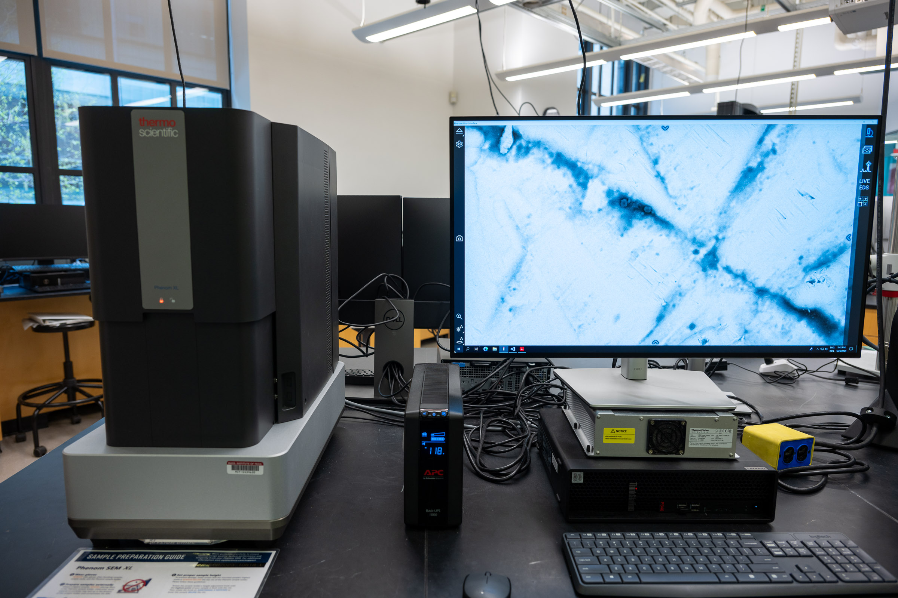
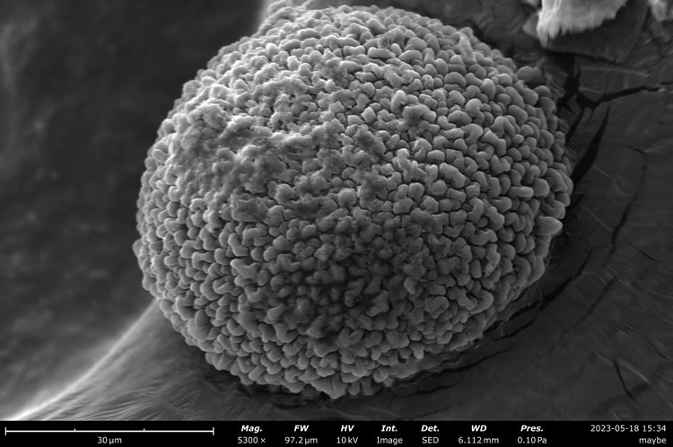
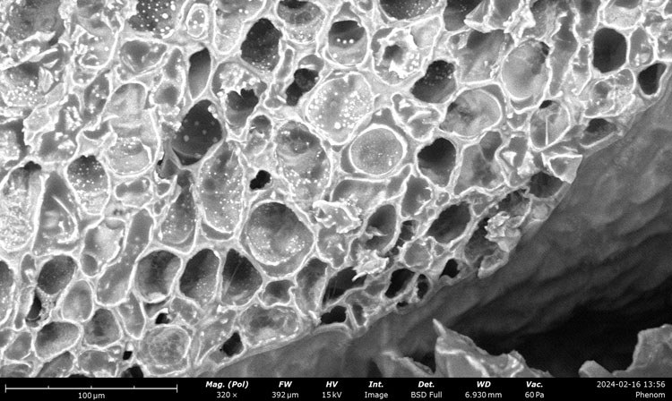
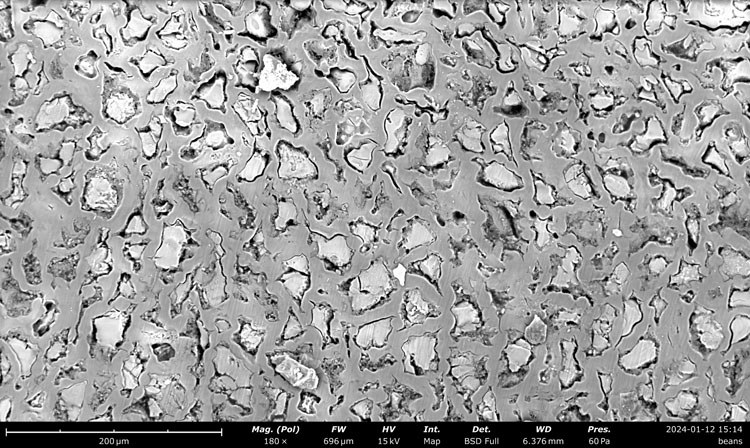
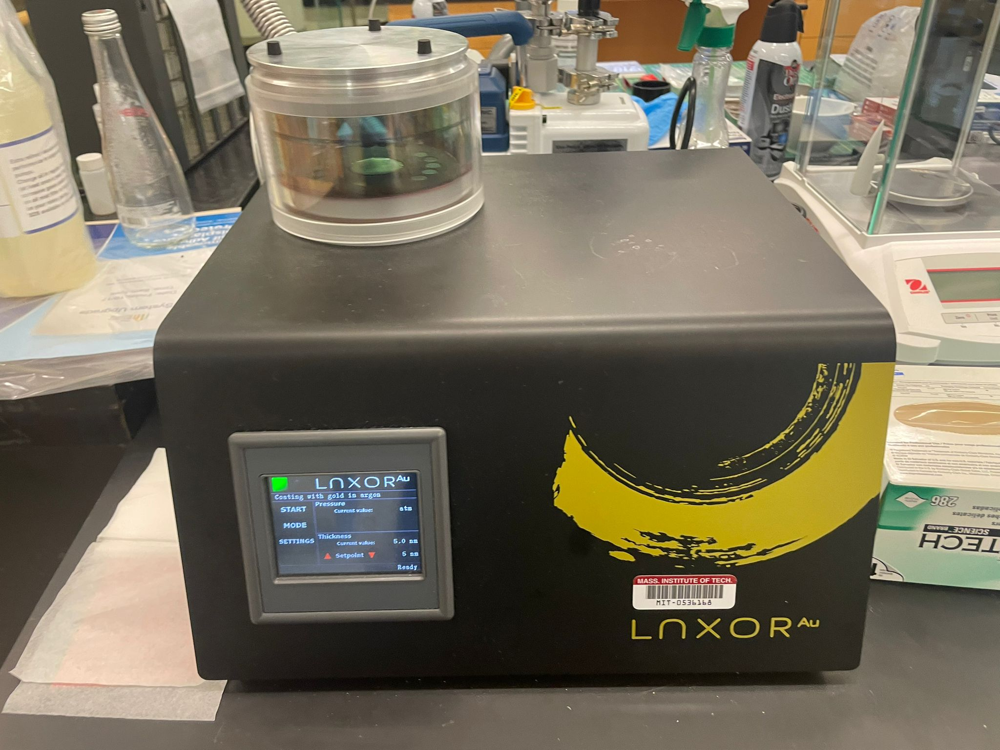
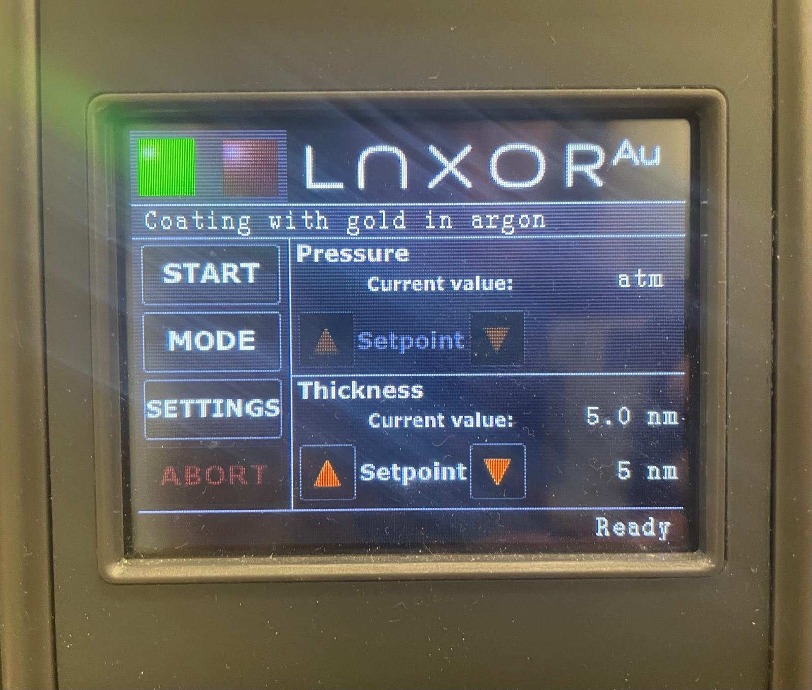
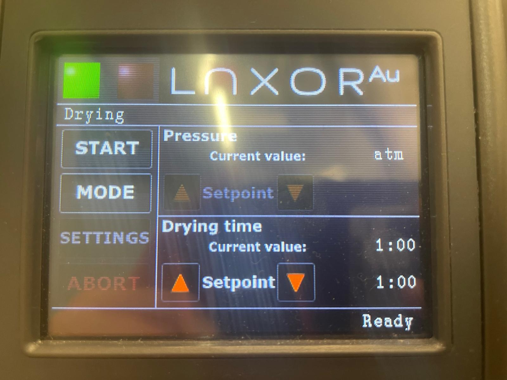

# Thermo Fisher Phenom Scanning Electron Microscopes (SEM)

## Overview

The Breakerspace has two scanning electron microscopes (SEM): a Thermo Fisher [Phenom XL](https://www.thermofisher.com/us/en/home/electron-microscopy/products/desktop-scanning-electron-microscopes/phenom-xl.html) and a Thermo Fisher [Phenom Pure](https://www.thermofisher.com/us/en/home/electron-microscopy/products/desktop-scanning-electron-microscopes/phenom-pure.html).

<figure style="margin-left:0; margin-right:0;">
  
  
  <figcaption>Phenom XL SEM and Phenom Pure SEM in the Breakerspace lab.</figcaption>
</figure>

[SEMs](https://www.thermofisher.com/blog/materials/what-is-sem-scanning-electron-microscopy-explained/) use a focused beam of electrons to image materials at much higher magnification than can be achieved with an optical microscope. In good conditions, the Phenom instruments can resolve features on the order of 100 nm.

This page is the shared SEM hub. Use it to choose an instrument, review common SEM sample-prep concepts, and find training or reservation links. For instrument operation, use the page for the SEM you are physically using:

* [Phenom XL SEM operating page](./phenom-xl.html)
* [Phenom Pure SEM operating page](./phenom-pure.html)

### Quick Actions {#quick-actions}

<section markdown="1">
#### Get started

* [New to SEM? Register for training](https://breakerspace.libcal.com/calendar?cid=19408&t=w&d=0000-00-00&cal=19408&ct=69558&inc=0)
* [Reserve time on the Phenom XL SEM](https://breakerspace.libcal.com/seat/174786)
* [Reserve time on the Phenom Pure SEM](https://breakerspace.libcal.com/seat/174787)
* [Open the Phenom XL operating page](./phenom-xl.html)
* [Open the Phenom Pure operating page](./phenom-pure.html)
</section>
<section markdown="1">
#### Learn and reference

* [Use the interactive chooser to select an SEM](#chooser)
* [Learn what SEM can show you](#science)
* [Review shared sample preparation guidance](#prep)
* [View manufacturer manuals](#manuals)
* [Try the practice exercises](#exercises)
</section>

### What This Instrument Shows You {#science}

#### The Basic Idea

A scanning electron microscope uses electrons instead of visible light to make an image. The instrument sends a narrow beam of electrons across the sample surface, point by point, and detectors record signals that come back from each location. Software turns those signals into an image.

Because electrons have much shorter wavelengths than visible light, SEM can reveal much smaller surface features than an optical microscope can. The Phenom SEMs can often show features down to the scale of hundreds of nanometers when the sample is prepared well. That is small enough to see details such as fine fibers, pores, particles, coatings, scratches, grains, and fracture textures that may be invisible or blurry in a light microscope.

SEM images are usually grayscale because they are not ordinary color photographs. Brightness often comes from surface shape, edges, detector angle, and material contrast. On the Phenom XL, EDS adds another kind of information: when the electron beam hits the sample, some atoms emit X-rays with energies that can be used to estimate which elements are present.

#### What Scientists Use It For

* A biologist might examine the surface of pollen, insect parts, fibers, shells, or tissue scaffolds to understand shape and texture at a scale smaller than ordinary microscopy.
* A mechanical engineer might inspect a fracture surface, worn part, coating, or printed component to ask how damage started and whether failure was brittle, ductile, layered, porous, or contaminated.
* A materials scientist might compare metals, ceramics, polymers, composites, powders, or coatings to look for grains, pores, cracks, particles, phases, or preparation artifacts.
* A chemist or environmental scientist might use SEM and EDS to compare particles, residues, filters, sediments, or corrosion products and ask whether different regions have different elemental signatures.
* A student exploring an unfamiliar sample might start with the optical microscope, then use SEM when the next question is about smaller surface details, fine particles, or elemental contrast.

#### What To Look For In The Results

In an SEM image, look first for scale, shape, and texture. Ask whether features are smooth or rough, isolated or connected, rounded or sharp, layered or porous, and whether the same pattern repeats across the sample.

<figure style="margin-left:0; margin-right:0;">
  
  
  
  <figcaption>SEM can reveal fine surface texture and show how processing changes familiar materials: pollen has intricate surface structure, while roasted and unroasted coffee beans show different internal structures.</figcaption>
</figure>

Edges and steep surfaces often look bright because they send more signal toward the detector. Holes, deep pores, and shadowed regions can look dark. In backscattered-electron images, heavier elements often appear brighter than lighter elements, so two regions with similar shape may still show contrast if their composition differs.

For EDS results, look for patterns rather than just labels. A useful EDS map might show that one element is concentrated in particles, another in the surrounding matrix, or a coating on only one side of a feature. EDS is most powerful when you compare it with the SEM image and with what you know about the sample.

#### What This Instrument Cannot Tell You

* SEM mainly shows surfaces. It cannot see through an opaque sample unless a cross section is exposed.
* Most SEM samples must be dry, stable, and compatible with vacuum. Wet, loose, volatile, magnetic, or beam-sensitive samples need special care.
* SEM images are not natural-color photographs. Color may be added later for presentation, but the instrument signal is usually grayscale.
* EDS estimates elements, not molecules or crystal structure. It may miss light elements, confuse overlapping peaks, or include signal from coatings, tape, stubs, or nearby regions.
* Sample preparation can change what you see. Polishing, cutting, coating, drying, or mounting can create artifacts as well as reveal real structure.

SEM users must complete Breakerspace lab training and SEM-specific training before working independently. If your sample is hazardous, wet, very magnetic, loose, reactive, biological, vacuum-sensitive, or otherwise unusual, ask staff before bringing it to the lab.

### Interactive SEM Chooser {#chooser}

Use this quick chooser if you are not sure which SEM to reserve. The recommendation is a starting point; ask staff if your sample is unusual or the result seems ambiguous.

  
<label><input type="checkbox" id="sem-eds"> I need EDS elemental analysis.</label>

  
<label><input type="checkbox" id="sem-large"> My sample is larger than an 18 mm stub, unusually shaped, or I want to load multiple stubs.</label>

  
<label><input type="checkbox" id="sem-cold"> My sample is wet, frozen, heat-sensitive, or needs the cold stage.</label>

  
<label><input type="checkbox" id="sem-routine"> I only need routine imaging of a small, dry, mounted sample.</label>

  <button type="button" id="sem-chooser-button">Recommend an SEM</button>
  

### Choose An SEM {#choose}

| Use case | Recommended instrument | Notes |
| --- | --- | --- |
| Large samples, multiple stubs, or awkward geometry | [Phenom XL](./phenom-xl.html) | Stage accepts samples up to 100 mm x 100 mm x 35 mm. Confirm height before loading. |
| Elemental analysis | [Phenom XL](./phenom-xl.html) | Use EDS for spot checks, maps, reports, and CSV exports. |
| Fast imaging of ordinary dry samples | [Phenom XL](./phenom-xl.html) or [Phenom Pure](./phenom-pure.html) | Choose based on availability and holder compatibility. |
| Frozen, wet, or beam-sensitive samples | [Phenom Pure](./phenom-pure.html) | Use the temperature-controlled cold stage after staff-approved sample prep. |
| One small mounted stub | [Phenom Pure](./phenom-pure.html) | Useful for straightforward imaging when EDS is not needed. |
| Non-conductive samples | Phenom XL or Phenom Pure | Use low vacuum, sputter coating, or conductive mounting depending on the goal. |





For EDS samples on the Phenom XL, prefer conductive mounting and avoid coating materials that interfere with the elements of interest. Gold coating is excellent for imaging but can complicate EDS; carbon coating is often better for inorganic EDS.



### Shared Sample Preparation Details {#prep-details}

SEM sample preparation has two goals: protect the microscope and make the sample electrically and mechanically stable enough to image. The most common preventable SEM problems are loose debris, incorrect height, poor grounding, wet samples, and over-prepared samples that no longer show the surface you wanted to study.

#### Basic Solid Samples

1. Place a clean bare stub in a sample prep tray.
2. Attach a double-sided carbon pad or another approved adhesive.
3. Attach the sample firmly to the pad.
4. If useful, add conductive tape, conductive paint, or graphite/silver paint to connect the sample surface to the metal stub.
5. Use stub tweezers to hold the stub, then gently tap and blow with compressed air to remove loose particles.
6. Confirm the sample is not taller than the instrument-specific height limit before loading.

Do not prepare samples inside an SEM sample holder. Loose particles can fall into the holder or loading area and later contaminate the detector, chamber, or column.

#### Powder And Particle Samples

Powders should be sparse, well attached, and mostly one layer thick.

1. Attach a carbon pad to a clean stub.
2. Pick up a very small amount of powder with a toothpick, spatula, or tweezers.
3. Gently brush or flick particles onto the exposed carbon pad.
4. Press particles lightly into the adhesive if needed.
5. Hold the stub with stub tweezers, tap the side of the stub, then blow with compressed air to remove loose grains.

If you care about particle size or shape, thick piles are a problem because particles overlap and hide each other. Use less material than feels natural; SEM needs a visible population of particles, not a mound.

#### Non-Conductive Samples

Non-conductive samples can charge under the electron beam. Charging often appears as a region that gets brighter over time, streaks, distorted features, drifting image position, or a field of view that washes out to white.

You have three main options:

1. **Low vacuum:** fastest and non-destructive. Useful for paper, polymers, ceramics, many organics, and samples where coating is not acceptable. Resolution and signal-to-noise will usually be worse than high vacuum.
2. **Sputter coating:** best for high-resolution imaging of insulating surfaces. Gold is common and highly conductive, but it adds a coating that can hide very fine surface features and complicate elemental analysis.
3. **Conductive bridge:** copper tape, carbon tape, graphite paint, or silver paint can provide a partial path to ground. This works best when the area of interest is close to the conductive bridge.

<figure style="margin-left:0; margin-right:0;">
  
  
  <figcaption>Sputter coating can reduce charging and improve high-vacuum imaging of non-conductive samples.</figcaption>
</figure>

#### Wet, Moist, And Biological Samples

Wet samples are risky in an SEM because water and other volatile liquids outgas under vacuum. Outgassing can cause poor images, vacuum errors, contamination, and microscope damage.

Common strategies:

* **Dry the sample** if preserving the wet structure is not important.
* **Use the sputter coater drying/vacuum mode** to test whether a sample visibly changes under vacuum before loading it into the SEM.
* **Freeze the sample** on the Phenom Pure cold stage if you need to preserve wet or heat-sensitive structure.
* **Use a very small amount in low vacuum** only when staff agree that the sample is appropriate and low moisture enough.

<figure style="margin-left:0; margin-right:0;">
  
  <figcaption>The sputter coater drying mode can help dry samples or test vacuum sensitivity before SEM imaging.</figcaption>
</figure>



### Manufacturer Manuals {#manuals}

* [Phenom XL user manual](https://www.dropbox.com/scl/fi/iyd538gtkj79kg0bc8113/2020-MS-Phenom-XL_User-Manual.pdf?rlkey=0yk985nvgz3lckqnrtxwo7afv&dl=0)
* [Phenom XL tensile stage manual](https://www.dropbox.com/scl/fi/fu39pi9pamr2top97cv6m/Tensile-Stage-Training-Manual.pdf?rlkey=xs9dkadn6k16f9vpo3vc3y2h7&dl=0)
* [Phenom XL all docs](https://www.dropbox.com/scl/fo/mk2sedrkfsvpllralaj4c/AMh_Ma2bU_Tl8Ul0u6xmiG4?rlkey=962g3kifk9bll59jv1ib9w86d&dl=0)
* [Phenom Pure user manual](https://www.dropbox.com/scl/fi/7ju8ldfdm0p04m6n81men/Phenom-ProX-G6-User-Manual.pdf?rlkey=l6gg1ld4zpmtxgrsxfgw00jpb&dl=0)
* [Phenom Pure temperature controlled stage manual](https://www.dropbox.com/scl/fi/nqcrhb3axctk6782k5hqk/User-Manual_Phenom_Temperature-Stage.pdf?rlkey=r01r9dl6k1km22to13s0nir24&dl=0)
* [Phenom Pure all docs](https://www.dropbox.com/scl/fo/th7xj2e2ul1sed2vobibt/ACVAySN_rjR_JnEXtPfs3_8?rlkey=3j90cjbe0akxyu7o3fanrxvn5&dl=0)

### Links {#links}

* [Nanoscience Instruments Phenom Desktop SEM YouTube Playlist](https://www.youtube.com/watch?v=Tuvu79IPFa8&list=PLSK7wbUBb88knCedT9BvlILTanNkLh38q)
* [Thermo Fisher SEM YouTube playlist](https://www.youtube.com/watch?v=jFO5AnYnn2c&list=PLoxdPzacxPYjwqELAD8XQGsygUYse2gmB)

### Exercises {#exercises}

These exercises are shared SEM examples. The instrument-specific pages identify which exercise is best for training on each SEM.

* **Level 1 - General training:** Prepare and image a small piece of hair. Use the Phenom Pure or XL to load the sample, navigate with NavCam, focus in LiveSEM, acquire images at several magnifications, and compare a cut end with a torn or broken end.
* **Level 2 - EDS practice:** Prepare salt and sugar on the same stub. Use morphology first, then EDS on the Phenom XL, to decide which is which.
* **Level 2 - Non-conductive sample comparison:** Image an uncoated non-conductive sample in low vacuum, then sputter coat a similar sample and compare resolution, charging, and surface contrast.
* **Level 2 - Image analysis:** Cut a thin slice of a roasted coffee bean, sputter coat it, and image pore structure. Estimate average cavity size from several images.
* **Level 3 - Specialist training:** Prepare a powder sample sparse enough for particle sizing. Acquire images suitable for measuring particle diameter and compare the result with a poorly dispersed sample.
* **Level 3 - Specialist training:** Use the Phenom Pure cold stage on a staff-approved wet or heat-sensitive sample. Document the freezing temperature, imaging behavior, and signs of frost, outgassing, or beam damage.
