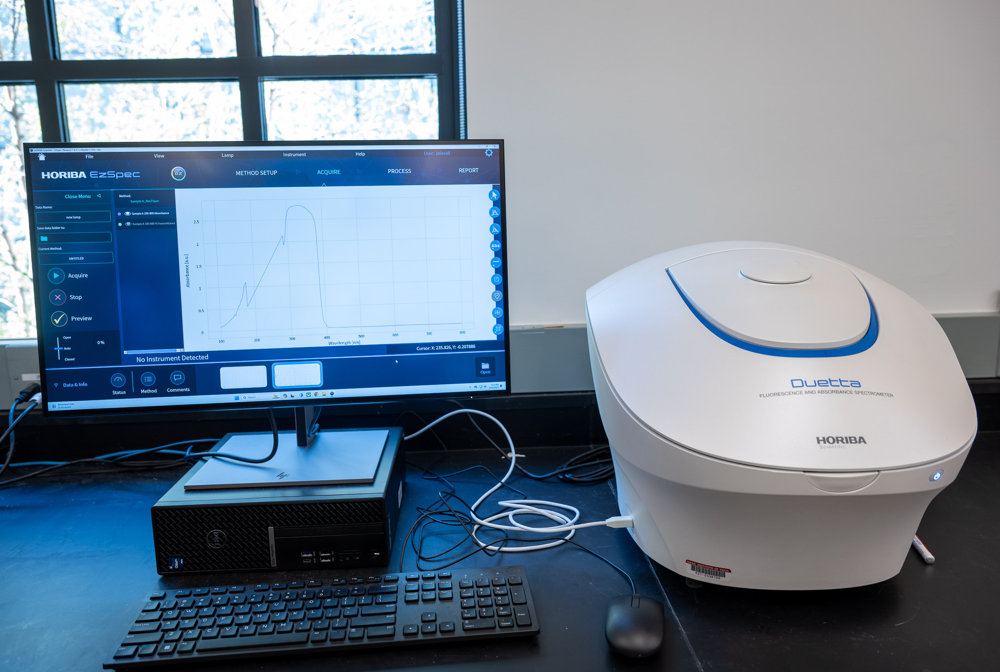
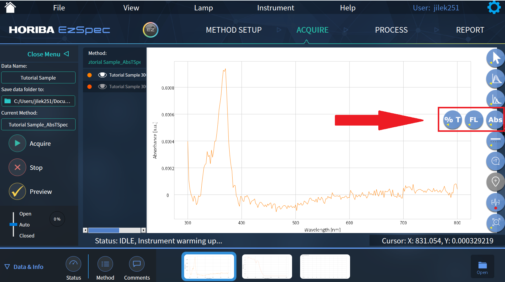
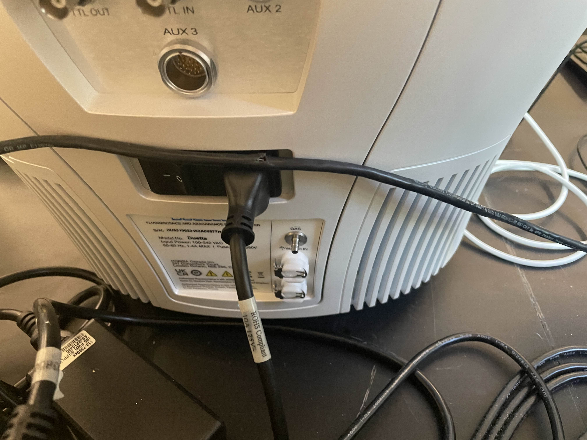
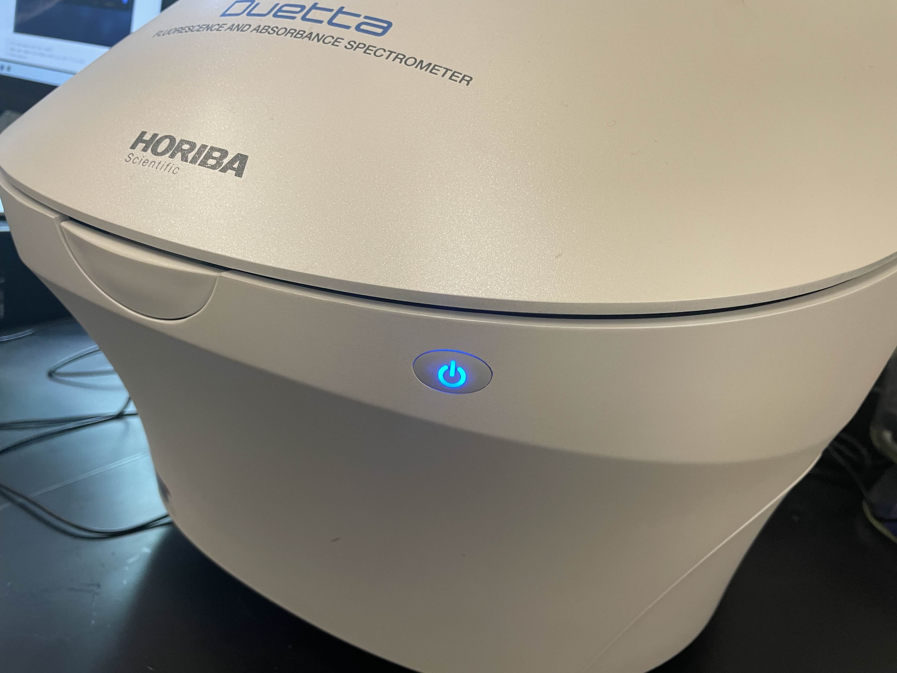
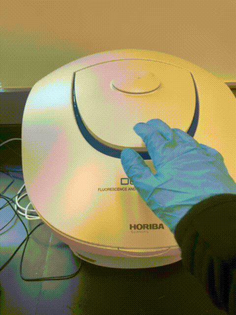
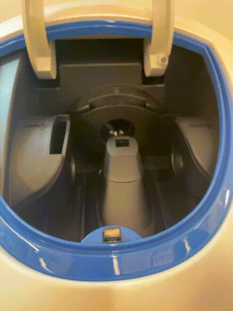
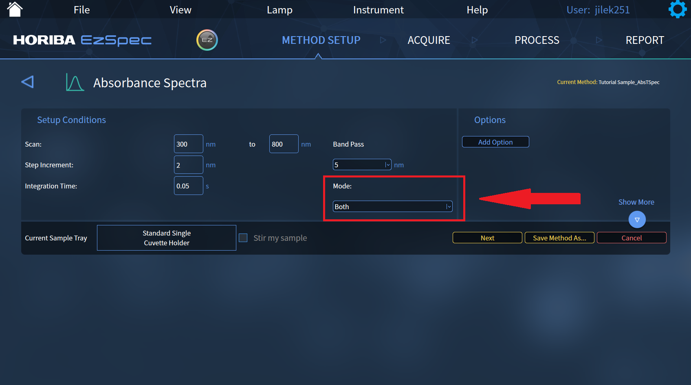
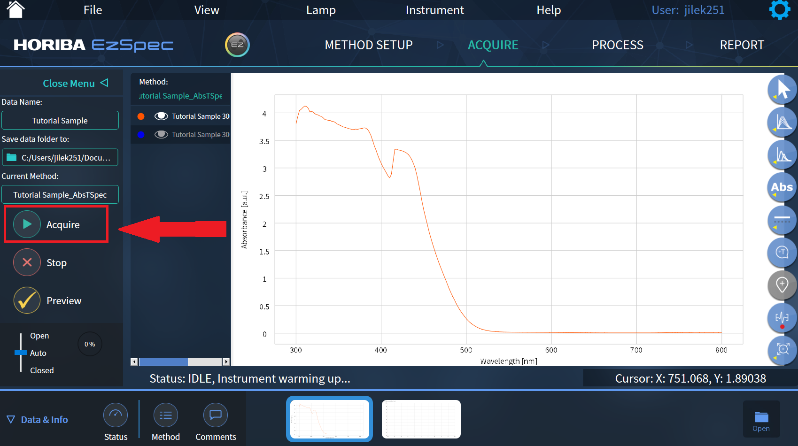

# Horiba Duetta Fluorescence And Absorbance Spectrometer

## Overview

The Horiba Duetta is the Breakerspace spectrometer for measuring how liquid samples absorb and emit light. It can operate as a UV-Vis-NIR absorbance spectrometer, as a fluorometer, or as a combined absorbance and fluorescence instrument for workflows that need inner-filter-effect correction.

Routine Breakerspace training currently focuses on absorbance and transmission spectra using cuvette samples in EZ Spec. The lab also has a transmission sample holder for flat transparent samples, such as quartz slides with controlled thin films. Fluorescence and combined molecular-fingerprint workflows are useful, but should be treated as staff-guided until the full lab workflow is documented.

This page is the operating page for the Duetta. It combines the quick reference for trained users, detailed training notes, reservation link, manuals, and exercises.

### Quick Actions {#quick-actions}

<section markdown="1">
#### Get started

* [New to the Duetta? Register for training](https://breakerspace.libcal.com/calendar?cid=19408&t=w&d=0000-00-00&cal=19408&ct=69558&inc=0)
* [Reserve time on the Duetta](https://breakerspace.libcal.com/seat/174790)
* [Operating the Duetta now? Follow the standard operating protocol](#sop)
* [Learn the complete operating workflow](#details)
</section>
<section markdown="1">
#### Learn and reference

* [Choose a UV-Vis or fluorescence measurement](#quick-method)
* [Learn what UV-Vis and fluorescence can show you](#science)
* [View manufacturer manuals](#manuals)
* [Try the practice exercises](#exercises)
</section>

### What This Instrument Shows You {#science}

#### The Basic Idea

The Duetta uses light to ask how molecules and particles interact with different colors, including ultraviolet, visible, and near-infrared wavelengths. In an absorbance measurement, the instrument sends light through a cuvette and compares how much light gets through the sample relative to a blank or reference. If the sample absorbs strongly at a wavelength, less light reaches the detector there.

That is why colored liquids have useful spectra. A blue dye looks blue because it absorbs some parts of visible light more than others. A UV-Vis absorbance spectrum turns that color behavior into a graph: wavelength on one axis, absorbance or transmission on the other. The graph can show where a sample absorbs most strongly, whether two samples look similar, and how absorbance changes with concentration.

Fluorescence asks a related but different question. Some molecules absorb light and then emit light at a longer wavelength. The Duetta can excite a fluorescent sample with one wavelength and measure the light it emits at other wavelengths. Fluorescence can be extremely sensitive, but it also depends strongly on method settings, concentration, solvent, scattering, and whether the sample reabsorbs its own emitted light.

#### What Scientists Use It For

* A chemist might follow the concentration of a colored compound by measuring how strongly it absorbs at a known wavelength.
* A biologist or bioengineer might measure fluorescent dyes, labels, proteins, nanoparticles, or media components, when the method has been validated for that sample.
* An environmental scientist might compare water samples, extracts, or particle suspensions to ask whether treatment, filtration, or contamination changed the optical signal.
* A materials researcher might compare quantum dots, dyes, films dissolved into solution, or nanoparticle suspensions by their absorbance and fluorescence behavior.
* A student might use the Duetta for a simple first spectroscopy experiment: prepare a dilution series of food coloring, collect spectra, and see how a visible peak changes as concentration changes.

#### What To Look For In The Results

For absorbance spectra, start with the main peaks and the baseline. Ask where the sample absorbs most strongly, whether the peak shape changes between samples, and whether the signal is within a useful range. A concentration series should usually show stronger absorbance for more concentrated samples, but only until the sample becomes too concentrated for a reliable measurement.

For transmission, look for wavelength regions where light passes through easily or is mostly blocked. This can be useful for comparing colored liquids, filters, optical materials, thin films, or samples where the question is simply "what light gets through?" For example, a student project used controlled layers of different sunscreens on quartz slides to compare how strongly different formulations blocked UV and visible light.

For fluorescence, look at both the intensity and the emission wavelength range. A strong fluorescence signal can indicate that the sample emits light efficiently under the selected excitation conditions. But fluorescence intensity is not automatically concentration: high concentrations can quench emission or reabsorb emitted light, and method settings can change the result.

<figure>
  
  <figcaption>EZ Spec can display absorbance and transmission data after acquisition. For a stronger teaching example, this page still needs an annotated spectrum from a simple training sample such as food coloring.</figcaption>
</figure>

Always check for practical artifacts before interpreting small differences. Bubbles, fingerprints, dirty cuvettes, scratches, particles, settling, the wrong blank, or a saturated peak can all produce misleading spectra.

#### What This Instrument Cannot Tell You

* UV-Vis absorbance usually shows optical behavior, not a complete chemical identity by itself.
* A peak at a wavelength does not prove that one specific molecule is present unless the sample, blank, and comparison method support that interpretation.
* Absorbance measurements can become unreliable when the sample is too concentrated, too turbid, or poorly blanked.
* Fluorescence intensity depends on method settings and sample environment; it is not automatically a direct concentration measurement.
* Particle suspensions can scatter light, settle, or aggregate, so apparent absorbance may not mean molecular absorption.
* The Duetta does not replace FTIR, Raman, XRD, SEM-EDS, chromatography, or other methods when the question is molecular identity, crystal structure, elemental composition, or mixture separation.

### Standard Operating Protocol {#sop}

#### Instrument Startup {#startup}

* Confirm the sample compartment is empty and the lid can close normally.
* Turn on the [rear instrument power switch](../assets/img/tutorials/uv-vis/duetta-back-power-switch.jpg), if needed.
* Press the [front power button](../assets/img/tutorials/uv-vis/duetta-power-front-button.jpg) and confirm it is blue.
* Log on to the instrument workstation using your MIT Kerberos.
* Open EZ Spec software and enter the acquisition interface.
* Let the lamps warm up before collecting data when quantitative comparison matters.

#### Operation {#operation}

* Wear nitrile gloves when handling cuvettes, sample holders, slides, samples, pipettes, wipes, or liquid-handling supplies.
* Prepare the sample and blank/reference cuvettes or holders.
* Create or load the appropriate EZ Spec method.
* Click [Acquire](../assets/img/tutorials/uv-vis/Acquire.png).
* Load and acquire the blank/reference and [sample](../assets/img/tutorials/uv-vis/add-in-cuvette.gif) in the order prompted by the selected method.
* Unload all cuvettes, slides, or sample holders from the sample compartment.
* Save or export the data.

#### Instrument Shutdown {#shutdown}

* Confirm all needed data are saved or exported.
* Confirm the sample compartment is empty.
* Dispose of or store samples according to the approved plan for that material.
* Close EZ Spec.
* Log out of the workstation.
* **Push and hold the front power button until the light shuts off.**
* Leave the work area clean and remove all samples, labels, wipes, and liquid-handling supplies.

### Compatible Materials And Sample Prep {#materials}

* Samples must be non-hazardous and safe to handle in the Breakerspace.
* Routine samples should be liquids that can be contained safely in a clean cuvette.
* Flat transparent samples or thin films on transparent substrates may be measured with the transmission sample holder when staff have approved the sample geometry and method.
* Most routine training samples should be water-based, low-odor, non-volatile, non-staining, and easy to clean if spilled.
* Do not bring hazardous solvents, reactive chemicals, biological hazards, strongly odorous liquids, staining dyes, or unknown liquids without staff approval.
* Do not load leaking, cracked, dirty, overfilled, or unstable cuvettes.
* Do not load sticky, wet, shedding, fragile, or poorly mounted slides unless staff have approved the workflow.
* Do not place loose solids, powders, open containers, or uncontained wet materials in the sample compartment.
* If a sample contains particles or sediment, decide whether the goal is to measure the dissolved material, the suspension, or scattering from particles. Those are different measurements.

<em>If you have any questions about whether a sample is appropriate to characterize in the Breakerspace, please ask before bringing it to the lab.</em>

#### Cuvettes

* Spare cuvettes are in the bottom drawer under the sample-prep bench, labeled "Spare Cuvettes."
* Deionized water for dilution or blank samples is typically available near the sink or sample-prep bench.
* Use cuvettes that are clean, clear, and compatible with the wavelength range and sample.
* Handle cuvettes by the frosted or non-optical sides when possible.
* Do not touch the clear optical faces with bare fingers or gloves.
* Keep the outside of the cuvette dry and clean. Fingerprints, droplets, lint, and scratches can add false absorbance or scattering.
* Fill the cuvette enough to cover the optical beam path, but do not overfill it.
* Remove bubbles from the optical path before measurement.
* Use the same cuvette orientation for blank and sample whenever possible.
* Use matched cuvettes or the same cuvette rinsed between measurements when small differences matter.

#### Transmission Holder And Slides

The transmission sample holder can be used for flat samples where light passes through a transparent substrate and sample layer. This is a staff-guided workflow until the holder setup is fully documented.

Good candidates include transparent slides, films, coatings, filters, or carefully prepared layers where the sample is thin, stable, and does not contaminate the holder or sample compartment. Quartz slides are useful when UV transmission matters because ordinary glass may absorb strongly in parts of the UV range.

Use a matching blank/reference whenever possible. For a sunscreen comparison, for example, a blank might be a clean quartz slide or a quartz slide prepared with the same base handling but no sunscreen. The sample slides should have controlled layer thickness, consistent application area, and enough drying or stabilization time that the film will not smear, drip, or transfer into the holder.

This holder is useful for questions such as comparing sunscreen formulations, checking whether a thin film blocks particular wavelengths, or measuring transmission through transparent materials. Interpretation depends strongly on sample thickness, uniformity, substrate choice, and blank selection.

#### Concentration And Dilution

Absorbance measurements work best when the sample absorbs some light but does not block nearly all of it. If a peak is cut off, flat at the top, noisy, or far above the useful range, the sample is probably too concentrated at that wavelength.

Start with a dilute sample when the concentration is unknown. If the spectrum is too weak, increase concentration or path length if appropriate. If the spectrum is saturated, dilute the sample and collect the blank and sample again.

For fluorescence, high concentration can be especially misleading because molecules can reabsorb emitted light or quench each other. If fluorescence workflows are used, dilution series and inner-filter-effect correction may be needed.

### Quick Method Selection {#quick-method}

| Goal | Starting method | Notes |
| --- | --- | --- |
| Measure color, dye concentration, or visible absorption | Absorbance and Transmission, Spectra | Use an appropriate blank and check that peaks are not saturated. |
| Compare a dilution series | Absorbance and Transmission, Spectra | Keep cuvette type, orientation, wavelength range, and blank consistent. |
| Check whether a sample transmits or absorbs light across UV/visible/NIR wavelengths | Absorbance and Transmission, Spectra | Make sure the cuvette and solvent are appropriate for the wavelength range. |
| Compare thin films, coatings, filters, or transparent slide samples | Absorbance and Transmission with transmission holder | Staff-guided; use a matching blank/reference substrate and controlled sample thickness. |
| Measure fluorescence emission or excitation | Fluorescence method | Staff-guided until the Breakerspace fluorescence workflow is fully documented. |
| Use absorbance-corrected fluorescence or molecular fingerprint workflows | Combined absorbance and fluorescence method | Staff-guided; method setup and interpretation are more specialized. |
| Estimate relative nanoparticle or suspension behavior | Absorbance/scattering comparison | Interpret carefully: turbidity, scattering, and settling can dominate the result. |

### Detailed Operating Instructions {#details}

The sections above are meant as a quick reference for trained users. The sections below are written as a training guide for new users and include practical details, images, and troubleshooting cues that are easiest to understand at the instrument.

The most common preventable Duetta problems are dirty cuvettes or slides, mismatched blanks, samples that are too concentrated or too thick, bubbles or nonuniform films in the beam path, unclear file names, and data that was collected but not exported before the user left.

#### Instrument Startup Notes

Before starting, confirm the sample compartment is empty and the lid closes normally. If the instrument is off, use the rear power switch first, then press the front power button. The front power button must be blue before operation.

Log on to the instrument workstation using your MIT Kerberos, open EZ Spec, and click the EZ Spec button to enter the acquisition interface. For quick qualitative checks, you may be able to begin after the instrument is ready. For quantitative comparisons, concentration series, or measurements that need better repeatability, let the lamps warm up before collecting data.

<figure style="margin-left:0; margin-right:0;">
  
  
  <figcaption>Use the rear switch and front power button to start the Duetta. The front power button must be blue before operation.</figcaption>
</figure>

#### What Absorbance And Transmission Measure

Absorbance and transmission describe how much light passes through a sample at each wavelength. Transmission is the fraction of light that gets through. Absorbance is a logarithmic way of reporting how much light was lost relative to the blank.

In a simple dye solution, more dye usually means higher absorbance at the dye's absorbing wavelengths. That relationship is often useful for concentration comparisons, but only when the sample is dilute enough, the blank is appropriate, the path length is known, and the instrument response is not saturated.

Absorbance spectra can be affected by more than molecular absorption. Particles, bubbles, fingerprints, scratches, cuvette mismatch, solvent background, fluorescence, and stray light can all change the spectrum. Always compare the result with what you know about the sample and how it was prepared.

#### What Fluorescence Measures

Fluorescence occurs when a sample absorbs light and then emits light at a longer wavelength. Fluorescence can be extremely sensitive, which makes it useful for fluorescent dyes, quantum dots, biological labels, and some natural materials.

Fluorescence is also easy to misinterpret if the method is not chosen carefully. Excitation wavelength, emission range, slit settings, concentration, solvent, scattering, photobleaching, and inner-filter effects can all change the result. For now, use fluorescence workflows with staff guidance unless you have already been trained on the specific method.

#### Blank And Reference Selection

The blank should represent everything in the sample except the absorbing or fluorescent material you want to measure. For a dye dissolved in deionized water, deionized water can be a reasonable blank. For a dye in buffer, solvent mixture, media, or extract, the blank should usually be that same background without the dye.

If the blank does not match the sample background, the spectrum may include solvent, cuvette, buffer, or container effects that do not belong to the material you are trying to study.

When comparing several samples, use the same blank strategy for all of them and record what the blank was.

#### Cuvette Loading Workflow

1. Label samples before going to the instrument if several liquids look similar.
2. Mix the sample gently if it may have settled, but avoid making bubbles.
3. Rinse the cuvette with a small amount of the solution when appropriate, then fill with the measurement sample.
4. Check that the liquid level covers the beam path.
5. Inspect the optical faces for droplets, fingerprints, scratches, dust, or lint.
6. Wipe the cuvette exterior with a clean lint-free wipe.
7. Hold the cuvette by non-optical sides and load it in a consistent orientation.
8. Close the sample compartment lid before acquisition.
9. Remove the cuvette after measurement; do not leave samples in the instrument.

<figure style="margin-left:0; margin-right:0;">
  
  
  <figcaption>Load cuvettes gently, keep the optical faces clean, and close the lid before acquisition.</figcaption>
</figure>

#### Routine Absorbance Workflow In EZ Spec

1. Start EZ Spec and click the EZ Spec button.
2. Click New Method.
3. Choose Absorbance and Transmission.
4. Choose Spectra.
5. Review the wavelength range and acquisition settings.
6. Set Mode to Both if you want both absorbance and transmission.
7. Enter a clear sample name and choose the save location.
8. Prepare and inspect the blank/reference cuvette.
9. Click Acquire.
10. Load the blank/reference and sample cuvettes in the order prompted by the selected method, closing the lid before each acquisition.
11. Check the spectrum for saturation, unexpected baseline shape, or obvious artifacts.
12. Unload all cuvettes from the sample compartment.
13. Save or export the data before moving to the next sample.

<figure style="margin-left:0; margin-right:0;">
  
  
  <figcaption>For routine absorbance training, set the mode to Both when absorbance and transmission are both useful, then click Acquire after the method, file name, save location, and sample setup are ready.</figcaption>
</figure>

#### Transmission Holder Workflow

Use the transmission holder when the sample is a flat transparent substrate, film, coating, or slide-mounted layer rather than a liquid in a cuvette. Confirm the holder, substrate, and sample preparation with staff before use.

1. Choose a transparent substrate appropriate for the wavelength range. Use quartz rather than ordinary glass when UV transmission matters.
2. Prepare a blank/reference substrate that represents the substrate and handling without the material being compared.
3. Prepare sample slides with controlled layer thickness, coverage, and drying or stabilization time.
4. Inspect the slide for fingerprints, dust, streaks, bubbles, scratches, or nonuniform film thickness in the beam path.
5. Load the blank/reference and sample slides in the order prompted by the selected method.
6. Keep slide orientation consistent between related measurements.
7. Unload slides promptly and clean the holder or surrounding area if any transfer is observed.

A recent Breakerspace project used this workflow to compare sunscreen formulations. The student applied controlled layers of different sunscreens to quartz slides, then compared absorbance and transmission spectra to ask which formulation blocked light most effectively across the measured wavelength range.

#### Comparing A Series Of Samples

For concentration comparisons, keep everything consistent except the concentration or treatment being tested.

* Use the same blank.
* Use the same cuvette type and orientation.
* Use the same wavelength range and acquisition settings.
* Measure from low concentration to high concentration when carryover is a concern.
* Rinse or replace cuvettes between samples.
* Watch for saturation at the strongest peaks.
* Record dilution factors and sample labels outside the software as well as in file names.

#### Working With Suspensions, Particles, Or Turbid Samples

Suspensions and nanoparticle samples can produce spectra that include both absorption and scattering. Larger particles, aggregates, bubbles, or settling can increase apparent absorbance even when the material is not absorbing strongly at that wavelength.

Before interpreting a suspension spectrum, ask whether the sample is stable during the measurement. If particles settle quickly, repeat measurements may change. If the goal is particle size or aggregation, the Duetta result may be useful as a relative comparison, but it should not be treated as a direct particle-size measurement without a validated method.

### Data Processing And Analysis {#data}

* Under the Acquire tab, you can toggle between Transmission, Absorbance, and Fluorescence views when those data are available.
* Use clear file names that include sample identity, concentration or dilution, date, and measurement type when useful.
* Save the native EZ Spec file if you may need to reopen or process the method later.
* Export text or CSV-style data when you need to plot spectra in another program.
* Export or save a report when you need a quick summary for notes or training documentation.
* Under the Process tab, EZ Spec can process data in several ways, including smoothing, peak finding, curve fitting, and related operations.
* Do not rely on smoothing or peak finding to fix poor data. If the raw spectrum is saturated, noisy, contaminated, or blanked incorrectly, recollect the measurement.

#### What To Check Before Trusting A Spectrum

* Are the strongest peaks within a useful absorbance range, or are they clipped/saturated?
* Does the blank match the solvent or sample background?
* Could bubbles, fingerprints, scratches, lint, or droplets be in the beam path?
* Does the spectrum repeat when the same sample is measured again?
* Does a dilution series behave in the expected direction?
* Are particles settling, scattering, or aggregating during measurement?
* Is the file saved and exported in a format you can use later?

#### Shutdown And Cleanup Notes

Before shutting down, confirm that every file you need has been saved or exported. The native EZ Spec file is useful if you may need to reopen the method or processing later, while exported text or CSV-style data are usually easier to plot or analyze elsewhere.

Remove all sample and blank/reference cuvettes, slides, or holders from the instrument. Dispose of or store samples according to the approved plan for that material, then clean up spare cuvettes, slides, wipes, labels, and liquid-handling supplies. Do not leave samples in the sample compartment or at the workstation.

Close EZ Spec, log out of the workstation, and push and hold the front power button until the light shuts off. The lamp has a limited service life and does not automatically turn off just because the workstation is disconnected, so shutting the instrument down at the end of a session is important.

### Common Failure Modes {#failures}

| Problem | Likely Cause | What To Try |
| --- | --- | --- |
| Peaks are cut off, flat-topped, or extremely high | Sample is too concentrated, detector is saturated, or wavelength range includes very strong absorption | Dilute the sample, recollect the blank, and measure again. |
| Absorbance baseline is unexpectedly high across most wavelengths | Dirty cuvette, fingerprints, bubbles, scattering particles, wrong blank, or sample turbidity | Inspect and wipe the cuvette, remove bubbles, use the correct blank, dilute or clarify the sample if appropriate. |
| Spectrum is noisy or weak | Sample absorbs very little, integration/acquisition settings are not ideal, lamp is not warmed up, or cuvette/sample is inappropriate for the wavelength range | Let lamps warm up, check method settings, increase concentration if safe and appropriate, or ask staff about method choice. |
| Repeat measurements do not agree | Cuvette orientation changed, bubbles moved, sample settled, cuvette was not rinsed, or file/method settings changed | Keep orientation consistent, remix gently, remove bubbles, rinse/replace cuvette, and repeat with consistent settings. |
| Blank-corrected spectrum looks physically strange | Blank does not match the sample background or was collected with a dirty/mismatched cuvette | Prepare a better blank, clean or replace cuvettes, and recollect blank and sample. |
| Slide or film spectra vary more than expected | Film thickness, slide orientation, substrate choice, fingerprints, or nonuniform application changed between measurements | Use a consistent blank/reference substrate, control layer thickness, keep orientation consistent, and inspect the slide before loading. |
| Fluorescence signal is unexpectedly low | Wrong excitation/emission settings, sample does not fluoresce, photobleaching, quenching, or concentration effects | Ask staff to review the fluorescence method; try a known fluorescent standard or dilution series if appropriate. |
| Fluorescence signal is distorted or lower at high concentration | Inner-filter effects, reabsorption, or quenching | Dilute the sample and use absorbance-corrected workflows only with staff-approved methods. |
| Sample spills or cuvette leaks | Overfilled, cracked, poorly capped, or mishandled cuvette | Stop, keep liquid out of the instrument, notify staff, and clean only according to the approved material and spill procedure. |
| Data was collected but cannot be found later | File name, save location, or export step was missed | Save/export before closing EZ Spec; use clear project folders and file names. |

### Manufacturer Manuals {#manuals}

* [Local copy of Duetta with EZ Spec operation manual](../assets/img/tutorials/uv-vis/Duetta-with-EZ-Spec-Operation-Manual-5700004252-Rev-1.4.3.pdf)
* [Dropbox copy of Duetta with EZ Spec operation manual](https://www.dropbox.com/scl/fi/9bzwitjz004xd8pl5bpyl/Duetta-with-EZ-Spec-Operation-Manual-5700004252-Rev-1.4.3.pdf?rlkey=8ekvwddzdt0pk931zwpxov43l&st=yisoc2r2&dl=0)

### Exercises {#exercises}

* **Level 1 - General training:** Measure absorbance and transmission spectra from water with food coloring. Identify the wavelengths where the colored sample absorbs most strongly and export the data.
* **Level 1 - Blank comparison:** Measure the same colored water sample using deionized water as the blank, then repeat with an intentionally mismatched blank chosen by staff. Compare how the spectrum changes.
* **Level 1 - Concentration series:** Prepare or use a staff-provided dilution series of a colored sample. Measure each sample with the same method and plot peak absorbance versus relative concentration.
* **Level 2 - Saturation and dilution:** Measure a sample that is too concentrated, identify the saturated or clipped region, dilute it, and show how the spectrum improves.
* **Level 2 - Suspension comparison:** Compare a stable dye solution with a turbid or particle-containing sample. Describe which spectral features may come from absorption and which may come from scattering.
* **Level 2 - Transmission holder comparison:** With staff guidance, compare transmission through a clean quartz slide and a prepared thin-film or sunscreen-coated slide. Explain how the blank/reference choice affects interpretation.
* **Level 3 - Fluorescence workflow:** With staff guidance, collect fluorescence data from a known fluorescent standard or safe fluorescent sample, then compare how excitation wavelength, concentration, or inner-filter correction changes the result.
* **Level 3 - Method development:** With staff guidance, create a repeatable absorbance or fluorescence method for a recurring sample type, including sample prep, blank choice, method settings, export format, and acceptance checks.
