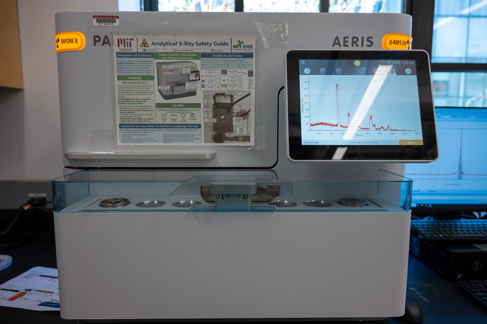
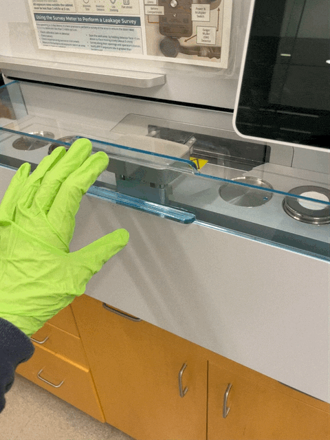
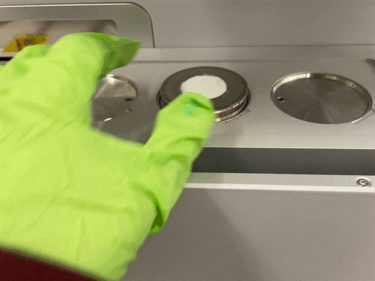
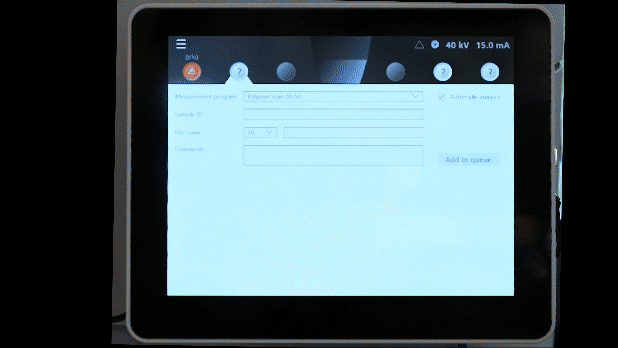
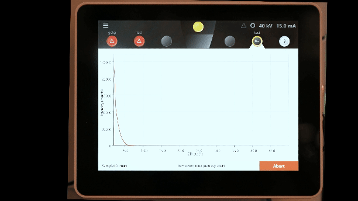
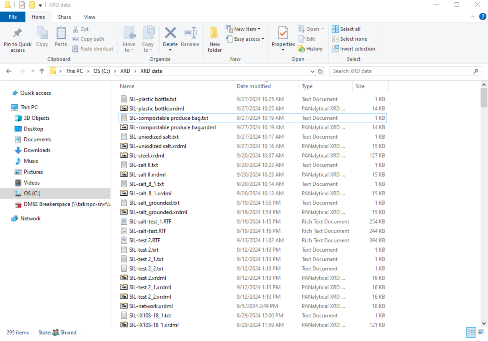

# Malvern Panalytical Aeris Research XRD

## Overview

The [Panalytical Aeris Research XRD](https://www.malvernpanalytical.com/en/products/product-range/aeris-range) is a benchtop [X-ray diffractometer](https://www.malvernpanalytical.com/en/products/technology/xray-analysis/x-ray-diffraction) used to analyze the phase composition, crystal structure, and orientation of solid and powder samples. A full scan can produce useful results in less than five minutes, and the six-position sample changer lets you queue several samples in a row.

This page is the operating page for the XRD. It combines the quick reference for trained users, detailed training notes, data-analysis workflow, manuals, exercises, and a staff to-do list.

### Index:

* [Standard operating protocol](#sop) - ([startup](#startup), [operation](#operation), [shutdown](#shutdown))
* [Compatible materials and sample prep](#materials)
* [Detailed operating instructions](#details)
* [Data processing and analysis](#data) - ([using HighScore Plus](#highscore), [worked example](#worked-example), [interpreting results](#interpreting))
* [Common failure modes](#failures)
* [Manufacturer manuals](#manuals)
* [Links](#links)
* [Exercises](#exercises)

### Standard Operating Protocol {#sop}

The Aeris is a fully enclosed, interlocked instrument: the X-ray shutter cannot open unless the cover is closed and the safety interlocks are engaged, so normal use exposes you to no radiation. Never attempt to defeat, bypass, or force an interlock, and never try to open the enclosure while a measurement is running. If an interlock fault, unusual noise, error, or any sign of damage appears, stop, leave the cover closed, and contact Breakerspace staff. Record every session in the X-ray safety log book.

#### Instrument Startup {#startup}

* Make sure at least one position in the sample changer is free (no sample holder in place). Booting with all six positions occupied causes a startup error.
* Turn on the [mains power switch](../assets/img/tutorials/xrd/mains-switch.jpg) at the rear of the instrument, if needed. This switch is normally left on.
* Make sure the cover is closed and the interlocks are engaged.
* Press the [power button](../assets/img/tutorials/xrd/power-button.jpg) to switch on the instrument.
* Turn the [HT keyswitch](../assets/img/tutorials/xrd/keyswitch.jpg) clockwise to switch on the high-tension (HT) generator.

#### Operation {#operation}

* Prepare your sample at the sample prep table using the correct holder (see [compatible materials and sample prep](#materials)).
* Remove the plastic sample-changer cover and place the prepared holder in any free loading position.
* Replace the plastic sample-changer cover.
* In the software, select the changer position that matches the physical slot where you placed the holder ([see the queue interface](../assets/img/tutorials/xrd/Queue.gif)).
* Select a measurement program from the drop-down list.
* Enter a descriptive sample name and edit the file name as needed.
* Start the measurement, or click **Add to Queue** to run it after the current sample.
* Export results to the networked workstation or a USB drive.
* Fill out your information in the X-ray safety log book.
* Additional samples can be loaded and queued while the current sample is being measured. Repeat as needed.

#### Instrument Shutdown {#shutdown}

* Confirm all data you need has been exported.
* Press the power button to switch off the instrument.
* Turn the HT keyswitch counter-clockwise to switch off the HT generator.
* If the instrument will be off for a long period, you can also switch off the mains power supply.
* Remove your sample holders, return them to storage, and leave the sample prep area clean.

### Compatible Materials And Sample Prep {#materials}

The Aeris has a Cu Kα X-ray source (λ = 1.5406 Å) with a penetration depth on the order of 100 µm. This source causes fluorescence in samples containing iron or manganese, which raises the background and may not give usable results for those materials.

* Samples must be non-hazardous and safe to handle in the Breakerspace.
* Powders, solid plates, pressed pellets, metal coupons, membranes, and odd-shaped solids can all be measured with the appropriate holder.
* For powders, grind to a fine, uniform powder (aim for grain size on the order of a few micrometers, roughly 5-10 µm) so that enough grains in many orientations contribute to the diffraction signal.
* When grinding, avoid creating airborne dust: grind gently, do not inhale fine powder, and contain and clean up any spilled powder afterward. Wear safety glasses, and use gloves when a sample calls for it. If a powder is especially fine, floaty, irritating, or you are unsure how to handle it safely, ask staff before grinding.
* Grinding finely and using a back-loading holder both help reduce preferred orientation, which otherwise distorts relative peak intensities.
* Load samples so the surface is flat, level, and centered in the holder. Sample height is the single most common source of bad beginner data: a surface sitting too high or too low shifts every peak to a slightly wrong 2θ angle, which can prevent a correct database match even when the sample is fine. Fill the holder so the sample surface is flush with the reference surface, not mounded up or sunk below it.
* Label each holder physically and give each measurement a descriptive name (a convention such as `Lastname_sampleID_YYYYMMDD` keeps exported files organized).

Some samples can damage the instrument or simply will not give a useful result, and should be checked with staff first:

* Loose or poorly secured powder can spill inside the enclosure. Make sure powder is packed and contained in the holder before loading.
* Strongly magnetic powders can be pulled toward the optics and should not be run without staff guidance.
* Liquids, gels, greasy samples, and anything that could run, outgas, or contaminate the stage are not appropriate for the standard holders.
* Single crystals and large solid chunks do not produce a normal powder pattern. XRD phase identification here is set up for powders and flat polycrystalline samples.
* Very small amounts of material may not cover the holder well enough for a good pattern; ask staff about low-quantity holder options.

Panalytical provides an excellent sample preparation guide, available in paper form in the lab and here in [PDF form](https://www.dropbox.com/scl/fi/17o43bqhe52u49kkecvrf/xrd-sample-holders-preparation.pdf?rlkey=vxi65kwyeqrcr62jbcxa5rqvq&dl=0). Refer to it for instructions on the different holder types and their associated sample-prep techniques. Page 1.4 lists all available holder types. Of those, we have:

* PW1811/00 and PW1811/27 for back or front loading of powders
* PW1812/00 for odd shapes (fixed with plasticine or wax)
* PW1813/26 for metal plates, membrane filters, pressed pellets, and similar flat samples

XRD sample holders, mounting clay, and other small materials are stored in the black cabinet next to the sample prep table. Perform all sample loading at the table and transfer holders to the instrument on the tray once complete.

<em>If you have any questions about whether a material is appropriate to characterize in the Breakerspace, please ask before bringing it to the lab.</em>

### Detailed Operating Instructions {#details}

The sections above are a quick reference for trained users. The sections below are a training guide for new users, with the practical details and images that are easiest to follow at the instrument.

#### Sample Loading {#loading}

* Remove the plastic sample-changer cover.
* Place a prepared sample in any of the six positions on the sample changer.
* Replace the plastic sample-changer cover.

<figure style="margin-left:0; margin-right:0;">
	
	
</figure>

#### Running A Measurement Program {#measurement}

* Select the changer position that matches the physical slot where you loaded the holder. The instrument measures whichever position you select, so a mismatch here means it scans the wrong slot (or an empty one). Note the slot number when you load the holder so you can select it correctly.
* Choose a measurement program from the drop-down list.
* Enter the sample ID.
* Edit the file name as necessary.
* Click **Add to Queue**.

The stored programs on the instrument cover most basic phase-identification needs. Typical starting settings for general phase ID are Cu Kα radiation, a 2θ range of about 10-80°, a step size near 0.02°, and a count time of roughly 0.5-2 s per step. A smaller step size and longer count time improve resolution and signal-to-noise at the cost of a longer scan.

<figure style="margin-left:0; margin-right:0;">
	
	
</figure>

#### Exporting Data {#export}

Data can be saved to a USB drive or exported to a shared network drive on the XRD workstation to the right of the instrument. The workstation can be accessed using a common login: the username is `xrd` and the password is `xrd-password`. Data can be found in the folder `"C:\XRD\XRD data"` (the path contains a space, so `XRD data` is a single folder name).

Export both the raw scan and any processed plots so you can reprocess later. Save a copy to your own storage as well, since the shared workstation is not a backup.

<figure style="margin-left:0; margin-right:0;">
	<a href="../assets/img/tutorials/xrd/xrd-data-in-folder.png" target="_parent">
		
		<figcaption>Recommended export location in Windows Explorer.</figcaption>
	</a>
</figure>

#### New Measurement Programs {#new-programs}

New measurement programs can be created using the XRDMP Creator software on the workstation that supports the XRD, though the programs stored on the instrument should cover most basic analysis needs. Documentation on XRDMP Creator is available in its Help menu. If you need to create new programs and need assistance, please contact Breakerspace staff.

#### Advanced Mode {#advanced}

Advanced mode is used to change optical components, manage data (including importing programs and deleting programs and results), and access other advanced configuration tools. Lab users typically will not need advanced mode, and instruction in its use is beyond the scope of this page.

### Data Processing And Analysis {#data}

Data from the Aeris can be processed using [HighScore Plus 5.0](https://www.malvernpanalytical.com/en/products/category/software/x-ray-diffraction-software/highscore-with-plus-option) on the XRD workstation.

#### Using HighScore Plus {#highscore}

##### Determine The Background

* Treatment > Determine Background.
* The automatic setting usually does the job.
* Granularity changes the spacing between inflection points on the background curve.
* Bending factor determines how much the background is allowed to curve.
* Click Accept. Inspect the result visually, because an improper background can create or hide peaks.

##### Determine Peaks

* Treatment > Search Peaks.
* Adjust the significance (a signal-to-noise threshold near 3 is a reasonable starting point) until the detected peaks reflect what you consider real peaks.
* Under Peak List, review the detected peaks to make sure the software did not add or miss any. Delete a peak with Right Click > Delete Peak. Insert peaks with:
  * Option 1: Treatment > Insert Peak (Ctrl+R), then click the tip of each peak you want to add.
  * Option 2: In Peak Lists > Right Click > Add Peak, and enter the values manually.

##### Identify A Mystery Compound

* After determining the background and peaks, Right Click > Search Match > (optionally) change the search settings > Search > OK.
* Options for improving your outcomes:
  * Under the Restrictions tab > Restriction set > Select restriction set, you can pick your material type from a drop-down menu. For example, if your material is organic, select "Organic."
  * Under the Restrictions tab > Edit, you get a pop-up with many ways to restrict the search. For example, under Chemistry you can input elements that are or are not present in the sample.
  * Clicking Execute Fitting > Profile Fit > Default often improves the confidence and precision of the results.
* Interpreting the matches:
  * Score shows the program's confidence in the pattern match between your sample and each candidate. To check a candidate, click it: thin blue lines appear on the graph. Confirm that each blue line lines up with the height and position of a peak in your sample. Match on peak positions (2θ) first, since relative intensities vary with sample prep and preferred orientation.
  * Once you are confident in a match, left-click and drag it to the Pattern List panel to "accept" it. Any peak not matched by an accepted candidate keeps a blue downward-facing arrow, and the candidate list reorganizes to fit the remaining peaks.
  * Continue until all peaks are matched and all phases in your sample have been identified. Accept a phase based on a consistent set of peaks, not a single-peak match.

#### Worked Example: Identifying An Unknown Powder {#worked-example}

This walkthrough ties the steps above together. Suppose you have an unknown white powder and want to know what crystalline phase or phases it contains.

1. **Prepare and scan.** Grind the powder finely, back-load it into a powder holder, and run a general phase-ID program (Cu Kα, 2θ from about 10-80°, 0.02° step). You get a pattern with several peaks rising above a smooth background.
2. **Determine the background.** Run Treatment > Determine Background and inspect it visually. Confirm the curve follows the baseline between peaks and does not clip the base of any real peak or invent a bump where there is none.
3. **Search peaks.** Run Treatment > Search Peaks at a significance near a signal-to-noise of 3. Compare the detected peaks with what your eye calls a peak, then add missed peaks or delete spurious ones. Record the positions of the strongest peaks (for example, the four or five tallest).
4. **Run Search Match.** Right Click > Search Match. If you know something about the sample, restrict the search (for example, limit chemistry to elements you expect, or set the material type). The software returns a ranked candidate list with scores.
5. **Test the top candidates.** Click each high-scoring candidate to overlay its reference lines on your pattern. Accept a candidate only if its lines land on the positions of several of your peaks, especially the strong ones; reject a candidate whose strongest lines have no matching peak, even if its score looks high. Match on peak positions (2θ) first, because relative intensities shift with sample prep and preferred orientation.
6. **Account for every major peak.** Drag an accepted candidate into the Pattern List. Any peak still unmatched keeps a blue arrow, and the candidate list reorganizes to fit it. If one phase does not explain all the strong peaks, look for a second phase rather than forcing the first to fit.
7. **Report.** Produce a labeled pattern with each major peak assigned to a phase, list the peak positions and matched phases, and note the instrument settings. Flag any peak you could not assign as possible contamination, a minor phase, or a holder/substrate peak.

A confident result usually rests on a consistent set of matched peaks, not a single high-scoring line. A sample data file, `exercise_A_raw.csv`, is available in the [XRD handout material](../handouts/xrd/) if you want to practice this workflow.

#### Interpreting Results {#interpreting}

A good phase-identification result is a labeled pattern where each major peak is accounted for by an identified phase. When you write up or export results, include the major peak positions, the matched phases, and a short note on the instrument settings (radiation, 2θ range, step size, count time). Note any peaks you could not assign, and treat them as possible contamination, minor phases, or holder/substrate peaks rather than forcing a match.

Not getting sharp peaks or a clean database match does not mean you did something wrong. XRD only sees crystalline order, so an amorphous material (many plastics, glasses, gels, and truly disordered solids) legitimately produces broad humps instead of sharp peaks, and no phase match. A poorly ordered, mixed, or novel material may also fail to match a database entry even though the data are real. If you expected crystalline peaks and got none, first rule out sample-height and grain-size problems (see [compatible materials and sample prep](#materials)); if the data still look amorphous, that is a valid result worth reporting.

Advanced analysis such as quantitative phase fractions, crystallite size from peak broadening (the Scherrer approximation), and full Rietveld refinement is possible but beyond routine use. Rietveld work fits a calculated pattern to your data and is judged by a difference curve and goodness-of-fit metrics such as Rwp and χ²; open tools such as GSAS-II or FullProf can do it as well as HighScore Plus. If your project needs quantitative results, discuss it with staff.

### Common Failure Modes {#failures}

| Symptom | Likely cause | What to try |
| --- | --- | --- |
| Startup [error asking you to remove a sample](https://www.dropbox.com/scl/fi/4a0rnd149la2lyrvo0rll/XRD_please_remove_sample.jpg?rlkey=u5x63mlic9llbitkgpigh0xcw&st=126n38zb&dl=0) | The instrument was booted with all sample-changer positions occupied | Remove one sample holder so at least one position is free, then continue. |
| No peaks or very low counts | Sample misaligned, uneven, or recessed in the holder; wrong program | Re-seat the sample so its surface is flat and centered; confirm the correct program and that the scan actually ran. |
| High background | Fluorescence from iron or manganese in the sample, or a dirty holder | This source fluoresces with Fe and Mn; consider whether the sample is suitable. Clean or replace the holder and re-prepare the sample. |
| Broad, weak, or smeared peaks | Grain size too large or poor packing | Grind the powder more finely and pack it evenly into the holder. |
| Distorted relative peak intensities | Preferred orientation from platy or needle-like grains | Grind more finely and use a back-loading holder to randomize orientation. |
| Unexpected extra peaks | Contamination, holder peaks, or substrate peaks | Run an empty holder for comparison and re-prepare the sample. |
| Fewer results than samples loaded | Samples were loaded but not added to the queue | Confirm each sample was added to the measurement queue. |

### Manufacturer Manuals {#manuals}

* [Aeris quick start guide](https://www.dropbox.com/scl/fi/gqd44xvmv9q5660bk5gs4/aeris_quickstart_guide.pdf?rlkey=zj5qv5ajbxf80865fnh939r5g&dl=0)
* [Aeris user guide](https://www.dropbox.com/s/sw476m00qq3c7jr/aeris_user_guide.pdf?dl=0)
* [HighScore Plus quick start guide](https://www.dropbox.com/scl/fi/0vaijznxsfaa05xfqwxd2/highscore_plus_quickstart_guide.pdf?rlkey=kx900yxwi5dtxug5ng1do8tyv&dl=0)
* [Sample holders and sample prep guide](https://www.dropbox.com/scl/fi/17o43bqhe52u49kkecvrf/xrd-sample-holders-preparation.pdf?rlkey=vxi65kwyeqrcr62jbcxa5rqvq&dl=0)
* [XRD for the analyst](https://www.dropbox.com/scl/fi/0e8vioulematgbd1yluzb/x-ray_powder_diffraction.pdf?rlkey=eae3hs1ispi1fi7vruh8oq9az&dl=0)

### Links {#links}

* [Tutorial videos by the IAMM Diffraction Facility](https://www.youtube.com/@IAMMDiffractionFacility)
* [Panalytical XRD YouTube playlist](https://www.youtube.com/watch?v=YujXF6NKORM&list=PL2wIBTZfZRjdxVJYhan7PHbz_hyStiGgH)
* [Panalytical Aeris videos](https://www.youtube.com/@MalvernPanalytical/search?query=aeris)

### Exercises {#exercises}

* **Level 1 - Identify the mystery powder:** Prepare and run a provided unknown powder, determine the background and peaks in HighScore Plus, and use Search Match to identify the phase. Report the major peak positions and your matched phase. A sample data file, `exercise_A_raw.csv`, is available in the [XRD handout material](../handouts/xrd/).
* **Level 2 - Amorphous vs. crystalline:** Compare a crystalline polymer with an amorphous one and describe how the patterns differ (sharp peaks vs. broad humps).
* **Level 2 - Polymorphs of calcium carbonate:** Distinguish two mineral forms of calcium carbonate, such as calcite and aragonite, by their diffraction patterns.
* **Level 3 - Full phase ID with plane labeling:** Identify a mystery powder and label each major peak with the crystal plane (hkl) it results from.
* **Level 3 - Sample-prep effect:** Run the same powder coarse and finely ground, or front-loaded and back-loaded, and compare peak sharpness and relative intensities to show the effect of preferred orientation.

### Tutorial To-Do List {#todo}

* Add a labeled overview photo of the instrument showing the mains switch, power button, and HT keyswitch locations.
* Reshoot the loading, queue, and export GIFs with appropriate glove use if handling guidance calls for it.
* Add a dedicated screenshot of the changer-position selection in the UI (the current step links the general `Queue.gif`; a still that highlights the position selector would be clearer).
* Add one or two annotated example patterns showing background, labeled peaks, and an accepted Search Match candidate.
* Confirm the current workstation login details and networked export path before publishing.
* Consolidate the remaining XRD source content (`tutorials/xrd.md`, `tutorials/xrd-preview.md`) into this page and retire the duplicates once this page is approved.
* Cross-link the printed [XRD handout](../handouts/xrd/) once its cheat-sheet content is finalized.
* Add approved training powders and reference samples for the exercises once the material library is ready.
