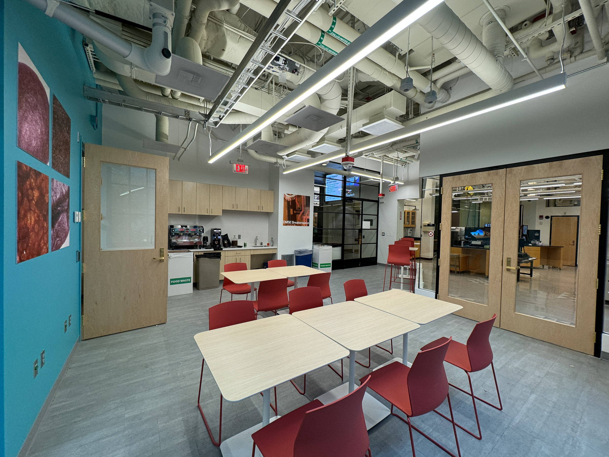
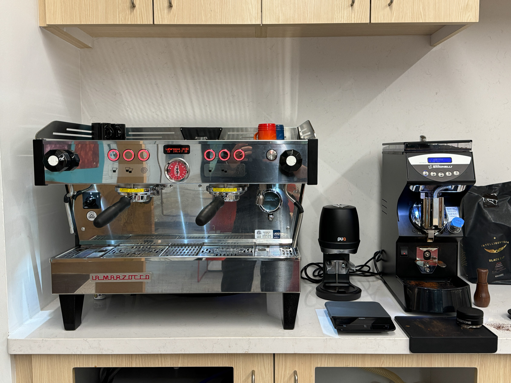

# Use The Breakerspace Lounge

The Breakerspace Lounge is the shared seating and food-and-drink area immediately outside the instrument lab. MIT undergraduates can request access to work, meet, take a break, and use the lounge's current coffee equipment during open hours.

<figure class="page-figure">
  
  <figcaption>Students gather in the lounge for a coffee brewing competition in 3.000 Coffee Matters.</figcaption>
</figure>

## Quick Actions

* [Request Breakerspace Lounge access](https://forms.gle/1pd59bjGXiPnehDL9)
* [Check Lounge hours and who can use the space](#hours-and-access)
* [Review the shared-space rules before bringing food or drink](#using-the-shared-space). Keep all food and drink out of the instrument lab.

## Hours And Access

The Breakerspace Lounge is open **8 AM to midnight, seven days/week**.

Lounge access is available to all MIT undergraduates. Complete the [Breakerspace Lounge access form](https://forms.gle/1pd59bjGXiPnehDL9) and agree to the lounge policies. Tap access is usually granted within two business days.

Lounge access does not authorize instrument operation. Complete the relevant [Breakerspace training]({{ "/training.html" | relative_url }}) before reserving or using an instrument independently.

## Using The Shared Space

### Food And Drink

Food and drinks are permitted in the lounge but not in the instrument lab. Keep food, beverages, cups, bottles, and eating utensils on the lounge side of the space. Finish or leave them in the lounge before entering the lab.

### Shared-Space Expectations

* Clear your table, dispose of waste, and wipe up spills before leaving.
* Leave shared furniture and equipment ready for the next person.
* Keep the path from the lab doors through the lounge to the corridor unobstructed.
* Use the space considerately when other students, teaching groups, or lab users are working nearby.

<figure class="page-figure">
  
  <figcaption>The everyday lounge layout includes shared tables, the coffee counter, and doors into the instrument lab.</figcaption>
</figure>

## Coffee Equipment And Roasting

The lounge currently includes a La Marzocco Linea PB espresso machine, Nuova Simonelli Mythos grinder, and PuqPress automatic tamper. Once you have lounge access, you may use the espresso equipment during open hours. Bring your own mug, follow the posted instructions, and leave the equipment and counter clean for the next user. Ask Breakerspace staff before using equipment that is unfamiliar to you.

The Breakerspace also uses an Aillio Bullet R1 V2 roaster for coffee activities and instruction. Contact [dmse-breakerspace@mit.edu](mailto:dmse-breakerspace@mit.edu) to ask about current roasting activities and how to participate.

  <figure class="page-figure">
    
    <figcaption>Current espresso equipment in the Breakerspace Lounge.</figcaption>
  </figure>
  <figure class="page-figure">
    
    <figcaption>The Aillio Bullet roaster used for coffee activities and instruction.</figcaption>
  </figure>

## Learning And Community Events

The lounge can support teaching and collaborative work alongside the instrument lab. [3.000 Coffee Matters]({{ "/3000.html" | relative_url }}) is one example: students move between coffee preparation, sensory observation, materials characterization, and data interpretation.

The lounge has also hosted occasional staff-organized community events. During Infinite Halloween, participants carve small pumpkins in the lounge before staff-guided compression testing on the [Instron]({{ "/tutorials/instron.html" | relative_url }}). These special activities are planned separately from normal lounge access and do not authorize users to bring produce or other unusual samples into the instrument lab.

  <figure class="page-figure">
    
    <figcaption>Students carve pumpkins in the lounge during an Infinite Halloween trick-or-treating event.</figcaption>
  </figure>
  <figure class="page-figure">
    
    <figcaption>The event connects a lounge activity with staff-guided mechanical testing in the lab.</figcaption>
  </figure>

## Questions Or Access Problems

If your lounge access has not been granted after the usual processing period, or you have a question about using the space, see [Help & Support]({{ "/resources.html" | relative_url }}) or email [dmse-breakerspace@mit.edu](mailto:dmse-breakerspace@mit.edu).
