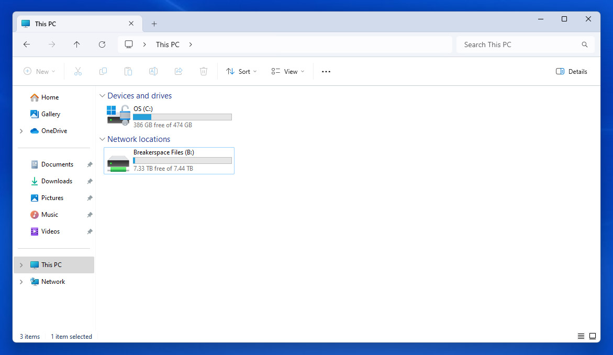

# Breakerspace Resources

Use this page for general Breakerspace support: getting access, saving and moving files, contacting the team, and finding shared reference materials. Instrument-specific operating instructions, manuals, troubleshooting, exercises, and reservation links are moving to the [instrument pages]({{ "/instruments/" | relative_url }}).

## Getting Access

New lab users should [register for a Breakerspace lab training](https://breakerspace.libcal.com/calendar?cid=19408&t=w&d=0000-00-00&cal=19408&ct=69558&inc=0) before reserving or using instruments independently.

The instrument workstations are on the [MIT WIN domain](https://ist.mit.edu/winmitedu), with access managed through [Moira group lists](https://groups.mit.edu/webmoira/). After you complete training for an instrument, you should be added to the relevant group, such as `dmse-brkrspc-sem` for the SEMs.

Once access is active, log on to the instrument workstation using your MIT Kerberos. If you completed training and believe you should have access but cannot log on, contact [dmse-breakerspace@mit.edu](mailto:dmse-breakerspace@mit.edu).

For lounge access, use the [lounge access request form](https://docs.google.com/forms/d/e/1FAIpQLSdcX0J_sUQmiO0j15IHSrni4rX7LMLaILCjoXQOn4QriWAoHA/viewform?usp=sf_link).

## Files And Data

When you log in to a Breakerspace workstation, you should see a shared network drive in "My Computer" called "Breakerspace Files", usually mapped to drive letter `I:`.

[](./assets/img/breakerspace-files.JPG){:target="_blank"}

The shared drive is hosted on a file server in the Breakerspace and is also the Dropbox Team folder for the "DMSE Breakerspace" Dropbox Team. Files saved here are accessible to other users logged in to Breakerspace workstations and to members of the DMSE Breakerspace Dropbox Team. Do not use this shared folder for private or sensitive files.

Periodically, the file server reboots and Dropbox may not sync until an admin logs in to the file server and the Dropbox app runs. If you saved files to `Breakerspace Files` and they do not appear in the DMSE Breakerspace Dropbox Team folder, contact [dmse-breakerspace@mit.edu](mailto:dmse-breakerspace@mit.edu).

If you have an MIT Dropbox for Business account registered to your MIT email address, you should receive an email inviting you to join the DMSE Breakerspace Team once you complete your initial training. If you have not created a Dropbox for Business account, you will need to do so before you can be invited to the team.

More information about MIT Dropbox for Business accounts is available from the [MIT Dropbox landing page](https://kb.mit.edu/confluence/display/istcontrib/Dropbox+Landing+Page). If you visit [dropbox.com/teams](https://dropbox.com/teams) while logged in with your MIT account, you can search for "DMSE Breakerspace" and ask to join if you are not already a member.

You may also use other appropriate ways to manage and transfer your data, such as thumb drives, external hard drives, or a non-Team Dropbox folder in your own account.

Recommended shared-drive locations:

```text
Breakerspace Files (I:)\_USERS\your-folder
```

```text
Breakerspace Files (I:)\courses\subject_folder\your-folder
```

If the shared folder becomes untidy or confusing, Breakerspace staff may reorganize files as needed to improve usability.

## Communication

The Breakerspace Slack workspace is [mit-dmse-breakerspace.slack.com](https://mit-dmse-breakerspace.slack.com). It includes channels for individual instruments and is a good place to ask questions, share tips and results, and connect with DMSE faculty, instructors, staff, and other users.

You should receive an invitation at your `@mit.edu` email after you complete training. If you did not receive an invitation, contact [dmse-breakerspace@mit.edu](mailto:dmse-breakerspace@mit.edu).

## Safety And Lab Use

Use Breakerspace instruments only after completing the required training. Materials analyzed in the Breakerspace should be non-hazardous and safe to handle. Check the relevant [instrument page]({{ "/instruments/" | relative_url }}) before preparing samples or making a reservation.

### PPE

Wear nitrile gloves during sample preparation and when loading or unloading instruments. Take gloves off and discard them before using the keyboard, mouse, or instrument workstation.

Wear safety glasses when operating the Instron.

### Samples And Materials

Ask Breakerspace staff before bringing unusual samples to the lab, especially samples that are wet, loose, reactive, biological, vacuum-sensitive, very magnetic, odorous, unknown, unusually large or heavy, sharp, fragile, or otherwise likely to create handling, contamination, or instrument-safety concerns.

The lab is intended for non-hazardous materials. Do not bring hazardous materials or hazardous waste into the Breakerspace without explicit staff approval.

### Cleanup And Waste

Unload all samples when you are done. Remove your samples from the lab or discard them appropriately unless staff have explicitly approved leaving them for later use.

Return sample holders, tools, and fixtures to the appropriate storage location. Instron tooling should be removed and put away after use. Follow the shutdown and cleanup steps on the relevant instrument page for instrument-specific tasks.

Dispose of sharps and glass, including glass slides, in the sharps disposal container near the sample prep area. Place ordinary recycling and trash in the appropriate bins. Since Breakerspace work should only involve non-hazardous materials, there should not be hazardous materials or hazardous waste to discard.

## Reference Materials

* [Instrument pages]({{ "/instruments/" | relative_url }}) for current and future integrated instrument guides.
* [Training index]({{ "/sop.html" | relative_url }}) for tutorial/SOP pages during the transition.
* [Sample library]({{ "/sample-library.html" | relative_url }}) for shared training and reference samples as that collection develops.

The sample library is a work in progress. It is intended to support future training exercises and reference examples, but users should not rely on it as a complete or required collection yet. Return reusable sample-library materials to the cabinet, and contact [dmse-breakerspace@mit.edu](mailto:dmse-breakerspace@mit.edu) if a consumable sample is running low.

## Student Staff To-Do List

* Add a clear photo of the sharps disposal container near the sample prep area.
* Add photos showing the ordinary trash and recycling bins used by Breakerspace lab users.
* Confirm whether the lounge access request link should match the current link on the Lounge page.
* Add a short screenshot or example showing the recommended `Breakerspace Files` folder structure.
* Review this page after each major instrument page is updated and remove any resource-page content that belongs on the instrument page instead.
