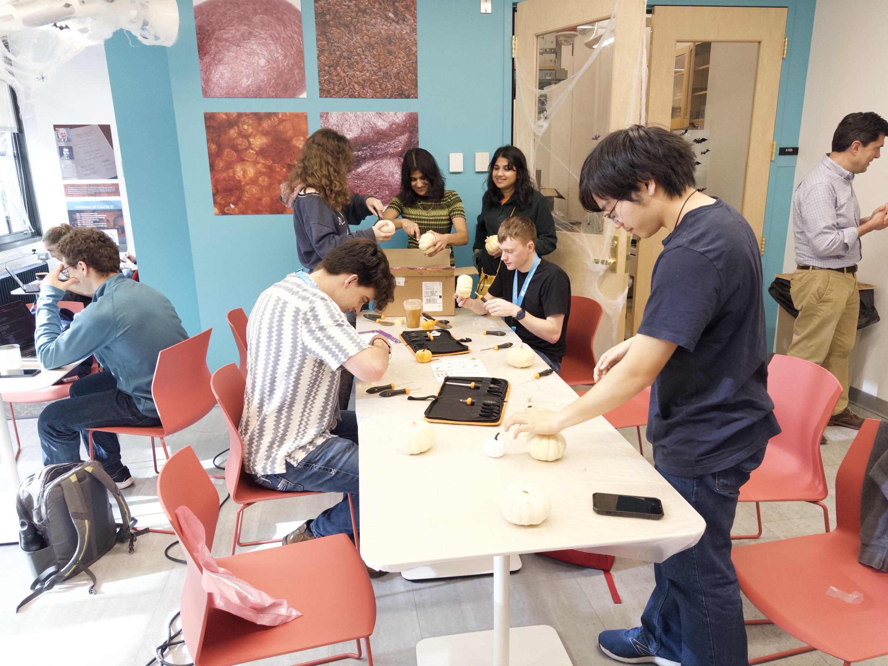
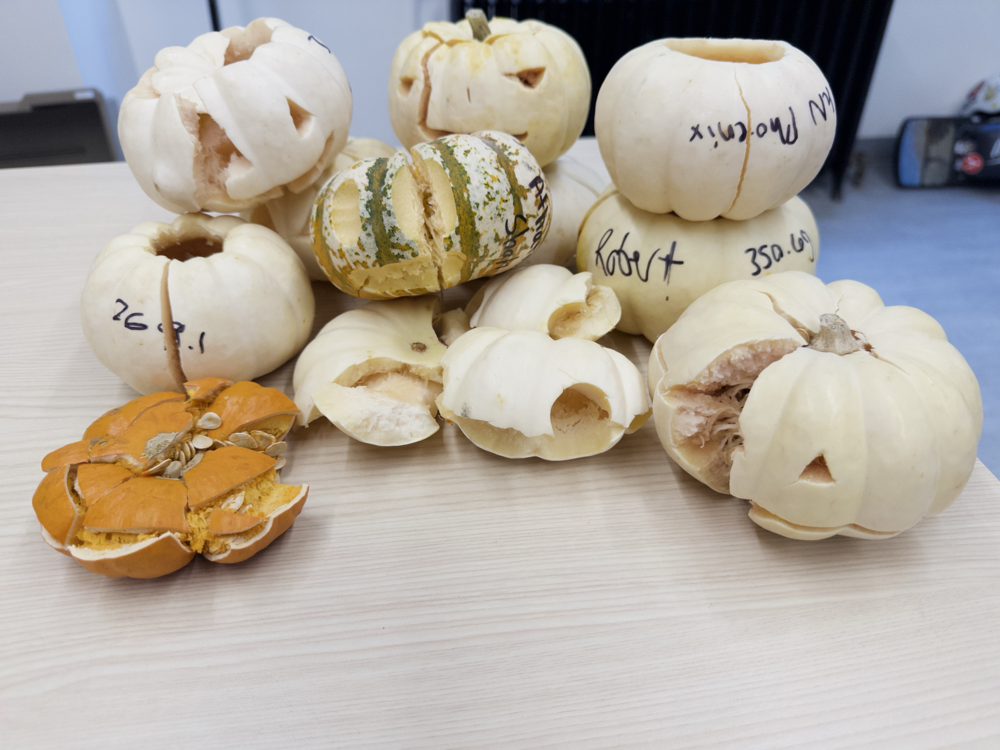

# Pumpkins Under Pressure: Carving For Strength

<strong>Proposed showcase format:</strong> This demonstration uses real Breakerspace event photographs to test an educational content model. Exact pumpkin masses, peak loads, force-displacement curves, scoring rules, and rankings have not yet been added, so the page does not present a winner or a completed quantitative comparison.

During the Breakerspace's Infinite Halloween event, participants faced a materials and structures challenge: carve away as much pumpkin as possible while leaving a structure that could still withstand a large compressive load. The goal was to produce the strongest, lightest carved pumpkin rather than simply the pumpkin that survived the largest force.

<figure class="page-figure">
  
  <figcaption>A carved pumpkin is prepared for staff-guided compression testing on the Breakerspace Instron.</figcaption>
</figure>

## The Design Question

Removing material makes a pumpkin lighter, but every cut also changes how force travels through its curved wall. A large opening may remove mass efficiently while interrupting an important load path. A sharp corner may save little weight but create a stress concentration where a crack can begin. Two pumpkins with the same final mass can therefore fail at very different loads.

One useful way to turn that goal into a quantitative comparison would be:

**load-carrying efficiency = peak compressive force / carved pumpkin mass**

This quantity is more accurately described as structural load capacity per unit mass than as an intrinsic material strength-to-weight ratio. The pumpkins are irregular structures with different geometries, wall thicknesses, moisture, and biological variation; the test compares the performance of each pumpkin-and-carving combination, not a standardized property of pumpkin material.

## From Carving To Compression

Participants carved small pumpkins in the lounge, where food and biological materials could be handled separately from routine instrument work. Staff then managed the compression setup, containment, testing, and cleanup in the lab.

  <figure class="page-figure">
    
    <figcaption>Each carving is both a visual design and a decision about where the remaining shell will carry load.</figcaption>
  </figure>
  <figure class="page-figure">
    
    <figcaption>Centering and orientation matter because the platens determine where compressive force enters the pumpkin.</figcaption>
  </figure>

This was a planned, staff-guided event activity. Pumpkins are wet biological samples and are not part of the normal independent-user workflow. Do not bring produce or another unusual sample into the instrument lab without explicit staff approval, containment, and a cleanup plan; review [Samples And Materials]({{ "/safety.html#samples-and-materials" | relative_url }}).

## What The Instron Can Record

During compression, the Instron records force as the upper platen moves through a controlled displacement. A completed dataset could support several comparisons:

* **Peak force:** the largest compressive load carried before or during major collapse.
* **Displacement at peak force:** how far the structure deformed before reaching that load.
* **Initial response:** how rapidly force increased as the pumpkin began to deform.
* **Failure sequence:** whether a local crack, buckling region, or progressive collapse controlled the result.
* **Energy absorption:** the area under an appropriately processed force-displacement curve over a defined displacement range.

<figure class="page-figure">
  
  <figcaption>Visible cracks and collapse can be compared with changes in the force-displacement curve to identify stages of failure.</figcaption>
</figure>

Force divided by pumpkin mass gives a useful event score, but it is not stress. Calculating stress would require a meaningful load-bearing area, which changes across the irregular shell and evolves as the pumpkin deforms and cracks.

## What To Notice

### Load Paths

Material aligned between the top and bottom contact regions can carry compression through the shell. Openings force those load paths to curve around missing material, concentrating load in the remaining ribs and bridges.

### Stress Concentrations

Cracks often begin near notches, thin ligaments, sharp corners, natural defects, or abrupt changes in wall thickness. Rounded carving features may distribute stress differently from narrow cuts with sharp ends.

### Buckling And Fracture

The pumpkin need not fail only by crushing the material. Curved wall sections can bend or buckle, after which cracks may propagate rapidly. The first visible crack, peak force, and complete collapse may occur at different moments.

### Natural Variability

Pumpkins differ in size, shape, rind thickness, moisture, internal structure, and damage before carving. A fairer experiment would record those factors, repeat similar designs on several pumpkins, and include an uncarved control group.

## After The Test

<figure class="page-figure">
  
  <figcaption>Different post-test shapes preserve clues about where cracks began and how each structure redistributed load as it collapsed.</figcaption>
</figure>

Post-test photographs can be annotated with crack origins, major load-bearing ribs, contact regions, and the direction of collapse. Those observations become more useful when they are synchronized with the force-displacement data and the final mass of each carved pumpkin.

## Completing This Showcase

This demonstration can become a complete quantitative example when the following evidence is assembled for a future event or recovered from existing records:

* The exact challenge rules and scoring equation.
* A stable identifier, pre-carving mass, and post-carving mass for each pumpkin.
* Consistent photographs before carving, before testing, during failure, and after testing.
* Peak force and the full force-displacement curve for every test.
* A table comparing removed mass, final mass, peak load, and load-carrying efficiency.
* Notes about pumpkin dimensions, wall thickness, orientation, and obvious pre-existing defects.
* An uncarved control or repeated carving strategies where practical.
* An annotated explanation of the winning design and the limits of that conclusion.

## Explore Further

* Learn about compression testing on the [Instron universal testing system]({{ "/tutorials/instron.html" | relative_url }}).
* See how Infinite Halloween fits into [learning and community events in the lounge]({{ "/lounge.html#learning-and-community-events" | relative_url }}).
* Review [Safety And Lab Use]({{ "/safety.html" | relative_url }}) before proposing an unusual material or staff-guided activity.
