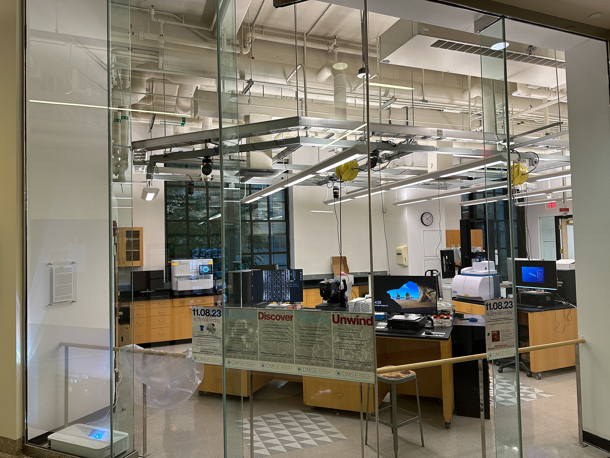
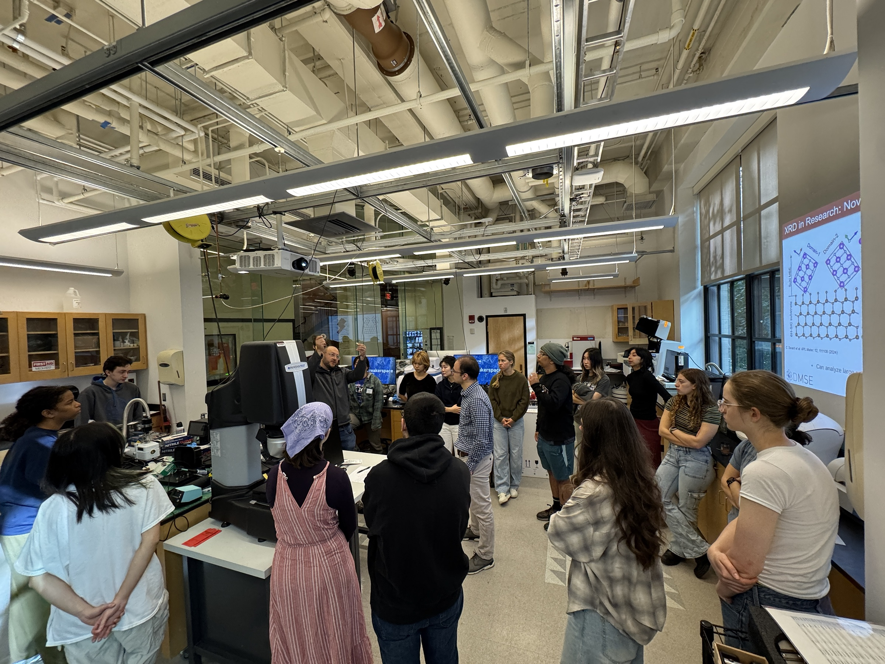

# Teach With The Breakerspace

<section class="teaching-summary" aria-label="Teaching partnership summary">
  
The Breakerspace can support course orientations, instrument training, guided lab modules, project work, multi-instrument rotations, and more extensive course partnerships.

  <dl class="teaching-summary-list">
    

      <dt>Best fit</dt>
      <dd>Courses where students need to connect material structure, composition, processing, or properties to experimental evidence.</dd>
    

    

      <dt>What we provide</dt>
      <dd>Instrument access, technical consultation, training, safety guidance, and staff-supported instruction in some formats.</dd>
    

    

      <dt>What instructors provide</dt>
      <dd>Learning goals, course context, student preparation, teaching staff participation, and sufficient planning time.</dd>
    

    

      <dt>Start here</dt>
      <dd>Tell us the course, enrollment, desired learning outcome, likely timing, and the kind of student activity you have in mind.</dd>
    

  </dl>

  <nav class="teaching-summary-actions" aria-label="Teaching page shortcuts">
    <a href="#collaboration-pathways">Explore teaching formats &darr;</a>
    <a href="#established-course-models">See example courses &darr;</a>
    <a class="teaching-contact-action" href="mailto:dmse-breakerspace@mit.edu">Contact the Breakerspace &rarr;</a>
  </nav>
</section>

The sections below explain how these partnerships can work, from a single exploratory visit to a full subject built around hands-on investigation.

This page is for instructors, teaching teams, and academic programs across MIT interested in using the Breakerspace for undergraduate teaching. At this stage, undergraduate-facing subjects are the lab's primary focus. If you have an idea that is not listed here, reach out: many good collaborations begin as a rough question, sample, or learning goal.

Questions and course-planning inquiries can be sent to [dmse-breakerspace@mit.edu](mailto:dmse-breakerspace@mit.edu).

## Quick Actions

| Goal | What to do |
| --- | --- |
| Discuss a possible course collaboration | Email [dmse-breakerspace@mit.edu](mailto:dmse-breakerspace@mit.edu) with the course number, enrollment, term, learning goals, and any instruments or samples you have in mind. |
| Arrange a brief visit or exploration session | Contact the Breakerspace team at least one to two weeks ahead when possible, with the preferred date, class size, and what you hope students will encounter. |
| Reserve the whole lab for a formal teaching exercise | Email [dmse-breakerspace@mit.edu](mailto:dmse-breakerspace@mit.edu) at least one week in advance with the requested time, setup and cleanup needs, enrollment, instruments, staffing, and alternative times. The request is not confirmed until the Breakerspace responds in writing. |
| Have students become independent Breakerspace users | Ask students to follow the [Breakerspace training pathway](./training.html). |
| Choose instruments for a course activity | Browse the [instrument pages](./instruments/) or contact the Breakerspace team for help matching questions to tools. |
| See a course example | Read about [3.000 Coffee Matters](./3000.html), a first-year subject built around coffee, materials, measurement, and the Breakerspace. |

## Collaboration Pathways {#collaboration-pathways}

Different courses need different levels of structure. These are common ways instructors can work with the Breakerspace.

### Exploration, Demonstration, Or Supervised Visit

A brief visit can combine orientation, specific live demonstrations, and carefully scoped guest participation under direct supervision. This model works well when students should encounter what an instrument makes visible or measurable but do not need to operate it independently later in the course. It keeps limited subject time focused on the material, evidence, and experiment rather than full operator training.

Students who want to go further are always welcome and encouraged to return for regular instrument training.

### Instrument Training For A Course Cohort

Students complete Breakerspace training for one or more instruments that are central to the course. After training, students can reserve trained-user time according to the normal Breakerspace access model.

This pathway is appropriate when later assignments or projects require independent instrument use. Subject instructors, teaching assistants, and teaching fellows can train in advance to help lead the sessions and manage teaching in the lab.

### Guided Lab Module

A guided module differs from a broad exploratory visit by centering on a defined course question, prepared samples or workflows, and a specific student output. Students collect or interpret evidence in small groups while the subject teaching team connects the work to the course and Breakerspace staff or trained teaching staff guide the instrument activity.

A module can be a directly supervised course session when students do not need later independent access, or it can include instrument training when they do.

<figure class="page-figure">
  
  <figcaption>3.010 students take part in a course-integrated XRD exercise and instrument training in the Breakerspace.</figcaption>
</figure>

### Project Support

For project-based subjects, already-trained students can ask Breakerspace staff for help choosing feasible measurements, preparing samples, developing methods, and interpreting what their results can and cannot show. This model suits courses whose teams bring different materials, questions, and characterization needs.

### Course-Integrated Rotation

A rotation moves small teams through several instruments or workflows, then asks them to combine the evidence into a larger interpretation. It is most useful when the learning goal is to compare how different methods answer different parts of the same materials question.

### Breakerspace-Centered Subject

Some subjects use the Breakerspace as a primary teaching environment over several weeks. This model supports sustained hands-on exploration, comparison across methods, and a course team that takes an active role in training, supervision, and lab administration.

## Planning A Collaboration

We generally start with what students should learn, the material that will make the question concrete, and the evidence they should collect. From there, we can choose a safe workflow at the right level of complexity. We share instructors' priorities: meaningful use of subject time, hands-on work where it advances learning, and honest interpretation of what the resulting data do and do not show.

Common themes include surface structure, chemical fingerprints, crystals and phases, mechanical behavior, powders and particles, sample-preparation effects, everyday materials, and comparison across multiple methods.

### How We Work Together

The teaching team brings the academic goals, course context, student preparation, and deliverables. The Breakerspace team helps translate those goals into feasible instruments, samples, training, staffing, and lab workflows. Shared instruction is usually the strongest model, but Breakerspace staff can lead a defined activity or a trained course team can manage teaching in coordination with the lab.

Teaching assistants and teaching fellows are valuable partners in developing and teaching activities. With enough notice, we can train them in advance and prepare them for the specific instruments and workflows they will support.

### Timing And Capacity

* Contact us at least one to two weeks before a brief visit when possible. Plan designed modules, cohort training, repeated use, and larger engagements before the semester begins.
* Sessions work best with no more than five or six students at one instrument. Larger groups can rotate or use instruments in parallel, with one trained instructor assigned to each active instrument.
* Students need the relevant training before independent use. Unusual samples and any safety or compatibility questions should be discussed in advance.

### Reserving The Whole Lab {#whole-lab-reservations}

Formal exercises that need coordinated or exclusive use of the instrument lab require a staff-approved whole-lab reservation. These reservations are not self-service. Email [dmse-breakerspace@mit.edu](mailto:dmse-breakerspace@mit.edu) at least **one week in advance** with the course or activity, requested time including setup and cleanup, enrollment, instruments, responsible teaching staff, training or access needs, and possible alternative times.

Earlier requests are important for recurring sessions, larger groups, multi-instrument rotations, or activities that require Breakerspace staffing or sample review. Staff will check existing reservations and operational constraints before confirming the session, adding it to the calendar, and making the affected instrument times unavailable. Do not announce the lab reservation to participants until the Breakerspace has confirmed it in writing.

Email [dmse-breakerspace@mit.edu](mailto:dmse-breakerspace@mit.edu) with the course, enrollment, learning goal, likely timing, and the activity you have in mind. Early ideas are welcome.

## Established Course Models {#established-course-models}

Breakerspace already supports teaching at several levels of engagement. These examples can be useful starting points, but they are not the limits of what a collaboration can become.

### 3.000 Coffee Matters

[3.000 Coffee Matters](./3000.html) is an introductory, Breakerspace-centered subject for first-year students that uses coffee as a familiar entry point into materials science. Students brew, taste, measure, image, and analyze coffee while learning how structure, processing, chemistry, and instrumentation connect to the final cup.

The course works because coffee is approachable but scientifically rich. Students can taste a difference, change a brewing variable, collect data, and ask whether the measurement explains what they experienced. That same model can be adapted to other safe, familiar material systems when the teaching goal is to connect observation, measurement, and interpretation.

### 3.001 Exploration Sessions

3.001 has visited the Breakerspace consistently over several years for one or two exploration sessions per semester. This lighter-touch model gives students meaningful exposure to the lab and its instruments without requiring a full course integration.

### 3.010 Guided XRD Exercise And Training

3.010 students take part in a course-integrated [XRD](./instruments/xrd.html) exercise and instrument training in the Breakerspace. This guided-module model connects diffraction concepts from the subject to sample handling, measurement, and interpretation in the lab.

### 3.042 Project Support

3.042 is a capstone subject whose students ideally arrive already trained and independent in the Breakerspace. There is no formal course engagement with the lab, but students use it extensively as their projects develop. Their advanced characterization needs often lead to informal collaboration: Breakerspace staff help students extend their abilities, while the students' projects help the lab develop and refine its own capabilities.

### 3.040 Instructor-Led Advanced Characterization

3.040 is an advanced characterization subject for DMSE majors centered in the Breakerspace. Its trained course team manages instrument training, supervision, and administrative work directly while coordinating with the Breakerspace team. This model works well when a teaching team needs sustained, specialized lab use and is prepared to develop the necessary instrument and lab expertise.
