# Technoorg-Linda SEMPrep 2 Broad Beam Ion Mill Tutorial

## Overview

The Technoorg-Linda SEMPrep 2 broad beam ion mill prepares samples for SEM imaging by sputtering material away with argon ion beams. It is most useful for final polishing, surface cleaning, EBSD preparation, and slope cutting cross sections that would be difficult to prepare cleanly by mechanical polishing alone.

The Breakerspace system has a high-energy ion source for faster milling, a focused low-energy ion source for gentle final cleaning, polishing and slope-cutting holders, a sample alignment microscope, and liquid nitrogen cooling for heat-sensitive samples.

### Index

* [Standard operating protocol](#sop) - ([startup](#startup), [operation](#operation), [shutdown](#shutdown))
* [Compatible materials and quick sample prep](#materials)
* [Quick method selection](#quick-method)
* [Detailed operating instructions](#details)
* [Data processing and analysis](#data)
* [Common failure modes](#failures)
* [Manufacturer manuals](#manuals)
* [Links](#links)
* [Exercises](#exercises)
* [Tutorial to-do list](#todo)

### Standard Operating Protocol

#### Instrument Startup

* Turn the instrument display on.
* Confirm that high voltages are off and the chamber is in a safe state.
* Turn the turbomolecular pump standby mode off.
* If the turbomolecular pump current at 1500 Hz is unusually high or above 1 A, open the forevacuum pump bypass valve for about 10 minutes and ask staff for help if it does not recover.
* Open the argon cylinder in the closet to the left of the instrument.
* Press [Purge (5s)](../assets/img/tutorials/ion-mill/purge.JPG) four times, waiting about five seconds between each click.
* Confirm that needle-valve control is set to semi-automatic.
* Open the needle valve for the ion source you plan to use so it reaches the preset pressure, then let it close automatically.
* Open the other ion source needle valve only if that source will be used during the session.

#### Operation

* Wear nitrile gloves when handling samples, holders, carrier plates, masks, and alignment tools.
* Prepare the sample externally for [polishing](#polishing) or [slope cutting](#slope-cutting).
* Load the holder using the software sample exchange procedure.
* Select the head unit and ion source appropriate for the method.
* Set sample motion, milling angle, accelerating voltage, and milling time according to the trained procedure or approved recipe.
* Confirm that pressure is below 5 x 10-6 mbar before turning on an ion source or running a recipe.
* Start the semi-automatic run or automated recipe.
* Monitor the run at the instrument.
* When the run is complete, confirm that high voltage and sample motion are off before [unloading](#unloading).
* Allow cooled samples to return toward room temperature before unloading.

#### Instrument Shutdown

* Confirm that all high voltages are off.
* Turn sample motion off.
* Return the stage tilt to 0&deg;.
* Open the shutter plate.
* Turn the camera and illumination off.
* Confirm that the needle valve is closed.
* Turn turbomolecular pump standby mode on.
* Close the argon cylinder.
* Turn off the monitor.
* Leave the sample holders, alignment tools, and work area clean.

### Compatible Materials And Quick Sample Prep

* Samples must be non-hazardous and safe to handle in the Breakerspace.
* Samples must be dry and free of volatile materials unless a staff-approved cooling method is being used.
* Samples must be free of loose particles before loading.
* Samples must be mechanically stable and securely mounted.
* Better mechanical preparation usually means shorter ion milling time and better final results.
* Heat-sensitive samples may require cooling and staff-guided method development.
* If you want a specific cross-section location, the sample must be mounted and aligned carefully before milling.

##### _If you have any questions about whether a material is appropriate to prepare in the Breakerspace, please ask before bringing it to the lab._

### Quick Method Selection

| Goal | Typical method | Starting thought |
| --- | --- | --- |
| Clean a polished metallographic sample for SEM or EBSD | Surface polishing | Start from a flat, mechanically polished surface; use low milling angle and rotation. |
| Remove mechanical polishing damage | Surface polishing followed by gentle low-energy cleaning | Use shorter runs and compare before/after SEM images. |
| Reveal a subsurface layer or interface | 30&deg; slope cutting | Use the alignment tool to position the mask precisely over the target area. |
| Produce a near-perpendicular cross section | 90&deg; slope cutting | Requires careful sample geometry to reduce redeposition. |
| Prepare a heat-sensitive sample | Cooling-assisted polishing or cutting | Staff-guided only until the sample behavior is known. |
| Develop a repeatable method | Automated recipe | Use an approved recipe or create one with staff after a successful manual run. |

### Detailed Operating Instructions

The sections above are meant as a quick reference for trained users. The sections below are written as a training guide for new users and include the practical details, images, and troubleshooting cues that are easiest to understand at the instrument.

The ion mill is a high-voltage, high-vacuum instrument. Do not bypass interlocks, open covers, disconnect cables, work inside the chamber during operation, or change service-level settings unless staff have explicitly trained you to do so. If the software or vacuum system behaves unexpectedly, stop and ask for help.

#### What Ion Milling Does

Ion milling removes material by bombarding the sample with argon ions. Compared with mechanical polishing, it can produce cleaner SEM surfaces with less smearing, deformation, embedded abrasive, or polishing damage. It is usually a finishing process, not a substitute for rough cutting, mounting, grinding, and polishing.

The SEMPrep 2 has two ion sources:

* **High-energy ion source:** faster material removal, commonly used for initial milling or faster slope cutting.
* **Low-energy ion source:** gentler final cleaning, trimming, and surface polishing after higher-energy treatment.

The system can run in semi-automatic mode, where a trained user sets the major conditions for a run, or automated mode, where a recipe runs a sequence of milling steps.

#### Surface Polishing Workflow

Surface polishing is the level 1 training task for this instrument. A typical training sample should be a mounted metallographic sample that has already been ground and mechanically polished to a reflective finish.

Use polishing when the goal is to clean or improve a broad surface for SEM imaging or EBSD. During polishing, the sample rotates while the ion beam contacts the surface at a low angle, usually in the 3&deg; to 10&deg; range.

##### Prepare A Polishing Sample

1. Start with a flat, polished, dry sample.
2. Choose the polishing holder appropriate for the sample geometry.
3. Attach the sample securely, usually near the center of the holder.
4. Set the sample height using the height tool so the surface is at the correct level for milling.
5. Remove loose debris before loading.
6. Take a before image in the SEM if you want to evaluate the effect of ion polishing.

<figure style="margin-left:0; margin-right:0;">
  <a href="../assets/img/tutorials/ion-mill/polish-standard.JPG" target="_parent">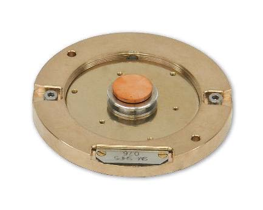</a>
  <a href="../assets/img/tutorials/ion-mill/polish-flat.JPG" target="_parent">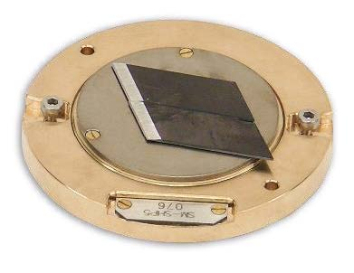</a>
  <a href="../assets/img/tutorials/ion-mill/polish-hollow.JPG" target="_parent">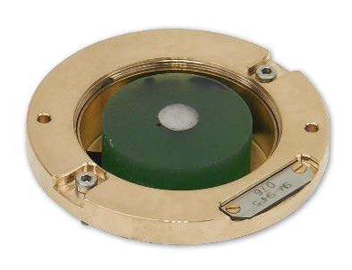</a>
  <figcaption>Examples of polishing holders used for different sample geometries.</figcaption>
</figure>

<figure style="margin-left:0; margin-right:0;">
  <a href="../assets/img/tutorials/ion-mill/polish-height.JPG" target="_parent">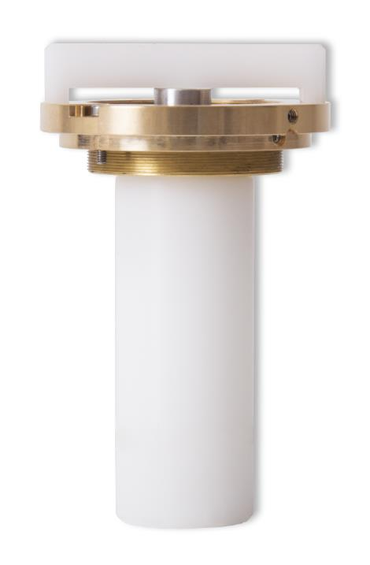</a>
  <a href="../assets/img/tutorials/ion-mill/polishing.JPG" target="_parent">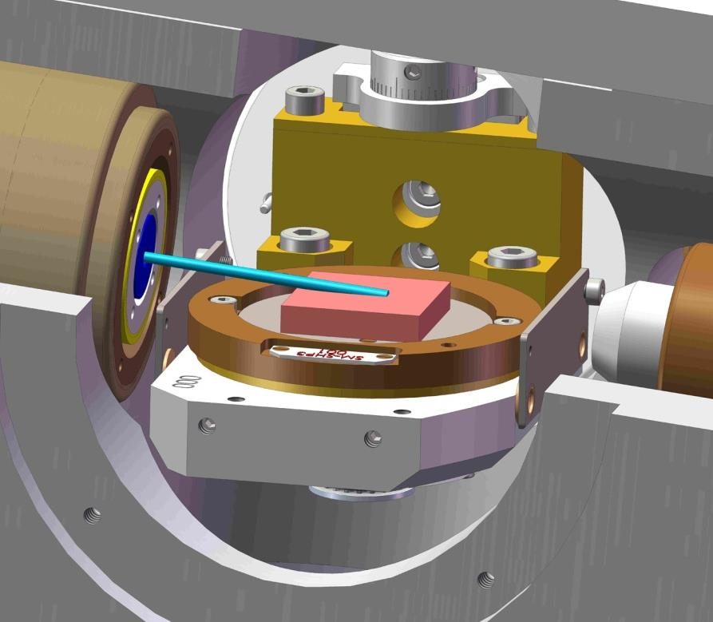</a>
  <figcaption>Height setting and polishing geometry are central to repeatable polishing results.</figcaption>
</figure>

##### Run A Polishing Process

1. Load the polishing holder using the [sample exchange procedure](#loading).
2. Select the polishing head unit in the software.
3. Select the intended ion source.
4. Set sample motion to rotation.
5. Set the milling angle. For surface polishing, a low angle is usually used.
6. Confirm that pressure is below 5 x 10-6 mbar.
7. Set voltage, milling time, and other run parameters according to the approved training method or recipe.
8. Start sample motion before turning on the ion source.
9. Start the ion source and monitor the process.
10. When the run is complete, turn high voltage off, turn motion off, return the stage to 0&deg;, and unload.

For many student training samples, the first goal is not to optimize every parameter. The first goal is to learn the complete sequence safely, then compare before and after SEM images to understand what the ion mill changed.

#### Slope Cutting Workflow

Slope cutting uses a titanium mask to shield part of the sample while the ion beam mills a controlled cross section. The position of the mask relative to the sample determines where the cut happens, so sample bonding and alignment matter as much as the milling settings.

Use slope cutting when you want to reveal an interface, coating, layered structure, embedded feature, or near-surface region.

##### Bond The Sample To A Carrier Plate

1. Choose a sample with a flat back side that can be bonded to the carrier plate.
2. Place the carrier plate in the gluing jig.
3. Apply a removable conductive or approved bonding agent.
4. Push the sample against the jig wall so the sample is parallel to the carrier plate edge.
5. Press the sample down and allow the bond to set.
6. Transfer the carrier plate into the appropriate 30&deg; or 90&deg; holder.

<figure style="margin-left:0; margin-right:0;">
  <a href="../assets/img/tutorials/ion-mill/bonding-platform.JPG" target="_parent">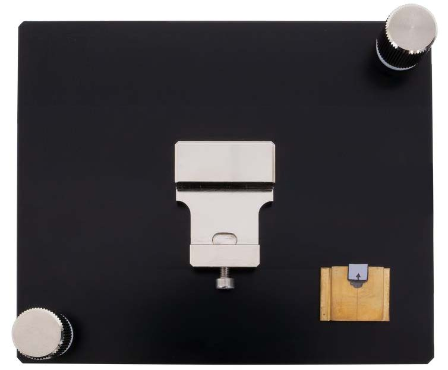</a>
  <a href="../assets/img/tutorials/ion-mill/gluing-jig.JPG" target="_parent">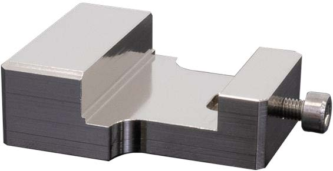</a>
  <a href="../assets/img/tutorials/ion-mill/sample-gluing-jig.JPG" target="_parent">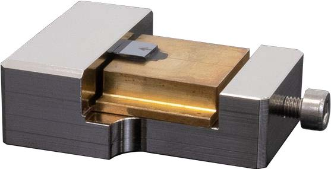</a>
  <figcaption>The bonding platform and gluing jig help position the sample consistently on the carrier plate.</figcaption>
</figure>

##### Align The Sample To The Mask

Use the sample alignment microscope and alignment platform to position the sample relative to the Ti mask before loading the holder into the ion mill.

1. Mount the alignment platform on the microscope XY stage.
2. Set the digital microscope to maximum optical and digital magnification when using the scale. At that setup, one scale division is 5 um.
3. Place the sample holder head unit in the alignment platform nest and lightly secure it.
4. Use the precision screwdriver and the holder adjustment screws to bring the sample near the mask without touching it.
5. For 90&deg; slope cutting, set the sample edge about 30 um from the Ti mask and about 25 um above the mask plane.
6. For 30&deg; slope cutting, set the Ti mask gap to about 40 um. For reflective samples, the mask reflection appears at half the true distance, so a 20 um reflection distance corresponds to a 40 um gap.
7. After alignment, remove the holder carefully and load it into the ion mill.

<figure style="margin-left:0; margin-right:0;">
  <a href="../assets/img/tutorials/ion-mill/sample-scope.JPG" target="_parent">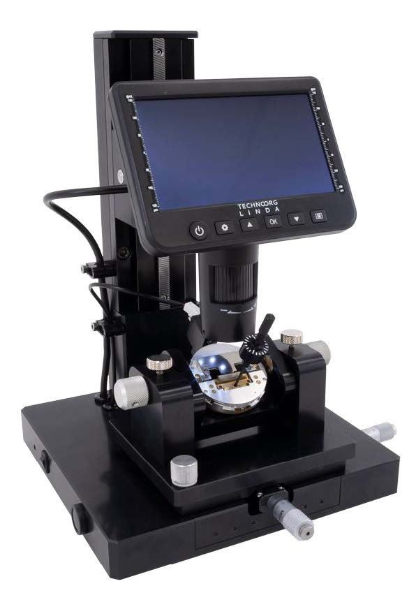</a>
  <a href="../assets/img/tutorials/ion-mill/alignment-platform.JPG" target="_parent">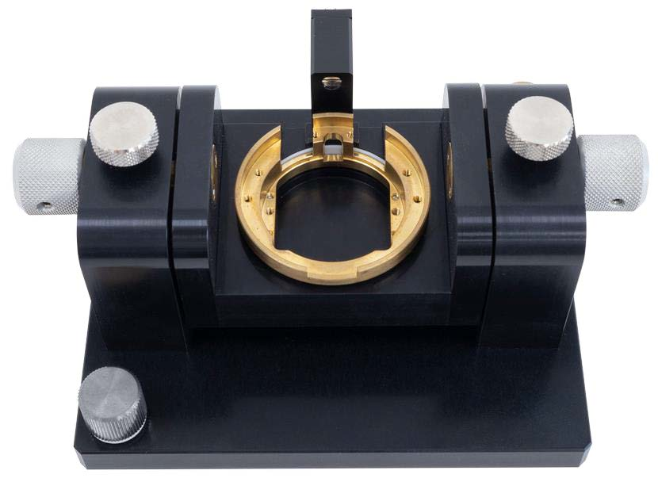</a>
  <a href="../assets/img/tutorials/ion-mill/prec-driver.JPG" target="_parent">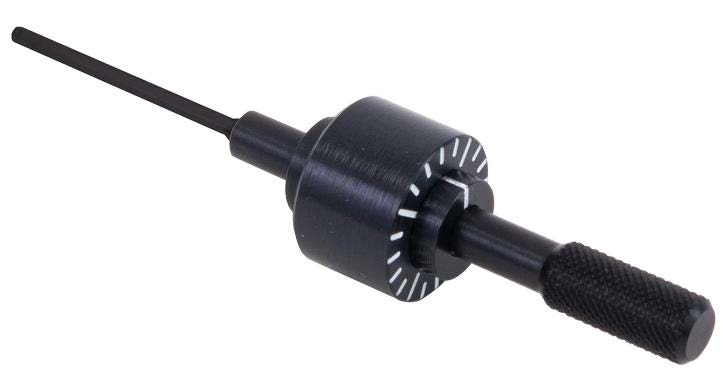</a>
  <figcaption>The alignment microscope, platform, and precision screwdriver are used to set the sample-mask distance.</figcaption>
</figure>

##### 30&deg; Slope Cutting

The 30&deg; holder is useful for cutting a sloped notch into the sample face. Samples may be up to about 5 mm thick, 16 mm wide, and 13 mm long. Best results come from a sample whose target surface is parallel to the mounting surface, so the mask distance is uniform across the region being cut.

<figure style="margin-left:0; margin-right:0;">
  <a href="../assets/img/tutorials/ion-mill/30deg-1.JPG" target="_parent">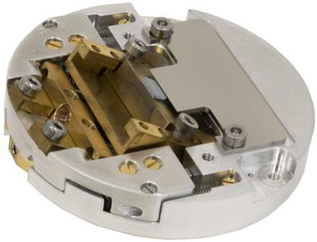</a>
  <a href="../assets/img/tutorials/ion-mill/30deg-2.JPG" target="_parent">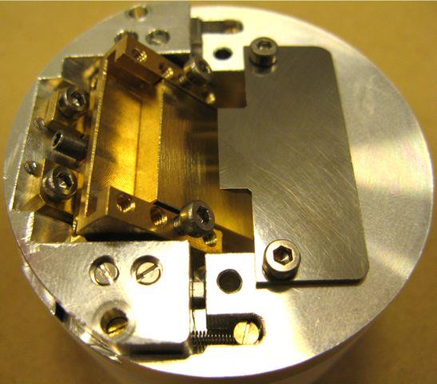</a>
  <a href="../assets/img/tutorials/ion-mill/30deg-3.JPG" target="_parent">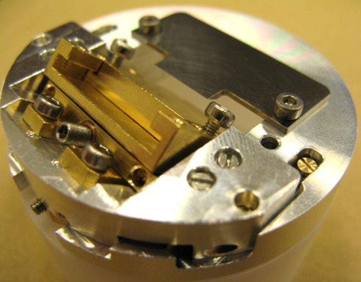</a>
  <figcaption>30&deg; slope-cutting holder views.</figcaption>
</figure>

##### 90&deg; Slope Cutting

The 90&deg; holder is used when the desired cut surface is approximately perpendicular to the mounting face. Samples may be up to about 6 mm thick, 16 mm wide, and 20 mm long. Redeposition can be a problem at 90&deg;, so a clean, well-polished face and minimal, uniform protrusion above the mask are important.

<figure style="margin-left:0; margin-right:0;">
  <a href="../assets/img/tutorials/ion-mill/90deg-1.JPG" target="_parent">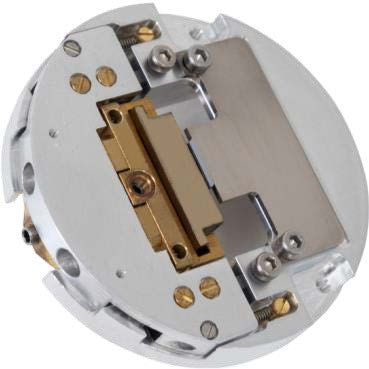</a>
  <a href="../assets/img/tutorials/ion-mill/90deg-2.JPG" target="_parent">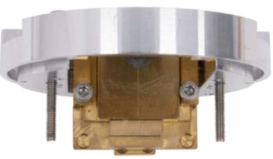</a>
  <figcaption>90&deg; slope-cutting holder views.</figcaption>
</figure>

##### Run A Slope-Cutting Process

1. Load the aligned slope-cutting holder using the [sample exchange procedure](#loading).
2. Select the slope-cutting head unit in the software.
3. Select the intended ion source.
4. Set sample motion to oscillation. Slope cutting uses oscillation, not continuous rotation.
5. Set the stage tilt for the holder and method. For slope cutting, 0&deg; is typical, with small adjustments sometimes used to reduce redeposition.
6. Confirm that pressure is below 5 x 10-6 mbar.
7. Set voltage, milling time, and ion-source conditions according to the approved training method or recipe.
8. Start sample motion, start the ion source, and monitor the process.
9. When complete, turn high voltage off, turn motion off, return tilt to 0&deg;, and unload.

#### Startup, Argon Purge, And Needle Valve Setup

The ion sources require clean argon flow and stable vacuum. The startup purge routine helps clear the gas line before milling.

1. Open the argon cylinder.
2. In the needle-valve control area, confirm semi-automatic control.
3. Press **Purge (5s)** four times, waiting about five seconds between clicks.
4. Open the needle valve for the ion source that will be used so the chamber reaches the preset pressure.
5. Let the valve close automatically before proceeding.

<figure style="margin-left:0; margin-right:0;">
  <a href="../assets/img/tutorials/ion-mill/purge.JPG" target="_parent">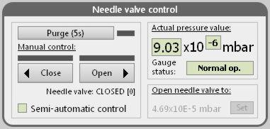</a>
  <figcaption>The purge and needle-valve controls are used during startup and ion-source setup.</figcaption>
</figure>

Do not run an ion source until the chamber has reached the required base pressure. If the vacuum does not recover, or if the software shows vacuum warnings during loading or pumping, stop and ask staff for help.

#### Sample Loading And Unloading

The SEMPrep 2 uses a load-lock so samples can be exchanged without fully venting the main working chamber. Always use the software-guided sample exchange procedure.

##### Loading

1. In the sample stage and head unit control tab, click **Sample loading/removal**.
2. Follow the step-by-step sample exchange window.
3. Wait for calibration, pumping, and stage movement to complete.
4. When the load-lock chamber is vented and the software says it is ready, open the load-lock door.
5. Insert the holder using the appropriate loading tool.
6. Fix the holder screws with the correct hex driver.
7. Close the load-lock door.
8. Click through the software prompts to pump the load-lock and draw the stage into the working chamber.
9. Check vacuum level and stage position.
10. Click **Finish** when the procedure completes.

##### Unloading

1. Confirm all high voltages are off.
2. Confirm sample motion is off.
3. Return the stage tilt to 0&deg;.
4. If cooling was used, allow the sample to warm toward room temperature before unloading.
5. Start the same **Sample loading/removal** procedure.
6. Follow the software prompts until the load-lock is vented and the holder can be removed.
7. Remove the holder carefully, close the load-lock door, and allow the system to return to its pumped state.

<figure style="margin-left:0; margin-right:0;">
  <a href="../assets/img/tutorials/ion-mill/stage-control.JPG" target="_parent">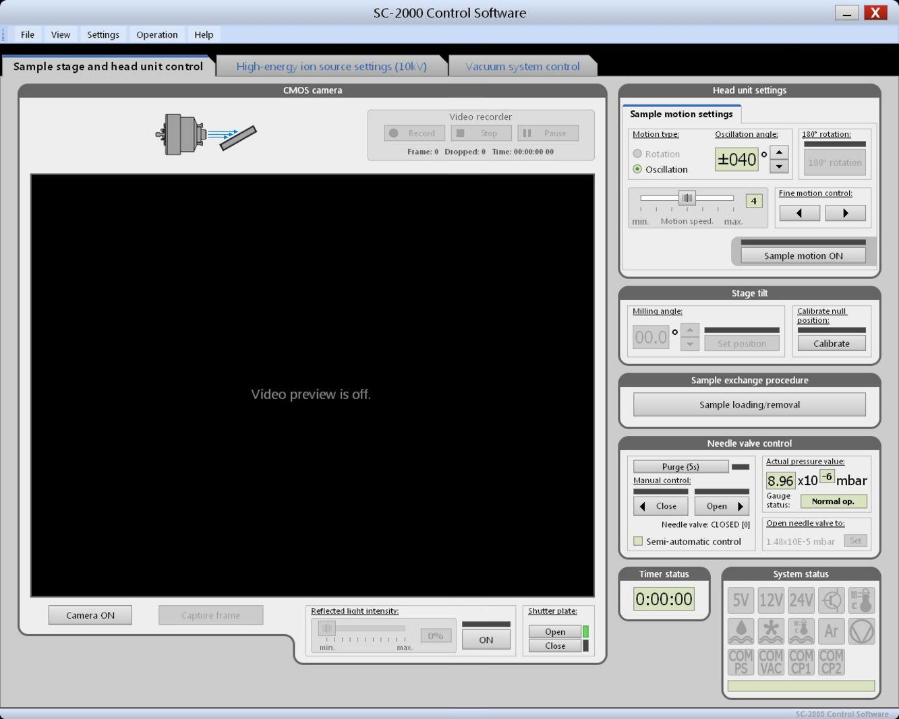</a>
  <figcaption>The sample stage and head unit control tab is the starting point for sample exchange and motion control.</figcaption>
</figure>

#### Semi-Automatic Operation

Semi-automatic operation is useful for training, method development, and staff-guided work where a user needs to understand each condition.

1. Select the head unit type.
2. Select the high-energy or low-energy ion source.
3. Move or rotate the sample so it faces the selected ion source.
4. Select rotation or oscillation as appropriate for the holder.
5. Turn sample motion on.
6. Set the stage tilt.
7. Confirm base pressure is below 5 x 10-6 mbar.
8. Turn on the ion source and set the approved voltage/current conditions.
9. Use semi-automatic needle-valve control unless staff instruct otherwise.
10. Start timing the run.
11. Monitor the run and stop if vacuum, current, stage motion, or visual observation looks wrong.
12. At the end, turn the ion source off before turning motion off or unloading.

Users should not improvise new high-energy, low-energy, gas-flow, or cathode settings during unsupervised work. Use a trained method or a staff-approved recipe.

#### Automated Recipes

Automated mode is best once a process has been established. A recipe can combine multiple steps, such as faster high-energy milling followed by gentler low-energy cleaning.

1. Switch to automated thinning mode in Settings / Thinning.
2. Open an existing approved recipe, or create one with staff.
3. Review each step: ion source, accelerating voltage, sample motion, milling angle, and milling time.
4. Confirm pressure is below 5 x 10-6 mbar.
5. Click **Run all steps** to run the complete recipe.
6. Monitor the process.
7. After the run, switch back to manual thinning mode before starting sample exchange.

### Data Processing And Analysis

The ion mill does not produce analytical data by itself. Its output is the prepared sample surface or cross section. The best way to evaluate a run is to compare the sample before and after milling using the SEM or optical microscope.

For useful before/after comparisons:

* Record the sample name, holder type, method, ion source, voltage, angle, motion mode, milling time, and whether cooling was used.
* Capture SEM or optical images before milling.
* Capture SEM images after milling at the same magnification and region when possible.
* Note whether the result shows polishing improvement, curtaining, redeposition, roughness, delamination, thermal damage, or insufficient milling.

### Common Failure Modes

| Symptom | Likely cause | What to try |
| --- | --- | --- |
| Vacuum does not recover after loading | Door/seal issue, debris, wet sample, or holder not seated | Stop the process, check for obvious loading issues only if safe, and ask staff. |
| Software warns during sample exchange | Load-lock pumping or stage movement problem | Follow the on-screen prompt; do not force the stage or door. |
| Ion source will not stabilize | Argon flow, needle valve, pressure, source condition, or incorrect setup | Stop and ask staff; do not keep opening the valve blindly. |
| Polished area is too small | Milling angle too high or sample height/position incorrect | Recheck holder, height, angle, and before/after images. |
| Surface still has scratches or smear | Insufficient mechanical prep or insufficient ion polishing time | Improve mechanical polishing or run a staff-approved longer/cleaning step. |
| Surface looks rough or damaged | Too aggressive conditions, long milling, heat, or inappropriate angle | Reduce energy/time, improve cooling, or adjust angle with staff. |
| Slope cut misses target feature | Sample bonding or mask alignment error | Use the alignment microscope; document target position before loading. |
| Redeposition on 90&deg; cuts | Geometry, protrusion, mask condition, or long milling | Improve sample face, minimize protrusion, clean mask, or adjust method. |
| Sample detaches or shifts | Poor bonding, loose holder screws, heat, or incompatible adhesive | Rebond sample and use the gluing/alignment fixtures. |
| Viewing image is poor | Camera/illumination off, dirty viewing window, or focus/position issue | Turn camera/illumination on, adjust focus/illumination, and ask staff before cleaning window. |

### Manufacturer Manuals

* [SEMPrep2 ion mill manual](https://www.dropbox.com/scl/fi/50x7hl7x68mmfu5ypkt5g/SC-2100_manual_v2.6-2105.pdf?rlkey=d1ivx4xdfuvc14v36bllvusoh&dl=0)
* [Sample alignment microscope manual](https://www.dropbox.com/scl/fi/4bxxm6zr7q0elwqqvx5a0/Sample-Alignment-Tool-manual.pdf?rlkey=ltp97kascl3a2wrx785xmj749&dl=0)

### Links

* [Technoorg Linda - making of 100th SEMPrep ion milling system](https://www.youtube.com/watch?v=HaZ6fGmBUhc)

### Exercises

* **Level 1 - General training:** Mechanically polish a mounted metal sample, image it in the SEM, ion polish it using the standard polishing holder and a staff-approved short polishing method, then image the same region again. Describe what changed.
* **Level 2 - Slope cutting:** Mount a layered or coated sample on a carrier plate, align it with the 30&deg; slope-cutting holder, run a staff-approved slope-cutting recipe, and image the cross section in the SEM.
* **Level 2 - Method comparison:** Compare two polishing times or two final-cleaning conditions on similar samples. Use before/after SEM images to decide which method produced the better surface.
* **Level 3 - Specialist training:** Develop a documented automated recipe for a recurring sample type, including sample prep, holder choice, ion-source sequence, milling times, and before/after image criteria.

### Tutorial To-Do List

* Add a photo or GIF of a trained user opening the argon cylinder and confirming the correct regulator state.
* Add a short screen-capture GIF of the startup purge sequence and semi-automatic needle-valve setup.
* Add a screen-capture GIF of the software-guided sample loading/removal procedure.
* Add photos of the actual Breakerspace polishing holders labeled by name and use case.
* Add photos of a gloved hand loading a polishing holder with the correct tool.
* Add photos or GIFs showing sample height adjustment for the polishing holder.
* Add photos or GIFs showing a sample being bonded to a carrier plate in the gluing jig.
* Add photos or GIFs showing 30&deg; and 90&deg; alignment under the sample alignment microscope, including what the target mask gap looks like on screen.
* Add a screenshot of the automated recipe library with a safe example recipe highlighted.
* Add one complete level 1 training example using a specific material-library sample, including bin number/location once the cabinet is organized.
* Add one level 2 slope-cutting exercise using a specific layered/coated material-library sample, including bin number/location once available.
* Add before/after SEM image pairs showing successful polishing, insufficient polishing, redeposition, and sample damage.
