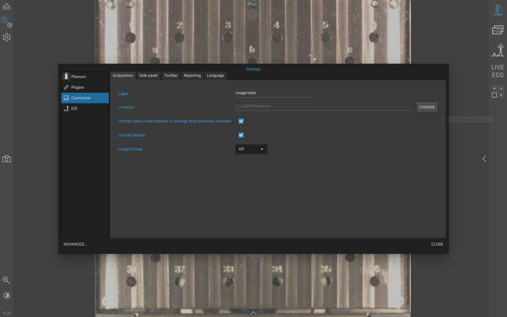
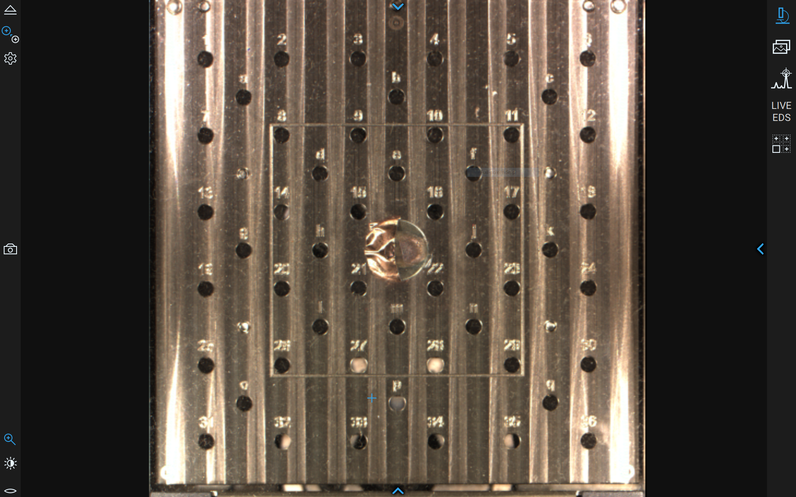
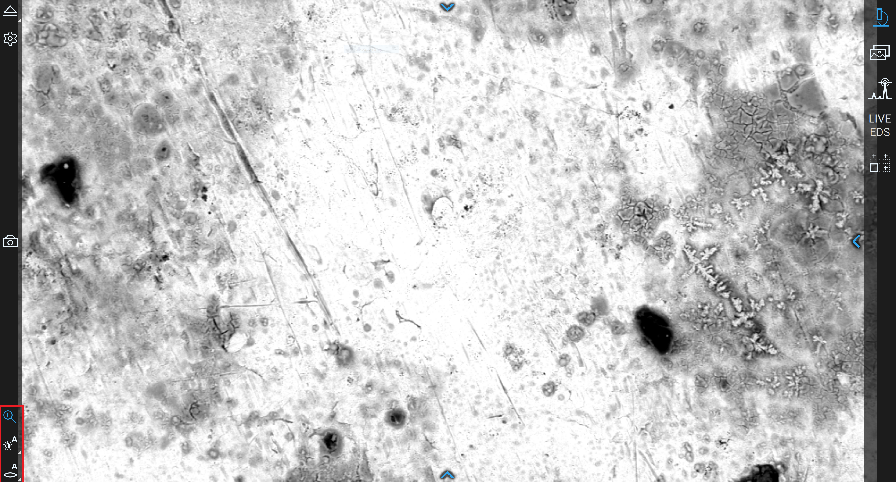

# Thermo Fisher Phenom Scanning Electron Microscopes (SEM)

## Overview

The Breakerspace has two scanning electron microscopes (SEM): a Thermo Fisher [Phenom XL](https://www.thermofisher.com/us/en/home/electron-microscopy/products/desktop-scanning-electron-microscopes/phenom-xl.html) and a Thermo Fisher [Phenom Pure](https://www.thermofisher.com/us/en/home/electron-microscopy/products/desktop-scanning-electron-microscopes/phenom-pure.html).

[SEMs](https://www.thermofisher.com/blog/materials/what-is-sem-scanning-electron-microscopy-explained/) use a focused beam of electrons to image materials at much higher magnification than can be achieved with an optical microscope. In good conditions, the Phenom instruments can resolve features on the order of 100 nm.

The Phenom XL has a large 100 mm x 100 mm sample stage, low-vacuum imaging for non-conductive samples, energy dispersive spectroscopy (EDS), and a tensile stage for in-situ observation of mechanical tests. The Phenom Pure accepts one sample on an 18 mm or smaller stub, supports high- and low-vacuum imaging, and has a temperature-controlled cold stage for frozen or beam-sensitive samples. Both instruments have backscatter (BSD) and secondary electron (SED) detectors.

### Index

* [Standard operating protocol](#sop) - ([startup](#startup), [operation](#operation), [shutdown](#shutdown))
* [Compatible materials and quick sample prep](#materials)
* [Quick imaging settings](#quick-settings)
* [Detailed operating instructions](#details)
* [Data processing and analysis](#data)
* [Common failure modes](#failures)
* [Manufacturer manuals](#manuals)
* [Links](#links)
* [Exercises](#exercises)
* [Tutorial to-do list](#todo)

### Standard Operating Protocol

#### Instrument Startup

* Log on to the instrument workstation using your MIT Kerberos.
* Start the Phenom User Interface software.
* Wake the instrument if needed.
* If the instrument does not connect automatically, open [Settings / Phenom / Status](../assets/img/tutorials/sem/connect.PNG) and connect to the microscope.
* If using the Phenom Pure cold stage, switch on the chiller unit about 30 minutes before imaging so the cooling water reaches operating temperature.

#### Operation

* Wear nitrile gloves when handling samples, stubs, sample holders, stages, and sample-prep tools.
* [Prepare samples](#prep) externally at the sample prep table.
* Confirm that the sample is dry or fully frozen, firmly attached, free of loose particles, and below the holder height limit.
* [Load](#loading) the sample into the instrument.
* Remove gloves before using the computer.
* Set the image [label and save location](#customize).
* Use NavCam to navigate, move to SEM view, adjust imaging settings, focus, and acquire images.
* For EDS or Live EDS, stop acquisition before moving to another area or returning to SEM observation.
* Wear gloves again, unload samples, and leave the holder/stage clean and stored correctly.

#### Instrument Shutdown

* Save and copy any data you need.
* Close the Phenom software. Press F11 if you need to exit fullscreen view.
* Log off Windows.
* The microscope will put itself in standby.
* If you used the cold stage, turn cooling off at the controller, allow the stage to return toward room temperature, then switch off the chiller unit.

### Compatible Materials and Quick Sample Prep

* Samples must be non-hazardous and safe to handle in the Breakerspace.
* Samples must be dry, except for samples intentionally frozen on the Phenom Pure cold stage.
* Samples must be firmly attached to a stub or approved holder.
* Samples must be free of loose particles. After mounting, gently tap or blow the sample with compressed air away from the microscope and electronics.
* Non-conductive samples can be viewed in low-vacuum mode, sputter coated, or connected to the stub with conductive tape/paint.
* Phenom XL maximum sample size: 100 mm x 100 mm x 35 mm.
* Phenom Pure maximum sample size: approximately 18 mm diameter and 12 mm tall.

##### _If you have any questions about whether a material is appropriate to characterize in the Breakerspace, please ask before bringing it to the lab._

#### Sample Prep At A Glance

| Sample type | Fast prep | Notes |
| --- | --- | --- |
| Conductive solid | Carbon pad, conductive tape, silver paint, graphite paint, or clamp | Make sure the feature of interest is near the highest point and the sample is grounded. |
| Non-conductive solid | Low vacuum, sputter coating, or conductive bridge to the stub | Low vacuum is non-destructive but lower resolution; coating improves imaging but changes the surface. |
| Powder or particles | Sparse layer on carbon pad, then tap and blow off loose material | Avoid thick piles and overlapping particles, especially for size/shape measurements. |
| Wet, moist, or biological | Dry, critical-point dry, use a very small amount in low vacuum, or freeze on the cold stage | Wet samples can outgas and damage the microscope if not prepared correctly. |
| Beam-sensitive polymer/organic sample | Lower voltage/current, lower magnification, shorter dwell time, cooling, or light coating | Watch for cracking, melting, boiling, drift, or image changes over time. |
| Magnetic sample | Mount very securely and use longer working distance if needed | Magnetic samples can distort focus/stigmation and, if loose, can be pulled from the stub. |
| EDS sample | Prefer conductive mounting; avoid coating materials that interfere with the elements of interest | Gold coating is excellent for imaging but can complicate EDS; carbon coating is often better for inorganic EDS. |

### Quick Imaging Settings

| Goal | Starting settings | Watch for |
| --- | --- | --- |
| General imaging | 10 kV, Image intensity, auto brightness/contrast, manual or auto focus | Good balance of resolution, speed, and sample tolerance. |
| Surface-sensitive imaging | 5 kV, Low or Image intensity | Useful for residues, stains, coatings, and beam-sensitive surfaces. |
| EDS on Phenom XL | 15 kV, Map intensity, working distance about 4-7 mm | Stop EDS before moving; verify counts before long maps. |
| Non-conductive sample | Low vacuum, sputter coating, or conductive tape/paint | Charging appears as brightening, drift, distortion, or loss of detail. |
| High-quality image capture | Start with default acquisition, then increase resolution/averaging only if stable | Long acquisitions magnify drift, charging, vibration, and beam damage. |

### Detailed Operating Instructions

The sections above are meant as a quick reference for trained users. The sections below are written as a training guide for new users and include the practical details, images, and troubleshooting cues that are easiest to understand at the instrument.

#### Sample Preparation Details

SEM sample preparation has two goals: protect the microscope and make the sample electrically and mechanically stable enough to image. The most common preventable SEM problems are loose debris, incorrect height, poor grounding, wet samples, and over-prepared samples that no longer show the surface you wanted to study.

##### Basic Solid Samples

1. Place a clean bare stub in a sample prep tray.
2. Attach a double-sided carbon pad or another approved adhesive.
3. Attach the sample firmly to the pad.
4. If useful, add conductive tape, conductive paint, or graphite/silver paint to connect the sample surface to the metal stub.
5. Use stub tweezers to hold the stub, then gently tap and blow with compressed air to remove loose particles.
6. Confirm the sample is not taller than the holder limit before loading.

Do not prepare samples inside the SEM sample holder. Loose particles can fall into the holder or loading area and later contaminate the detector, chamber, or column.

##### Powder And Particle Samples

Powders should be sparse, well attached, and mostly one layer thick.

1. Attach a carbon pad to a clean stub.
2. Pick up a very small amount of powder with a toothpick, spatula, or tweezers.
3. Gently brush or flick particles onto the exposed carbon pad.
4. Press particles lightly into the adhesive if needed.
5. Hold the stub with stub tweezers, tap the side of the stub, then blow with compressed air to remove loose grains.

If you care about particle size or shape, thick piles are a problem because particles overlap and hide each other. Use less material than feels natural; SEM needs a visible population of particles, not a mound.

##### Non-Conductive Samples

Non-conductive samples can charge under the electron beam. Charging often appears as a region that gets brighter over time, streaks, distorted features, drifting image position, or a field of view that washes out to white.

You have three main options:

1. **Low vacuum:** fastest and non-destructive. Useful for paper, polymers, ceramics, many organics, and samples where coating is not acceptable. Resolution and signal-to-noise will usually be worse than high vacuum.
2. **Sputter coating:** best for high-resolution imaging of insulating surfaces. Gold is common and highly conductive, but it adds a coating that can hide very fine surface features and complicate elemental analysis.
3. **Conductive bridge:** copper tape, carbon tape, graphite paint, or silver paint can provide a partial path to ground. This works best when the area of interest is close to the conductive bridge.

<figure style="margin-left:0; margin-right:0;">
  
  
  <figcaption>Sputter coating can reduce charging and improve high-vacuum imaging of non-conductive samples.</figcaption>
</figure>

##### Wet, Moist, And Biological Samples

Wet samples are risky in an SEM because water and other volatile liquids outgas under vacuum. Outgassing can cause poor images, vacuum errors, contamination, and microscope damage.

Common strategies:

* **Dry the sample** if preserving the wet structure is not important.
* **Use the sputter coater drying/vacuum mode** to test whether a sample visibly changes under vacuum before loading it into the SEM.
* **Freeze the sample** on the Phenom Pure cold stage if you need to preserve wet or heat-sensitive structure.
* **Use a very small amount in low vacuum** only when staff agree that the sample is appropriate and low moisture enough.

<figure style="margin-left:0; margin-right:0;">
  
  <figcaption>The sputter coater drying mode can help dry samples or test vacuum sensitivity before SEM imaging.</figcaption>
</figure>

#### Phenom Pure Cold Stage

Use the cold stage for wet, vacuum-sensitive, or heat-sensitive samples that need to be frozen or cooled during imaging. Smaller samples usually work better because they freeze faster and are less likely to deform or frost over.

##### Cold Stage Setup

1. Switch on the chiller unit about 30 minutes before use.
2. Confirm the chiller has airflow around it and is not against a heat source.
3. Check whether the [water reservoir](../assets/img/tutorials/sem/cold_stage_refilling_water.jpeg) needs refilling. Use deionized water only.
4. Place the cold-stage sample holder in its stand.
5. Mount the sample on the metal stub using [cryo-embedding compound](../assets/img/tutorials/sem/cold_stage_cryo_embedding_fluid.jpeg), not normal SEM adhesive.
6. Use a 1.5 mm Allen wrench to [adjust sample height](../assets/img/tutorials/sem/cold_stage_adjusting_sample_height.jpeg). The sample must sit below the top edge of the holder.
7. Insert the [connector block](../assets/img/tutorials/sem/cold_stage_gif_putting_in_connector.gif) into the SEM.
8. Turn on the [main unit](../assets/img/tutorials/sem/cold_stage_on_switch.jpeg), then use the controller to set the target temperature.

<figure style="margin-left:0; margin-right:0;">
  
  
  <figcaption>Cold-stage connector and sample-holder loading.</figcaption>
</figure>

##### Freezing Workflow

1. Remove excess liquid from the outside of the sample. Extra water encourages frost.
2. Keep the feature of interest away from the cryo gel, because the gel can obscure surface features.
3. Find the warmest temperature that reliably freezes your sample. Lower temperatures are not automatically better; excessive cooling can promote ice growth.
4. Wait until the cryo gel turns fully white before loading. Unfrozen gel can bubble or splatter in vacuum.
5. If your sample is thick, wait until the top surface is also frozen, but avoid leaving it exposed long enough to accumulate condensation.
6. Load the cold stage into the SEM.
7. After you find an area of interest, use photo mode on the controller before acquiring a final image to reduce drift.

<figure style="margin-left:0; margin-right:0;">
  
  
  
  <figcaption>Cold-stage controller, mounted sample, and frozen cryo gel.</figcaption>
</figure>

If the image flickers, bright bands streak across the field of view, or the sample appears to bubble, boil, collapse, or drift rapidly, eject the sample immediately and ask staff for help. These are signs that the sample may be outgassing or changing under the beam.

#### Sample Loading

##### Phenom XL

1. Open the sample compartment using the software eject button.
2. Remove the sample stage.
3. Using stub tweezers, push each stub pin into an open hole in the stage.
4. Set the tallest part of the tallest sample level with the stage opening, then lower the stage by the lab-recommended number of notches on the height dial.
5. For EDS, target a working distance around 4-7 mm. A good compromise for imaging and EDS is usually near the middle of that range.
6. Insert the sample stage into the loading bay.
7. Close the compartment using the software eject button.
8. Wait for the stage to move to the optical NavCam position.

##### Phenom Pure

1. Use the holder or stage appropriate for your intended vacuum mode. Follow the labels on the actual holders and ask staff if the holder choice is unclear.
2. Mount one sample on an 18 mm or smaller stub.
3. Adjust height so the highest part of the sample is below the top edge of the holder.
4. Unlock the sample compartment with the software eject button.
5. Open the door manually and insert the holder.
6. Close the door firmly and wait for the sample to move to the optical NavCam position.

The sample must never sit above the holder edge. An over-height sample can be destroyed during loading and can damage the microscope.

#### Project Label And Save Location

While the sample is loading, open Settings / Customize and set a useful image label and save location. Do this before you start collecting images so your files land in a project folder that will still make sense later.

<figure style="margin-left:0; margin-right:0;">
  
  <figcaption>Use the Customize settings to set project labels and save locations before acquisition.</figcaption>
</figure>

#### NavCam

When the sample finishes loading, the software shows the NavCam view. This is an optical overview of the sample stage that helps you choose regions of interest before switching to SEM imaging.

Use this moment to:

* Confirm that the expected sample or stub is visible.
* Check that the sample did not shift during loading.
* Adjust NavCam brightness, contrast, and focus if you will use it for navigation.
* Save a NavCam image if it will help document where later SEM images were taken.

<figure style="margin-left:0; margin-right:0;">
  
  <figcaption>NavCam is the optical overview used to select a region before moving to SEM view.</figcaption>
</figure>

#### LiveSEM View

Click **Move to SEM** to enter the live SEM view. Start zoomed out, find a recognizable feature, focus, then increase magnification gradually.

Useful controls:

* Mouse wheel changes the selected control, usually magnification, focus, brightness, or contrast.
* Right-click and drag horizontally on the live image to adjust focus quickly.
* Use auto brightness/contrast as a starting point, then adjust manually if the image looks washed out or too dark.
* Use autofocus only when there is enough contrast near the center of the image.
* At higher magnification, refocus after changing magnification, voltage, detector, vacuum mode, or working distance.
* Press F11 to leave fullscreen mode if you need access to the Windows taskbar.

<figure style="margin-left:0; margin-right:0;">
  
  <figcaption>Focus, brightness, and contrast controls are the main adjustments in LiveSEM view.</figcaption>
</figure>

##### Choosing Detector, Voltage, Vacuum, And Intensity

| Setting | Use it when | Practical note |
| --- | --- | --- |
| SED | You want surface/topographic detail | Usually best for conductive, high-vacuum samples. |
| BSD | You want composition/atomic-number contrast or low-vacuum imaging | Heavy elements appear brighter than light elements. |
| 5 kV | You care about surface-sensitive features or beam-sensitive samples | Lower signal, but less penetration and often less damage. |
| 10 kV | You want a general imaging starting point | Good default for many samples. |
| 15 kV | You need EDS or more X-ray signal | More beam interaction and more chance of beam damage. |
| Low intensity | High magnification or beam-sensitive samples | Slower/noisier, but gentler. |
| Image intensity | General imaging | Good default for most SEM images. |
| Point intensity | Lower magnification spot work | Useful when signal is low and fine resolution is less critical. |
| Map intensity | EDS mapping | Avoid using Map intensity casually on sensitive samples. |

#### Image Acquisition And Gallery

Press the camera icon to acquire an image. Images are saved with the resolution and averaging set in the acquisition settings. Start with the default settings, take a test image, then increase resolution or averaging only if the sample is stable.

Higher averaging improves signal-to-noise but takes longer. If the sample is charging, drifting, vibrating, or degrading, longer acquisition can make the final image worse.

The Gallery shows images in the active folder. You can add measurements and notes in the gallery. If you annotate an image, save the annotated version as a new file so the original remains unchanged.

<figure style="margin-left:0; margin-right:0;">
  
  <figcaption>Acquire images with the camera icon and review, measure, or annotate them in Gallery.</figcaption>
</figure>

#### EDS And Live EDS On The Phenom XL

[Energy dispersive spectroscopy (EDS)](https://www.thermofisher.com/blog/materials/edx-analysis-with-sem-how-does-it-work/) uses X-rays generated by the electron beam to estimate which elements are present in a region of the sample. On the Phenom XL, use EDS for elemental spot checks, line scans, maps, and reports.

Start with:

* 15 kV accelerating voltage.
* Map beam intensity.
* Working distance between about 4 mm and 7 mm.
* A stable, well-focused image before starting analysis.
* Conductive mounting or low-vacuum/coating strategy appropriate for the sample.

Live EDS is useful for quick spot checks. Formal EDS/EID projects are better when you need saved spectra, maps, reports, or raw CSV data.

Always stop EDS or Live EDS before navigating to another area, returning to normal SEM observation, or unloading. If the software complains when you try to leave EDS, return to the EDS interface and press stop.

<figure style="margin-left:0; margin-right:0;">
  
  
  <figcaption>Live EDS is good for quick checks; EDS/EID projects are better for saved spectra, maps, and reports.</figcaption>
</figure>

#### Sample Unloading

1. Stop EDS, Live EDS, or image acquisition if any collection is running.
2. Return to the normal SEM interface if needed.
3. Use the eject/unload control to bring the sample back to the loading position.
4. Wear gloves before touching the sample holder or stage.
5. Open the sample compartment.
6. Remove your sample.
7. Return the Phenom XL stage to the sample compartment and close the door.
8. Return the Phenom Pure holder to its drawer or stand.
9. If a holder is dirty, ask staff whether it should be cleaned before storage.

### Data Processing And Analysis

SEM image files are saved in the active folder selected in the Phenom software. Before collecting images, set a project-specific label and folder so files are easy to find and interpret later.

For basic image analysis:

* Use the Gallery to review images, add scale measurements, and add notes.
* Save annotated images as new files.
* Keep the original image file when possible.
* Record detector, voltage, vacuum, magnification, working distance, and sample prep if those conditions matter to your interpretation.

For EDS:

* Save EDS/EID projects if you need to return to the analysis later.
* Export reports, maps, spectra, and CSV data as needed.
* Be cautious with automatic peak labels. Check whether peaks overlap and whether coating, tape, stub, or mounting materials contributed elements.

### Common Failure Modes

| Symptom | Likely cause | What to try |
| --- | --- | --- |
| Image gets brighter, washes out, streaks, or drifts | Charging on a non-conductive sample | Use low vacuum, sputter coat, add conductive tape/paint, lower voltage/intensity, or image near a conductive bridge. |
| Sample cracks, melts, boils, shrinks, or changes during imaging | Beam damage or outgassing | Lower voltage, lower intensity, reduce magnification, shorten acquisition, cool the sample, or stop and ask staff. |
| Cold-stage image flickers or bright bands streak across the image | Wet sample outgassing or not fully frozen | Eject immediately; use a fresh smaller sample, freeze more carefully, remove excess water, or use a lower target temperature. |
| Poor focus at high magnification | Charging, magnetic sample, working distance, stigmation, contamination, or unstable sample | Verify with a standard sample, lower magnification, adjust focus/stigmation, use low vacuum/coating, or ask staff. |
| BSD image has almost no contrast | Detector mode or source/contrast issue | Confirm detector mode, check contrast on a standard sample or bare aluminum stub, and ask staff if source alignment may be needed. |
| Auto focus or auto brightness/contrast performs badly | Not enough contrast in the center of the field | Move to a feature-rich region, use auto brightness/contrast before autofocus, then fine-tune manually. |
| Sample does not move from load position to NavCam | Sample holder not seated, holder not recognized, or loading process interrupted | Press eject/load again, check holder seating, and ask staff if the holder needs activation or cleaning. |
| EDS has low or no counts | Working distance, voltage, intensity, or geometry is wrong | Use 15 kV, Map intensity, and working distance about 4-7 mm; confirm the detector is collecting before a long map. |
| Cannot leave EDS or Live EDS | Acquisition is still running | Return to the EDS interface and press stop before navigating away. |
| "Place sample holder correctly" or similar holder error | Holder seal/contact may be dirty or mis-seated | Remove and reseat the holder; check the seal; ask staff before cleaning or disassembling anything. |

### Manufacturer Manuals

* [Phenom XL user manual](https://www.dropbox.com/scl/fi/iyd538gtkj79kg0bc8113/2020-MS-Phenom-XL_User-Manual.pdf?rlkey=0yk985nvgz3lckqnrtxwo7afv&dl=0)
* [Phenom XL tensile stage manual](https://www.dropbox.com/scl/fi/fu39pi9pamr2top97cv6m/Tensile-Stage-Training-Manual.pdf?rlkey=xs9dkadn6k16f9vpo3vc3y2h7&dl=0)
* [Phenom XL all docs](https://www.dropbox.com/scl/fo/mk2sedrkfsvpllralaj4c/AMh_Ma2bU_Tl8Ul0u6xmiG4?rlkey=962g3kifk9bll59jv1ib9w86d&dl=0)
* [Phenom Pure user manual](https://www.dropbox.com/scl/fi/7ju8ldfdm0p04m6n81men/Phenom-ProX-G6-User-Manual.pdf?rlkey=l6gg1ld4zpmtxgrsxfgw00jpb&dl=0)
* [Phenom Pure temperature controlled stage manual](https://www.dropbox.com/scl/fi/nqcrhb3axctk6782k5hqk/User-Manual_Phenom_Temperature-Stage.pdf?rlkey=r01r9dl6k1km22to13s0nir24&dl=0)
* [Phenom Pure all docs](https://www.dropbox.com/scl/fo/th7xj2e2ul1sed2vobibt/ACVAySN_rjR_JnEXtPfs3_8?rlkey=3j90cjbe0akxyu7o3fanrxvn5&dl=0)

### Links

* [Nanoscience Instruments Phenom Desktop SEM YouTube Playlist](https://www.youtube.com/watch?v=Tuvu79IPFa8&list=PLSK7wbUBb88knCedT9BvlILTanNkLh38q)
* [Thermo Fisher SEM YouTube playlist](https://www.youtube.com/watch?v=jFO5AnYnn2c&list=PLoxdPzacxPYjwqELAD8XQGsygUYse2gmB)

### Exercises

* **Level 1 - General training:** Prepare and image a small piece of hair. Use the Phenom Pure or XL to load the sample, navigate with NavCam, focus in LiveSEM, acquire images at several magnifications, and compare a cut end with a torn or broken end.
* **Level 2 - EDS practice:** Prepare salt and sugar on the same stub. Use morphology first, then EDS on the Phenom XL, to decide which is which.
* **Level 2 - Non-conductive sample comparison:** Image an uncoated non-conductive sample in low vacuum, then sputter coat a similar sample and compare resolution, charging, and surface contrast.
* **Level 2 - Image analysis:** Cut a thin slice of a roasted coffee bean, sputter coat it, and image pore structure. Estimate average cavity size from several images.
* **Level 3 - Specialist training:** Prepare a powder sample sparse enough for particle sizing. Acquire images suitable for measuring particle diameter and compare the result with a poorly dispersed sample.
* **Level 3 - Specialist training:** Use the Phenom Pure cold stage on a staff-approved wet or heat-sensitive sample. Document the freezing temperature, imaging behavior, and signs of frost, outgassing, or beam damage.

### Tutorial To-Do List

* Add a complete level 1 training example using a specific material-library sample, including bin number/location once the cabinet is organized.
* Add a level 2 EDS exercise using specific stocked samples or standards, including bin number/location once available.
* Add a level 2 non-conductive-sample exercise using a specific material-library sample suitable for low-vacuum and sputter-coated comparison.
* Add photos or GIFs showing a gloved hand placing a stub in a prep tray and mounting a sample with stub tweezers.
* Add photos or GIFs showing powder transfer to carbon tape, tapping/removing loose particles, and a good vs overloaded powder stub.
* Add a GIF of setting the image label and save location in the Phenom software.
* Add a GIF of moving from NavCam to LiveSEM, focusing, and acquiring the first image.
* Add before/after image examples of charging mitigation: uncoated high vacuum, low vacuum, conductive bridge, and sputter coating.
* Add before/after image examples of beam damage or sample degradation on a sensitive sample.
* Add a GIF of starting and stopping Live EDS, emphasizing the stop button before navigating away.
* Add screenshots of a complete EDS report/export workflow and example CSV/raw-data export.
* Add cold-stage photos or GIFs showing cryo gel turning fully white, acceptable vs excessive frost, and black wire/connector placement during loading.
